# 金宇轮胎APS系统-成型排程完整技术文档

**文档版本**：V5.0.0  
**文档日期**：2026年3月23日  
**项目名称**：金宇轮胎生产排程系统（APS）-成型排程模块  
**版本说明**：整合数据库设计V5.1.0（修正版），完整支持试错分配、班次均衡、约束校验等核心算法；新增5张算法支持表、约束规则配置表

---

## 文档变更记录

| 版本 | 日期 | 变更内容 | 变更人 |
|------|------|----------|--------|
| V5.0.0 | 2026-03-23 | 整合数据库设计V5.1.0（修正版）；新增约束规则配置表、试错分配日志表、班次均衡调整记录表等5张算法支持表 | 系统生成 |
| V4.1.0 | 2026-03-22 | 新增第十二部分"测试设计"；补充接口容错机制、性能分析、异常处理分支 | 系统生成 |
| V4.0.0 | 2026-03-21 | 整合蓝图文档业务需求、优化现状与优化项、完善接口设计 | 系统生成 |
| V3.0.0-B | 2026-03-21 | 整合B版本试错分配算法、波浪交替策略、顺位标识更新、班次均衡调整 | 系统生成 |
| V2.0.0 | 2026-03-21 | 整合架构设计优化方案和补充流程图 | 系统生成 |
| V1.0.0 | 2026-03-21 | 初始版本 | 系统生成 |

---

## 文档说明

本文档整合了成型排程系统的完整技术设计，涵盖以下内容：

1. **业务现状与优化**：业务现状分析、管理优化项
2. **需求描述**：功能需求、业务流程、约束条件
3. **详细设计说明书**：业务需求、算法设计、代码实现、性能分析
4. **数据库表设计**：核心业务表、配置表的完整SQL定义
5. **流程图集**：包括12个详细流程图（含异常分支）
6. **时序图集**：8个组件交互时序图
7. **UML类图**：核心类设计
8. **架构设计优化方案**：设计模式应用、性能优化策略
9. **应对需求变动的架构**：规则引擎、配置化、插件化
10. **接口设计**：MES系统接口详细说明（含容错机制）
11. **附录**：配置参数、业务规则汇总
12. **成型排程系统整体说明**：详细场景描述
13. **测试设计**：测试策略、用例、环境、工具

---

# 目录

- [第一部分：业务现状与优化](#第一部分业务现状与优化)
  - [一、业务现状](#一业务现状)
  - [二、管理优化项](#二管理优化项)
- [第二部分：需求描述](#第二部分需求描述)
  - [一、功能需求](#一功能需求)
  - [二、业务流程设计](#二业务流程设计)
  - [三、约束条件](#三约束条件)
  - [四、基础数据清单](#四基础数据清单)
- [第三部分：详细设计说明书](#第三部分详细设计说明书)
  - [一、设计概述](#一设计概述)
  - [二、核心约束条件](#二核心约束条件)
  - [三、业务流程概览](#三业务流程概览)
  - [四、核心算法设计](#四核心算法设计)
- [第四部分：数据库表设计](#第四部分数据库表设计)
  - [一、核心业务表](#一核心业务表)
  - [二、配置参数表](#二配置参数表)
  - [三、表关系图](#三表关系图)
- [第五部分：流程图集](#第五部分流程图集)
  - [一、成型排产完整主流程](#一成型排产完整主流程)
  - [二、S5.3.10 试错分配算法详细流程](#二s5310-试错分配算法详细流程)
  - [三、顺位标识定时更新流程](#三顺位标识定时更新流程)
  - [四、试错分配算法最优解判断逻辑](#四试错分配算法最优解判断逻辑)
  - [五、胎面整车波浪交替分配流程](#五胎面整车波浪交替分配流程)
  - [六、数据校验与初始化详细流程](#六数据校验与初始化详细流程)
  - [七、班次量均衡调整详细流程](#七班次量均衡调整详细流程)
  - [八、完整数据流向图](#八完整数据流向图)
  - [九、试错分配算法核心逻辑流程图](#九试错分配算法核心逻辑流程图)
  - [十、开产首班处理流程](#十开产首班处理流程)
  - [十一、停产最后一班处理流程](#十一停产最后一班处理流程)
  - [十二、产能不足处理流程](#十二产能不足处理流程)
  - [十三、库存爆满处理流程](#十三库存爆满处理流程)
  - [十四、试制校验流程](#十四试制校验流程)
  - [十五、胎面卷曲异常处理流程](#十五胎面卷曲异常处理流程)
  - [十六、大卷帘布用完处理流程](#十六大卷帘布用完处理流程)
  - [十七、精度计划冲突处理流程](#十七精度计划冲突处理流程)
  - [十八、事务恢复流程](#十八事务恢复流程)
  - [十九、动态调整并发控制流程](#十九动态调整并发控制流程)
  - [二十、其他流程图](#二十其他流程图)
- [第六部分：时序图集](#第六部分时序图集)
  - [一、排程生成主流程时序图](#一排程生成主流程时序图)
  - [二、续作处理时序图](#二续作处理时序图)
  - [三、新增规格排产时序图](#三新增规格排产时序图)
  - [四、结构均衡优化时序图](#四结构均衡优化时序图)
  - [五、库存动态调整时序图](#五库存动态调整时序图)
  - [六、约束验证时序图](#六约束验证时序图)
  - [七、数据收集时序图](#七数据收集时序图)
  - [八、事件发布时序图](#八事件发布时序图)
- [第七部分：UML类图集](#第七部分uml类图集)
- [第八部分：架构设计优化方案](#第八部分架构设计优化方案)
  - [一、设计模式应用](#一设计模式应用)
  - [二、性能优化策略](#二性能优化策略)
  - [三、应对频繁需求变动的架构设计](#三应对频繁需求变动的架构设计)
  - [四、架构总览图](#四架构总览图)
- [第九部分：接口设计](#第九部分接口设计)
  - [一、MES接口](#一mes接口)
  - [二、接口详细说明](#二接口详细说明)
- [第十部分：附录](#第十部分附录)
  - [A. 配置参数说明](#a配置参数说明)
  - [B. 顺位标识规则说明](#b顺位标识规则说明)
  - [C. 班次均衡调整策略](#c班次均衡调整策略)
  - [D. 试错分配算法特点](#d试错分配算法特点)
  - [E. 术语表](#e术语表)
  - [F. 文档变更记录](#f文档变更记录)
  - [G. 试制与量试规则](#g试制与量试规则)
  - [H. 精度计划规则](#h精度计划规则)
  - [I. 停产与开产规则](#i停产与开产规则)
  - [J. 材料异常处理规则](#j材料异常处理规则)
  - [K. 收尾管理规则](#k收尾管理规则)
- [第十一部分：成型排程系统整体说明](#第十一部分成型排程系统整体说明)
- [第十二部分：测试设计](#第十二部分测试设计)
  - [一、测试策略](#一测试策略)
  - [二、测试用例](#二测试用例)
  - [三、测试数据准备](#三测试数据准备)
  - [四、测试环境](#四测试环境)
  - [五、测试工具](#五测试工具)
  - [六、质量门禁](#六质量门禁)
  - [七、测试计划](#七测试计划)
- [第十三部分：项目计划](#第十三部分项目计划)
  - [一、项目里程碑](#一项目里程碑)
  - [二、WBS任务分解](#二wbs任务分解)
  - [三、资源需求](#三资源需求)
  - [四、沟通计划](#四沟通计划)
  - [五、变更管理流程](#五变更管理流程)
  - [六、交付物清单](#六交付物清单)
  - [一、系统是什么？](#一系统是什么)
  - [二、系统要处理的特殊场景](#二系统要处理的特殊场景)
  - [三、日常排程怎么做（每天早上的流程）](#三日常排程怎么做每天早上的流程)
  - [四、输出什么](#四输出什么)

---

# 第一部分：业务现状与优化

## 一、业务现状

### 1.1 生产环境概况

**工厂规模**：
- 金宇轮胎越南工厂是金宇集团高标准建设的自动化工厂，产品主销海外市场
- TBR工厂2019年投产，设计年产能280万条
- PCR工厂2025年4月全线贯通，设计年产能1000万条

**设备配置**：
- **成型机**：目前有25台，分为5条生产线，均是三鼓成型机，通用性高
- **硫化机**：分布在4个地沟，55寸硫化机6台，其余均是65寸通用型硫化机
- **半成品工序**：包含胎面、胎侧、内衬、垫胶、钢丝圈、裁断等众多半部件设备
- **立库系统**：炼胶立库、半成品立库、胎胚立库、成品立库
- **运输系统**：半成品到成型使用电动牵引车运输；胎胚到硫化机使用EMS小车自动运输

**系统环境**：
- 拥有成熟的MES系统、WMS系统以及模具管理系统
- 集团层面RDM、CRM、SCM等系统已应用
- 模具管理系统可实现花纹块、侧板、品牌商标活字块及各认证活字块的细度管理

### 1.2 成型排程业务现状

**当前排程方式**：
- 日计划及衍生计划由工厂生产管理部组织完成
- 目前均由人工排产完成
- 依赖计划员的经验和现场情况判断

**主要业务痛点**：

1. **排程效率低**
   - 人工排产耗时长，难以应对紧急订单
   - 计划调整响应慢，无法快速适应生产变化

2. **约束条件复杂**
   - 需要考虑胎胚库存、硫化需求、机台产能、结构切换等多种约束
   - 人工难以同时优化多个目标

3. **均衡性难以保证**
   - 班次产量均衡依赖人工调整
   - 机台负载均衡难以精确控制

4. **信息不透明**
   - 排程依据和逻辑不够清晰
   - 异常情况处理缺乏标准化流程

5. **协同效率低**
   - 与上下游工序（硫化、半成品）协同不够紧密
   - 库存预警和异常通知不及时

### 1.3 关键业务数据

**成型机配置**：
- 机台总数：25台
- 生产线：5条
- 机型：均为三鼓成型机
- 通用性：高

**硫化机配置**：
- 55寸硫化机：6台
- 65寸硫化机：其余均为通用型
- 分布：4个地沟

**产能数据**：
- TBR年产能：280万条
- PCR年产能：1000万条
- 密炼、压延设备产能充裕

---

## 二、管理优化项

### 2.1 排程自动化

**优化目标**：将人工排程转变为系统自动排程，提高排程效率和准确性

**优化措施**：
1. **建立排程规则库**
   - 将排程经验固化为系统规则
   - 支持规则的动态调整和配置

2. **实现一键排程**
   - 输入计划日期和天数，系统自动生成排程
   - 支持排程结果的快速调整和重排

3. **排程可视化**
   - 提供排程结果的可视化展示
   - 支持甘特图、表格等多种展示形式

**预期效果**：
- 排程时间从2小时缩短至10分钟
- 排程准确率提升至95%以上

### 2.2 约束条件系统化

**优化目标**：将复杂的约束条件系统化、标准化，确保排程的可执行性

**优化措施**：
1. **建立约束检查机制**
   - 胎胚种类数约束：单台成型机每天不超过4种
   - 结构切换约束：每日结构切换次数限制1-2次
   - 成型硫化配比约束：按结构设置配比上限

2. **约束预警机制**
   - 实时检查约束违反情况
   - 自动预警并提示调整建议

3. **约束优先级管理**
   - 定义约束的优先级顺序
   - 支持约束的柔性处理

**预期效果**：
- 约束违反率降低至5%以下
- 排程可执行性提升至98%以上

### 2.3 均衡性优化

**优化目标**：实现班次产量均衡和机台负载均衡，提高资源利用率

**优化措施**：
1. **班次均衡策略**
   - 早班-中班-夜班呈波浪交替分配（6-12-6）
   - 偏差超过20%时强制调整

2. **机台负载均衡**
   - 采用试错分配算法，寻找最优分配方案
   - 优先让负载低、种类少的机台多干活

3. **动态调整机制**
   - 根据实时生产情况动态调整
   - 支持手动干预和自动调整相结合

**预期效果**：
- 班次产量偏差控制在20%以内
- 机台负载差异控制在合理范围

### 2.4 库存管理精细化

**优化目标**：实现胎胚库存的精细化管理，降低库存成本

**优化措施**：
1. **库存时长计算**
   - 实时计算胎胚库存可供硫化时长
   - 交班库存时长预警阈值：8小时
   - 库存超期预警阈值：18小时

2. **动态调整策略**
   - 库存不足（<8小时）：自动增加产量（+12条）
   - 库存充足（>18小时）：适当减少产量（-12条）

3. **库存可视化**
   - 实时展示各SKU库存状态
   - 预警信息及时推送

**预期效果**：
- 在制品库存降低20%
- 库存周转率提升15%

### 2.5 系统集成优化

**优化目标**：加强与MES、WMS等系统的集成，实现数据实时同步

**优化措施**：
1. **数据接口标准化**
   - 统一数据交换格式
   - 建立标准接口规范

2. **实时数据同步**
   - 胎胚库存实时同步
   - 在产规格实时获取
   - 排程结果实时下发

3. **异常处理机制**
   - 建立异常数据识别和处理流程
   - 异常情况自动告警

**预期效果**：
- 数据实时性提升至分钟级
- 数据准确率提升至99%以上

---

# 第二部分：需求描述

## 一、功能需求

### 1.1 核心功能

**F1：一键生成成型计划**
- 输入：计划日期、计划天数
- 输出：成型排程结果
- 功能：自动计算成型余量，生成排程明细

**F2：排程结果查询**
- 支持按日期、机台、班次、SKU等多维度查询
- 支持排程结果导出

**F3：排程结果调整**
- 支持手动调整排程结果
- 支持批量调整
- 调整前进行约束检查

**F4：排程结果下发**
- 将排程结果推送到MES系统
- 支持批量下发和单个下发

**F5：库存预警**
- 实时监控胎胚库存
- 库存不足或超期时自动预警

**F6：约束检查**
- 自动检查排程结果是否满足约束条件
- 显示约束违反情况

**F7：报表生成**
- 生成排程报表
- 支持多种报表格式

### 1.2 辅助功能

**F8：基础数据管理**
- 成型机台信息管理
- 班产标准管理
- 配置参数管理

**F9：开停产计划管理**
- 开产计划管理
- 停产计划管理
- 精度计划管理

**F10：结构切换记录**
- 记录结构切换信息
- 统计切换次数

---

## 二、业务流程设计

### 2.1 主业务流程

```
开始
  ↓
输入：计划日期、计划天数
  ↓
S5.1 前置校验与初始化
  ├── 获取MES数据（胎胚库存、在产规格、硫化日计划）
  ├── 获取可用成型机台
  ├── 获取班产标准
  ├── 数据完整性校验
  └── 初始化排程上下文
  ↓
S5.2 计算成型余量
  ├── 遍历硫化日计划
  ├── 计算硫化余量 = 计划量 - 完成量
  ├── 计算成型余量 = 硫化余量 - 胎胚库存
  └── 标注收尾SKU（3天内收尾或<400条）
  ↓
S5.3 任务排序
  ├── 规则1：续作优先
  ├── 规则2：收尾SKU优先
  ├── 规则3：硫化日计划顺序
  └── 规则4：优先级字段排序
  ↓
S5.4 续作与新增任务排产
  ├── S5.4.1 续作排产
  ├── S5.4.2 新增规格排产（含S5.3.10试错分配算法）
  └── S5.4.3 机台选择
  ↓
S5.5 各个班次量均衡调整
  ├── 计算班次偏差
  ├── 识别需要调整的班次
  ├── 执行调整操作
  └── 迭代优化
  ↓
S5.6 顺位标识与发布
  ├── 设置顺位标识
  ├── 最终验证
  ├── 约束检查
  └── 保存排程结果
  ↓
结束
```

### 2.2 排程生成流程

**输入**：
- 计划日期
- 计划天数
- 硫化日计划
- 胎胚库存
- 在产规格
- 可用机台

**处理**：
1. 数据校验
2. 余量计算
3. 任务排序
4. 续作排产
5. 新增规格排产
6. 班次均衡调整
7. 约束验证

**输出**：
- 排程明细列表
- 约束检查结果
- 预警信息

### 2.3 排程调整流程

**输入**：
- 待调整的排程
- 调整类型（增加/减少）
- 调整数量

**处理**：
1. 约束检查
2. 执行调整
3. 重新计算偏差
4. 验证结果

**输出**：
- 调整后的排程
- 调整记录

---

## 三、约束条件

### 3.1 硬性约束

| 约束类型 | 约束说明 | 配置值 | 违反处理 |
|----------|----------|--------|----------|
| 胎胚种类数限制 | 单台成型机每天生产胎胚种类数 | 不超过4种 | 必须调整 |
| 结构切换次数限制 | 每日结构切换次数限制 | 1-2次/天 | 必须调整 |
| 成型硫化配比限制 | 一台成型机可供多少台硫化机 | 按结构设置 | 必须调整 |
| 产能限制 | 机台最大日产能 | 按机台设置 | 必须调整 |

### 3.2 软性约束

| 约束类型 | 约束说明 | 配置值 | 违反处理 |
|----------|----------|--------|----------|
| 班次均衡 | 每班计划量需均衡 | 偏差<20% | 建议调整 |
| 机台负载均衡 | 同结构多台机台间负载差异 | 差异合理 | 建议调整 |
| 库存时长 | 胎胚库存可供硫化时长 | 8-18小时 | 动态调整 |
| 首检时间 | 结构切换后首检时长 | 30分钟 | 自动计算 |

### 3.3 特殊约束

**英寸交替约束**：
- 英寸交替只允许在早班进行
- 其他班次不允许英寸交替

**固定规格约束**：
- 机台有固定规格时，优先分配固定规格任务
- 固定规格机台不分配其他规格任务

**开停产约束**：
- 开产首班产量为标准产量的50%
- 停产时根据停产方式处理（全部收尾/分阶段收尾）

---

## 四、基础数据清单

### 4.1 机台基础数据

| 数据项 | 说明 | 来源 |
|--------|------|------|
| 机台编号 | 如H1101 | MES系统 |
| 机型 | 软控三鼓、赛象三鼓 | MES系统 |
| 反包方式 | 旋拉三鼓 | MES系统 |
| 零度供料架 | 是否有 | MES系统 |
| 固定规格 | 1-3个固定规格 | 人工维护 |
| 不可作业结构 | 逗号分隔 | 人工维护 |
| 排产限制 | 机台特殊性说明 | 人工维护 |
| 产线编号 | 1-5 | MES系统 |

### 4.2 产能标准数据

| 数据项 | 说明 | 来源 |
|--------|------|------|
| 产品结构 | 如12R22.5 | MES系统 |
| 班次类型 | 早班/中班/夜班 | 系统定义 |
| 班产标准 | 每班标准产量 | 人工维护 |
| 整车数量 | 胎面整车数 | 人工维护 |
| 每车容量 | 如12条 | 系统配置 |
| 绑定硫化机数 | 该结构对应的硫化机数 | MES系统 |

### 4.3 库存数据

| 数据项 | 说明 | 来源 |
|--------|------|------|
| SKU编码 | NC物料编码 | MES系统 |
| 当前库存 | 胎胚库存数量 | MES系统 |
| 硫化机台数 | 该SKU对应的硫化机数 | MES系统 |
| 单台模数 | 每台硫化机的模数 | MES系统 |
| 硫化时间 | 硫化所需时间（分钟） | MES系统 |

### 4.4 计划数据

| 数据项 | 说明 | 来源 |
|--------|------|------|
| 硫化日计划 | 硫化工序的日计划 | MES系统 |
| 开停产计划 | 成型机开停产计划 | 人工维护 |
| 精度计划 | 成型精度计划 | 人工维护 |

---

## 五、需求优先级（MoSCoW法则）

### 5.1 Must Have（必须有）- 核心功能

| 需求ID | 需求名称 | 说明 | 验收标准 |
|--------|----------|------|----------|
| M-01 | 一键生成成型计划 | 输入计划日期和天数，自动生成排程 | 50个SKU、25台机台场景下，生成时间<30秒 |
| M-02 | 续作优先排产 | 机台有在产规格时优先延续生产 | 续作任务排在第一顺位 |
| M-03 | 胎胚种类数约束 | 单台机台每天最多4种胎胚 | 超限自动调整或报错 |
| M-04 | 结构切换次数约束 | 每天最多2次结构切换 | 超限禁止切换 |
| M-05 | 班次均衡调整 | 早中夜班产量均衡（6-12-6） | 偏差<20% |
| M-06 | MES接口集成 | 与MES系统数据同步 | 库存、计划、完成量实时同步 |
| M-07 | 排程结果下发 | 将排程推送到MES系统 | 下发成功率>99% |

### 5.2 Should Have（应该有）- 重要功能

| 需求ID | 需求名称 | 说明 | 验收标准 |
|--------|----------|------|----------|
| S-01 | 库存动态调整 | 根据库存时长自动调整计划量 | 库存<8小时自动+12条，>18小时预警 |
| S-02 | 紧急收尾优先 | 3天内收尾的SKU优先安排 | 紧急收尾任务顺位提前 |
| S-03 | 试制排产 | 支持研发试制胎胚排产 | 提前7天申请，一天最多2个 |
| S-04 | 精度计划处理 | 支持成型精度计划安排 | 精度期间机台停机4小时 |
| S-05 | 开停产处理 | 支持节假日开停产计划 | 停产前三天减量90%/80%/70% |
| S-06 | 报表导出 | 支持排程报表导出Excel/PDF | 导出时间<5秒 |

### 5.3 Could Have（可以有）- 增强功能

| 需求ID | 需求名称 | 说明 | 验收标准 |
|--------|----------|------|----------|
| C-01 | 操作工请假登记 | 登记机台/班次/操作工请假 | 请假机台标记为不可用 |
| C-02 | 材料异常处理 | 胎面卷曲、大卷帘布异常处理 | 完成率自动调整 |
| C-03 | 甘特图展示 | 排程结果甘特图可视化 | 支持拖拽调整 |
| C-04 | 历史排程查询 | 查询历史排程记录 | 支持按日期、机台、SKU查询 |
| C-05 | 排程对比分析 | 对比不同版本排程差异 | 差异高亮显示 |

### 5.4 Won't Have（暂不做）- 未来功能

| 需求ID | 需求名称 | 说明 | 规划版本 |
|--------|----------|------|----------|
| W-01 | AI智能排程 | 基于机器学习优化排程 | V5.0 |
| W-02 | 移动端APP | 支持手机端查看排程 | V5.0 |
| W-03 | 多工厂协同 | 支持多工厂排程协同 | V6.0 |
| W-04 | 供应链集成 | 与供应商系统集成 | V6.0 |

---

# 第三部分：详细设计说明书

## 一、设计概述

### 1.1 业务定位

成型排程是轮胎制造承上启下的关键环节，旨在将硫化工序的日需求计划转化为成型机台上具体的胎胚生产指令。核心目标是：

- **精准保障硫化机胎胚供应**：确保胎胚库存与硫化需求实时匹配
- **均衡设备负荷**：合理分配生产任务，避免设备过载或闲置
- **优化生产顺序**：最小化规格切换时间，提升生产效率
- **降低在制品库存**：通过精准排产减少库存积压

### 1.2 系统特点

- **多约束优化**：同时考虑库存、产能、结构切换、胎胚种类等多种约束
- **动态调整**：根据胎胚库存时长动态调整计划量
- **智能分配**：采用试错分配算法（递归回溯）寻找最优分配方案
- **波浪交替**：胎面整车产量按早班-中班-夜班呈6-12-6波浪交替分配

---

## 二、核心约束条件

| 约束类型 | 约束说明 | 配置值 |
|----------|----------|--------|
| 胎胚库存可供硫化时长 | 实时监控胎胚库存与硫化需求的匹配度 | 预警阈值8小时，超期阈值18小时 |
| 成型硫化配比限制 | 一台成型机可供多少台硫化机 | 配置关系，按结构设置 |
| 结构切换约束 | 每日结构切换次数限制 | 1-2台/天，英寸交替只允许早班 |
| 胎胚种类数限制 | 单台成型机每天生产胎胚种类数 | 不超过4种 |
| 主花纹/胎胚种类均衡 | 同结构多台机台间差异 | 差异不超过1 |
| 产能均衡 | 每班计划量需均衡 | 呈波浪交替（如6-12-6） |
| 首检时间 | 结构切换后首检时长 | 30分钟 |

---

## 三、业务流程概览

```
S5.1 前置校验与初始化
    ↓
S5.2 计算成型余量
    ↓
S5.3 续作与新增任务排产
    ├── S5.3.1 续作排产
    ├── S5.3.2 新增规格排产（含S5.3.10试错分配算法）
    └── S5.3.3 机台选择
    ↓
S5.4 各个班次量均衡调整
    ↓
S5.5 顺位标识与发布
```

---

## 四、核心算法设计

### 4.1 成型排程主流程算法

**核心思想**：
1. 优先排产续作SKU，最小化工装切换
2. 根据硫化工序新增规格排产，采用试错分配算法寻找最优方案
3. 按班次均衡、结构均衡约束分配产量
4. 结合胎胚库存时长动态调整计划量

### 4.2 试错分配算法（S5.3.10）- B版本完整版

#### 4.2.1 算法核心思想：试错+择优

**核心原理**：
- **试错法**：通过递归回溯尝试所有可能的分配方案
- **择优选择**：在所有可行方案中选择满足约束且使负荷和种类数最均衡的方案

**算法特点**：
```
保证全部分完：只要存在一种分配方式，算法一定能找到
灵活处理历史任务：通过开关控制是否优先照顾续作规格
均衡性：优先让活少、种类少的机台多干活，通过方案对比达到均衡
可调整性：排序规则、尝试顺序可配置以适应不同现场需求
```

#### 4.2.2 最优方案判断逻辑（B版本标准）

**判断标准**：
```
对于方案A和方案B，A优于B的条件：
1. 负载差A < 负载差B
2. 或者：负载差A == 负载差B 且 种类差A < 种类差B
3. 或者：负载差和种类差都相等，但总负载不同

其中：
- 负载差 = max负载 - min负载
- 种类差 = max种类 - min种类
- 总负载 = 所有机台负载之和
```

**伪代码实现**：
```java
/**
 * 判断新方案是否优于历史最优方案
 * @param currentLoadDiff 当前方案负载差
 * @param currentTypeDiff 当前方案种类差
 * @param currentTotalLoad 当前方案总负载
 * @param bestLoadDiff 历史最优负载差
 * @param bestTypeDiff 历史最优种类差
 * @param bestTotalLoad 历史最优总负载
 * @return true表示新方案更优
 */
public boolean isBetterSolution(
    int currentLoadDiff, int currentTypeDiff, int currentTotalLoad,
    int bestLoadDiff, int bestTypeDiff, int bestTotalLoad) {
    
    // 情况1：负载差更小
    if (currentLoadDiff < bestLoadDiff) {
        return true;
    }
    
    // 情况2：负载差相等但种类差更小
    if (currentLoadDiff == bestLoadDiff && currentTypeDiff < bestTypeDiff) {
        return true;
    }
    
    // 情况3：负载差和种类差都相等，但总负载不同
    if (currentLoadDiff == bestLoadDiff && 
        currentTypeDiff == bestTypeDiff && 
        currentTotalLoad != bestTotalLoad) {
        return true;
    }
    
    return false;
}
```

#### 4.2.3 算法可靠性保障

**保证机制**：

1. **全部分完保障**
   - 只要存在可行分配方案，递归回溯必能找到
   - 通过剪枝策略避免无效搜索

2. **历史任务灵活性**
   - 配置开关：`prioritizeContinuation = true/false`
   - 开启时优先续作，关闭时仍可通过排序兼顾习惯

3. **均衡性保障**
   - 机台选择优先级：负载低 > 种类少 > 其他
   - 方案对比：确保最终方案满足多重均衡指标

4. **可配置性**
   - 排序规则可配置：按库存、按优先级、按硫化需求等
   - 尝试顺序可配置：从负载最小机台开始、从种类最少机台开始等

#### 4.2.4 核心流程详解

**准备工作流程**：
```
S5.3.10.1 准备工作
│
├─ 任务分组
│  ├─ 按产品结构分组
│  ├─ 按机台类型分组
│  └─ 按班次类型分组
│
├─ 任务排序
│  ├─ 应用优先级规则
│  │  ├─ 续作优先
│  │  ├─ 收尾SKU优先
│  │  └─ 固定规格优先
│  └─ 生成排序后任务列表
│
└─ 机台状态初始化
   ├─ 初始化负载状态
   ├─ 初始化种类数状态
   └─ 初始化约束状态
```

**递归分配流程**：
```
从第一个任务开始递归分配（试错）
│
├─ 基准情况检查
│  ├─ 所有任务已分配？
│  ├─ 评估当前方案
│  └─ 更新全局最优解
│
├─ 处理当前任务
│  ├─ 找能接活的机子
│  │  ├─ 过滤1: 机台状态可用
│  │  ├─ 过滤2: 规格匹配
│  │  ├─ 过滤3: 胎胚种类数约束
│  │  ├─ 过滤4: 结构切换次数约束
│  │  └─ 排序候选机台（负载低→高）
│  │
│  └─ 尝试分配数量
│     ├─ 确定分配单位（整车=12条）
│     ├─ 计算最大可分配量
│     └─ 循环尝试分配
│
└─ 递归调用与回溯
   ├─ 保存当前状态
   ├─ 递归处理下一个任务
   ├─ 恢复状态（回溯）
   └─ 继续尝试其他方案
```

### 4.3 班次量均衡调整详细流程（S5.4）- B版本完整版

#### 4.3.1 调整目标

**核心目标**：
- 确保早班、中班、夜班三个班次的生产负荷相对均衡
- 避免出现某个班次过载而其他班次闲置的情况
- 提高整体生产效率和资源利用率

#### 4.3.2 偏差分级处理策略（B版本）

**计算逻辑**：
```
班次平均产量 = 总计划产量 / 3
每个班次的偏差 = |该班次产量 - 班次平均产量| / 班次平均产量 × 100%
```

**三级偏差处理规则**：

| 偏差范围 | 处理策略 | 说明 | 调整单位 |
|----------|----------|------|----------|
| < 5% | 正常范围，不调整 | 认为在合理波动范围内，无需干预 | - |
| 5%-20% | 中度偏差，可选调整 | 根据库存和产能情况决定是否调整 | 整车（12条） |
| > 20% | 严重偏差，强制调整 | 必须调整至合理范围，避免生产瓶颈 | 整车（12条） |

#### 4.3.3 调整流程详细说明

**S5.4.1 计算班次偏差**
```
输入：各班次当前分配的任务列表
输出：各班次偏差率和调整策略

1. 计算每个班次的总产量
2. 计算班次平均产量 = 总产量 / 3
3. 计算每个班次的偏差率
4. 根据偏差率确定处理策略
```

**S5.4.2 识别需要调整的班次**
```
对于偏差率 > 5% 的班次：
  IF 偏差率 > 20% THEN
    标记为"强制调整"
  ELSE
    标记为"可选调整"
  
  确定调整方向：
  - 产量过高的班次：需要减少产量
  - 产量过低的班次：需要增加产量
```

**S5.4.3 执行调整操作**
```
对于需要调整的班次：

IF 调整策略 == "强制调整" THEN
  执行强制调整流程：
  1. 确定调整数量（向上取整到整车单位）
  2. 选择可调整的任务（优先选择柔性任务）
  3. 执行产量转移
  4. 验证调整后的偏差率
  
ELSE IF 调整策略 == "可选调整" THEN
  执行可选调整评估：
  1. 检查胎胚库存是否充足
  2. 检查产能约束是否满足
  3. 评估调整对生产连续性的影响
  4. 决定是否执行调整
END IF
```

**S5.4.4 迭代优化**
```
调整完成后的迭代流程：

WHILE 存在偏差率 > 20% 的班次 DO
  1. 重新计算各班次偏差率
  2. 识别最大偏差的班次
  3. 执行调整操作
  4. 验证整体均衡性
END WHILE

最终验证：
- 所有班次偏差率 < 20%（强制约束）
- 优先将偏差率控制在 < 5%（优化目标）
```

#### 4.3.4 特殊处理：胎面整车波浪交替分配

**背景说明**：
为了进一步提高班次均衡性，B版本引入了胎面整车的波浪交替分配策略，特别适用于大产量生产场景。

**分配模式判断**：

```
IF 总整车数 ≤ 11 THEN
  采用均匀分配模式：
  每班分配数量 = ceil(总整车数 / 3)
  
ELSE IF 总整车数 > 11 THEN
  采用波浪交替分配模式：
  早班 = 6车
  中班 = 总数 - 12车
  夜班 = 6车
END IF
```

**配置参数**：
- `waveAllocationThreshold = 6`：波浪交替分配的阈值（整车数）
- `waveAllocationBase = 6`：波浪交替分配的基础数量（整车数）

**分配总量验证**：
```
分配后必须验证：
早班 + 中班 + 夜班 = 总计划产量

如果出现余数处理：
- 余数 = 总计划产量 % 12
- 余数均匀分配到各个班次
```

#### 4.3.5 调整约束与边界条件

**约束条件**：
1. 最小调整单位：1个整车 = 12条轮胎
2. 调整不能违反机台产能约束
3. 调整不能违反胎胚库存约束
4. 调整后班次偏差率必须 < 20%

**边界条件处理**：
- 某班次无法减少：检查是否存在刚性任务
- 某班次无法增加：检查是否存在产能瓶颈
- 整体产能不足：考虑调整生产计划或加班

#### 4.3.6 算法伪代码

```java
/**
 * 班次量均衡调整算法
 * @param shifts 三个班次的任务列表
 * @return 调整后的班次任务列表
 */
public List<ShiftTask> balanceShifts(List<ShiftTask> shifts) {
    
    // 计算班次偏差
    ShiftBalanceInfo balanceInfo = calculateShiftDeviations(shifts);
    
    // 迭代调整直到满足强制约束
    while (hasSevereDeviation(balanceInfo)) {
        
        // 识别需要调整的班次
        List<ShiftTask> shiftsToAdjust = identifyShiftsNeedingAdjustment(balanceInfo);
        
        // 执行调整
        for (ShiftTask shift : shiftsToAdjust) {
            if (shift.getDeviationRate() > 0.20) {
                // 强制调整
                forceAdjustShift(shift, shifts);
            } else if (shift.getDeviationRate() > 0.05) {
                // 可选调整
                optionalAdjustShift(shift, shifts);
            }
        }
        
        // 重新计算偏差
        balanceInfo = calculateShiftDeviations(shifts);
    }
    
    // 应用波浪交替分配（针对胎面整车）
    applyWaveAllocation(shifts);
    
    // 最终验证
    validateShiftBalance(shifts);
    
    return shifts;
}
```

---


# 第四部分：数据库表设计

## 文档说明

本部分基于数据库设计V5.1.0（修正版），完整支持以下核心算法：
- 试错分配算法（递归回溯）
- 班次均衡调整（波浪交替）
- 约束校验算法
- 顺位排序算法

---

## 一、系统配置表

### 1.1 预警阈值配置表

```sql
-- ============================================
-- 预警阈值配置表
-- ============================================
CREATE TABLE T_CX_ALERT_CONFIG (
    id                   BIGINT PRIMARY KEY AUTO_INCREMENT COMMENT '主键ID',
    config_code          VARCHAR(50) NOT NULL UNIQUE COMMENT '配置编码',
    config_name          VARCHAR(100) NOT NULL COMMENT '配置名称',
    config_value         VARCHAR(500) NOT NULL COMMENT '配置值（支持字符串）',
    config_type          VARCHAR(20) DEFAULT 'NUMBER' COMMENT '配置类型：NUMBER/STRING/DATE/BOOLEAN',
    config_unit          VARCHAR(20) COMMENT '单位（小时/条/百分比）',
    description          VARCHAR(500) COMMENT '配置说明',
    is_active            TINYINT DEFAULT 1 COMMENT '是否启用：0-禁用 1-启用',
    effective_date       DATE COMMENT '生效日期',
    create_time          DATETIME DEFAULT CURRENT_TIMESTAMP,
    update_time          DATETIME DEFAULT CURRENT_TIMESTAMP ON UPDATE CURRENT_TIMESTAMP,
    create_by            VARCHAR(50) COMMENT '创建人',
    update_by            VARCHAR(50) COMMENT '更新人'
) COMMENT='预警阈值配置表';

-- 初始化预警配置数据（完整版，匹配技术文档）
INSERT INTO T_CX_ALERT_CONFIG (config_code, config_name, config_value, config_type, config_unit, description) VALUES
-- 库存预警
('INVENTORY_HIGH_HOURS', '胎胚库存高水位预警时长', '18', 'NUMBER', '小时', '胎胚库存可供硫化时长大于此值时触发高库存预警'),
('INVENTORY_LOW_HOURS', '胎胚库存低水位预警时长', '4', 'NUMBER', '小时', '胎胚库存可供硫化时长小于此值时触发低库存预警'),
('SHIFT_WARNING_THRESHOLD', '交班库存预警阈值', '8', 'NUMBER', '小时', '交班时库存可供硫化时长预警阈值'),

-- 约束配置
('MAX_SKU_PER_MACHINE_PER_DAY', '单台成型机每天最大胎胚种类数', '4', 'NUMBER', '种', '硬性约束：超过则必须调整'),
('MAX_STRUCTURE_SWITCH_PER_DAY', '每日结构切换最大次数', '2', 'NUMBER', '次', '硬性约束：超过则禁止切换'),
('MAX_CURING_RATIO', '成型硫化配比上限', '1.15', 'NUMBER', '倍', '成型机台对应硫化机数上限比例'),

-- 班次均衡
('SHIFT_BALANCE_DEVIATION_WARNING', '班次偏差警告阈值', '0.05', 'NUMBER', '百分比', '偏差5%时警告'),
('SHIFT_BALANCE_DEVIATION_FORCE', '班次偏差强制调整阈值', '0.20', 'NUMBER', '百分比', '偏差20%时强制调整'),
('FIRST_INSPECTION_DURATION', '首检时长', '30', 'NUMBER', '分钟', '结构切换后首检时长'),

-- 胎面整车
('TRIP_DEFAULT_CAPACITY', '默认胎面整车容量', '12', 'NUMBER', '条', '每车默认装载胎胚数量'),
('WAVE_ALLOCATION_THRESHOLD', '波浪交替分配阈值', '11', 'NUMBER', '车', '超过此值采用波浪交替'),
('WAVE_ALLOCATION_BASE', '波浪交替基础数量', '6', 'NUMBER', '车', '早班/夜班分配基础车数'),

-- 开停产
('FIRST_SHIFT_PRODUCTION_RATIO', '开产首班产量比例', '0.5', 'NUMBER', '百分比', '开产首班为标准产量的50%'),
('FIRST_SHIFT_HOURS', '开产首班工作时长', '6', 'NUMBER', '小时', '开产首班工作时长'),
('STOP_REDUCTION_D3', '停产前第3天减量比例', '0.90', 'NUMBER', '百分比', '停产前3天减至90%'),
('STOP_REDUCTION_D2', '停产前第2天减量比例', '0.80', 'NUMBER', '百分比', '停产前2天减至80%'),
('STOP_REDUCTION_D1', '停产前第1天减量比例', '0.70', 'NUMBER', '百分比', '停产前1天减至70%'),

-- 试制
('MAX_TEST_PRODUCTION_PER_DAY', '每日最多试制胎胚数', '2', 'NUMBER', '个', '每天最多安排2个试制'),
('TEST_PRODUCTION_ADVANCE_DAYS', '试制提前申请天数', '7', 'NUMBER', '天', '试制需提前7天申请'),

-- 精度
('ACCURACY_DURATION', '成型精度时长', '240', 'NUMBER', '分钟', '成型精度计划时长（4小时）'),
('MAX_ACCURACY_PER_DAY', '每日最多精度机台数', '2', 'NUMBER', '台', '每天最多2台机精度'),
('ACCURACY_INTERVAL_DAYS', '精度校验间隔天数', '60', 'NUMBER', '天', '每两个月进行一次精度'),

-- 其他
('SHIFT_HOURS', '每班工作时长', '8', 'NUMBER', '小时', '每班标准工作时长'),
('SCHEDULE_DAYS', '排程天数', '3', 'NUMBER', '天', '系统默认排程天数'),
('INCH_SWITCH_SHIFT', '英寸交替允许班次', 'DAY', 'STRING', '', '英寸交替只允许早班'),
('TIRE_SURFACE_REST_TIME', '胎面停放时间', '4', 'NUMBER', '小时', '胎面停放最长时间'),
('DYNAMIC_ADJUST_INTERVAL', '动态调整检查间隔', '60', 'NUMBER', '分钟', '每班结束前1小时检查'),
('MAIN_PRODUCT_THRESHOLD', '主销产品月均销量阈值', '500', 'NUMBER', '条', '超过此值为非主销产品'),
('ENDING_DISCARD_THRESHOLD', '非主销产品收尾舍弃阈值', '2', 'NUMBER', '条', '低于此值可舍弃'),
('MATERIAL_COMPLETE_RATE', '材料异常完成率阈值', '0.80', 'NUMBER', '百分比', '完成率低于80%视为异常');
```

### 1.2 班次配置表

```sql
CREATE TABLE T_CX_SHIFT_CONFIG (
    id                   BIGINT PRIMARY KEY AUTO_INCREMENT COMMENT '主键ID',
    shift_code           VARCHAR(20) NOT NULL UNIQUE COMMENT '班次编码：NIGHT-夜班/DAY-早班/AFTERNOON-中班',
    shift_name           VARCHAR(50) NOT NULL COMMENT '班次名称',
    start_time           TIME NOT NULL COMMENT '开始时间',
    end_time             TIME NOT NULL COMMENT '结束时间',
    sort_order           INT DEFAULT 0 COMMENT '排序（用于排班顺序）',
    is_active            TINYINT DEFAULT 1 COMMENT '是否启用',
    create_time          DATETIME DEFAULT CURRENT_TIMESTAMP
) COMMENT='班次配置表';

INSERT INTO T_CX_SHIFT_CONFIG (shift_code, shift_name, start_time, end_time, sort_order) VALUES
('NIGHT', '夜班', '00:00:00', '07:59:59', 1),
('DAY', '早班', '08:00:00', '15:59:59', 2),
('AFTERNOON', '中班', '16:00:00', '23:59:59', 3);
```

---

## 二、基础数据表

### 2.1 成型机台主数据表

```sql
CREATE TABLE T_CX_MACHINE (
    id                   BIGINT PRIMARY KEY AUTO_INCREMENT COMMENT '主键ID',
    machine_code         VARCHAR(50) NOT NULL UNIQUE COMMENT '机台编号（如GM01）',
    machine_name         VARCHAR(100) COMMENT '机台名称',
    machine_type         VARCHAR(50) COMMENT '机台类型：软控三鼓/赛象三鼓',
    wrapping_type        VARCHAR(50) COMMENT '反包方式：旋拉三鼓',
    has_zero_degree_feeder TINYINT DEFAULT 0 COMMENT '是否有零度供料架：0-否 1-是',
    structure            VARCHAR(50) COMMENT '在产结构',
    max_capacity_per_hour DECIMAL(10,2) COMMENT '每小时最大产能（条）',
    max_daily_capacity   INT COMMENT '设备最大日产能（条）',
    max_curing_machines  INT COMMENT '对应硫化机上限',
    
    -- 固定规格（1-3个）
    fixed_structure1     VARCHAR(100) COMMENT '固定规格1',
    fixed_structure2     VARCHAR(100) COMMENT '固定规格2',
    fixed_structure3     VARCHAR(100) COMMENT '固定规格3',
    
    -- 限制
    restricted_structures TEXT COMMENT '不可作业结构，逗号分隔',
    production_restriction VARCHAR(500) COMMENT '排产限制及机台特殊性说明',
    
    -- 产线
    line_number          INT COMMENT '产线编号（1-5）',
    
    status               VARCHAR(20) DEFAULT 'RUNNING' COMMENT '状态：RUNNING运行/STOPPED停机/MAINTENANCE维修',
    is_active            TINYINT DEFAULT 1 COMMENT '是否启用',
    create_time          DATETIME DEFAULT CURRENT_TIMESTAMP,
    update_time          DATETIME DEFAULT CURRENT_TIMESTAMP ON UPDATE CURRENT_TIMESTAMP,
    
    INDEX idx_line_number (line_number),
    INDEX idx_status (status)
) COMMENT='成型机台主数据表';
```

### 2.2 硫化机台主数据表

```sql
CREATE TABLE T_CX_VULCANIZE_MACHINE (
    id                   BIGINT PRIMARY KEY AUTO_INCREMENT COMMENT '主键ID',
    machine_code         VARCHAR(50) NOT NULL UNIQUE COMMENT '硫化机台编号',
    machine_name         VARCHAR(100) COMMENT '机台名称',
    mold_count           INT NOT NULL DEFAULT 1 COMMENT '单台模数（模具数量）',
    max_capacity_per_hour DECIMAL(10,2) COMMENT '每小时最大产能（条）',
    status               VARCHAR(20) DEFAULT 'RUNNING' COMMENT '状态',
    is_active            TINYINT DEFAULT 1 COMMENT '是否启用',
    create_time          DATETIME DEFAULT CURRENT_TIMESTAMP
) COMMENT='硫化机台主数据表';
```

### 2.3 物料主数据表

```sql
CREATE TABLE T_CX_MATERIAL (
    id                   BIGINT PRIMARY KEY AUTO_INCREMENT COMMENT '主键ID',
    material_code        VARCHAR(50) NOT NULL UNIQUE COMMENT '胎胚物料编码',
    material_name        VARCHAR(200) COMMENT '物料名称',
    specification        VARCHAR(100) COMMENT '规格型号',
    product_structure    VARCHAR(100) COMMENT '产品结构（如12R22.5）',
    main_pattern         VARCHAR(100) COMMENT '主花纹',
    pattern              VARCHAR(100) COMMENT '花纹',
    category             VARCHAR(50) COMMENT '物料分类',
    unit                 VARCHAR(20) DEFAULT '条' COMMENT '单位',
    vulcanize_time_minutes DECIMAL(10,2) COMMENT '硫化时间（分钟）',
    is_main_product      TINYINT DEFAULT 0 COMMENT '是否主销产品：0-否 1-是',
    is_active            TINYINT DEFAULT 1 COMMENT '是否启用',
    create_time          DATETIME DEFAULT CURRENT_TIMESTAMP
) COMMENT='物料主数据表';
```

---

## 三、库存与产能表

### 3.1 胎胚库存实时表

```sql
CREATE TABLE T_CX_STOCK (
    id                   BIGINT PRIMARY KEY AUTO_INCREMENT COMMENT '主键ID',
    material_code        VARCHAR(50) NOT NULL COMMENT '胎胚物料编码',
    current_stock        INT NOT NULL DEFAULT 0 COMMENT '实时库存数量（条）',
    planned_in_qty       INT DEFAULT 0 COMMENT '计划入库量（条）',
    planned_out_qty      INT DEFAULT 0 COMMENT '计划出库量（条）',
    available_stock      INT DEFAULT 0 COMMENT '可用库存 = 实时库存 + 计划入库 - 计划出库',
    
    -- 硫化能力相关
    vulcanize_machine_count INT DEFAULT 0 COMMENT '可用硫化机台数',
    vulcanize_mold_count    INT DEFAULT 0 COMMENT '总模数（所有硫化机模数之和）',
    
    -- 库存可供硫化时长（计算字段，可定时更新）
    stock_hours          DECIMAL(10,2) COMMENT '库存可供硫化时长（小时）',
    stock_hours_formula  VARCHAR(500) COMMENT '计算公式记录',
    shift_end_available_hours DECIMAL(10,2) COMMENT '交班剩余可供硫化时长（小时）',
    
    -- 预警状态
    alert_status         VARCHAR(20) DEFAULT 'NORMAL' COMMENT '预警状态：NORMAL正常/HIGH高库存/LOW低库存',
    alert_time           DATETIME COMMENT '预警触发时间',
    
    -- 收尾标记
    is_ending_sku        TINYINT DEFAULT 0 COMMENT '是否收尾SKU：3天内收尾或<400条',
    ending_date          DATE COMMENT '预计收尾日期',
    
    calc_time            DATETIME COMMENT '计算时间',
    create_time          DATETIME DEFAULT CURRENT_TIMESTAMP,
    update_time          DATETIME DEFAULT CURRENT_TIMESTAMP ON UPDATE CURRENT_TIMESTAMP,
    
    UNIQUE KEY uk_material (material_code),
    INDEX idx_alert_status (alert_status),
    INDEX idx_stock_hours (stock_hours),
    INDEX idx_ending (is_ending_sku)
) COMMENT='胎胚库存实时表';
```

### 3.2 库存历史记录表

```sql
CREATE TABLE T_CX_STOCK_HISTORY (
    id                   BIGINT PRIMARY KEY AUTO_INCREMENT COMMENT '主键ID',
    material_code        VARCHAR(50) NOT NULL COMMENT '胎胚物料编码',
    record_date          DATE NOT NULL COMMENT '记录日期',
    record_hour          INT NOT NULL COMMENT '记录小时（0-23）',
    current_stock        INT NOT NULL COMMENT '库存数量',
    stock_hours          DECIMAL(10,2) COMMENT '可供硫化时长',
    alert_status         VARCHAR(20) COMMENT '预警状态',
    create_time          DATETIME DEFAULT CURRENT_TIMESTAMP,
    
    UNIQUE KEY uk_material_time (material_code, record_date, record_hour),
    INDEX idx_record_date (record_date)
) COMMENT='库存历史记录表';
```

### 3.3 班产标准表

```sql
CREATE TABLE T_CX_PRODUCTION_STANDARD (
    id                   BIGINT PRIMARY KEY AUTO_INCREMENT COMMENT '主键ID',
    material_code        VARCHAR(50) NOT NULL COMMENT '胎胚物料编码',
    shift_code           VARCHAR(20) NOT NULL COMMENT '班次编码',
    standard_qty         INT NOT NULL COMMENT '班产标准数量（条）',
    vehicle_quantity     INT COMMENT '胎面整车数量（车）',
    vehicle_capacity     INT DEFAULT 12 COMMENT '每车容量（条）',
    curing_machine_count INT COMMENT '绑定硫化机数',
    effective_date       DATE NOT NULL COMMENT '生效日期',
    expiry_date          DATE COMMENT '失效日期',
    is_active            TINYINT DEFAULT 1 COMMENT '是否启用',
    create_time          DATETIME DEFAULT CURRENT_TIMESTAMP,
    
    UNIQUE KEY uk_material_shift_date (material_code, shift_code, effective_date),
    INDEX idx_material_shift (material_code, shift_code)
) COMMENT='班产标准表';
```

### 3.4 胎面整车配置表

```sql
CREATE TABLE T_CX_TREAD_CONFIG (
    id                   BIGINT PRIMARY KEY AUTO_INCREMENT COMMENT '主键ID',
    material_code        VARCHAR(50) NOT NULL COMMENT '胎胚物料编码',
    capacity             INT NOT NULL DEFAULT 12 COMMENT '每车容量（条）',
    min_capacity         INT DEFAULT 1 COMMENT '最小装车量（条）',
    description          VARCHAR(200) COMMENT '说明',
    is_active            TINYINT DEFAULT 1 COMMENT '是否启用',
    create_time          DATETIME DEFAULT CURRENT_TIMESTAMP,
    update_time          DATETIME DEFAULT CURRENT_TIMESTAMP ON UPDATE CURRENT_TIMESTAMP,
    
    UNIQUE KEY uk_material (material_code)
) COMMENT='胎面整车配置表';
```

### 3.5 成型硫化配比表

```sql
CREATE TABLE T_CX_MACHINE_RATIO (
    id                   BIGINT PRIMARY KEY AUTO_INCREMENT COMMENT '主键ID',
    forming_machine_code VARCHAR(50) NOT NULL COMMENT '成型机台编号',
    vulcanize_machine_code VARCHAR(50) NOT NULL COMMENT '硫化机台编号',
    ratio                DECIMAL(5,2) NOT NULL DEFAULT 1.00 COMMENT '配比系数',
    is_active            TINYINT DEFAULT 1 COMMENT '是否启用',
    create_time          DATETIME DEFAULT CURRENT_TIMESTAMP,
    
    UNIQUE KEY uk_forming_vulcanize (forming_machine_code, vulcanize_machine_code)
) COMMENT='成型硫化配比表';
```

---

## 四、约束规则配置表（新增）

### 4.1 约束规则配置表

```sql
CREATE TABLE T_CX_CONSTRAINT_RULE_CONFIG (
    id                   BIGINT PRIMARY KEY AUTO_INCREMENT COMMENT '主键ID',
    rule_code            VARCHAR(50) NOT NULL UNIQUE COMMENT '规则编码',
    rule_name            VARCHAR(100) NOT NULL COMMENT '规则名称',
    rule_type            VARCHAR(20) NOT NULL COMMENT '规则类型：HARD硬性约束/SOFT软性约束',
    constraint_type      VARCHAR(50) NOT NULL COMMENT '约束类型：SKU_COUNT/STRUCTURE_SWITCH/CURING_RATIO/CAPACITY/SHIFT_BALANCE',
    limit_value          VARCHAR(100) COMMENT '限制值',
    limit_unit           VARCHAR(20) COMMENT '限制单位',
    check_sql            TEXT COMMENT '约束检查SQL（可选）',
    error_message        VARCHAR(500) COMMENT '违反时的错误提示',
    priority             INT DEFAULT 0 COMMENT '优先级（数值越大越优先）',
    is_active            TINYINT DEFAULT 1 COMMENT '是否启用',
    create_time          DATETIME DEFAULT CURRENT_TIMESTAMP,
    update_time          DATETIME DEFAULT CURRENT_TIMESTAMP ON UPDATE CURRENT_TIMESTAMP
) COMMENT='约束规则配置表';

-- 初始化约束规则
INSERT INTO T_CX_CONSTRAINT_RULE_CONFIG (rule_code, rule_name, rule_type, constraint_type, limit_value, limit_unit, error_message, priority) VALUES
('SKU_COUNT_LIMIT', '胎胚种类数限制', 'HARD', 'SKU_COUNT', '4', '种', '单台成型机每天胎胚种类数不能超过4种', 100),
('STRUCTURE_SWITCH_LIMIT', '结构切换次数限制', 'HARD', 'STRUCTURE_SWITCH', '2', '次', '每日结构切换次数不能超过2次', 100),
('CURING_RATIO_LIMIT', '成型硫化配比限制', 'HARD', 'CURING_RATIO', '1.15', '倍', '成型硫化配比不能超过1.15', 90),
('INCH_SWITCH_SHIFT', '英寸交替班次限制', 'HARD', 'INCH_SWITCH', 'DAY', '', '英寸交替只允许在早班进行', 100),
('SHIFT_BALANCE_WARNING', '班次均衡警告', 'SOFT', 'SHIFT_BALANCE', '0.05', '百分比', '班次偏差超过5%时警告', 50),
('SHIFT_BALANCE_FORCE', '班次均衡强制调整', 'SOFT', 'SHIFT_BALANCE', '0.20', '百分比', '班次偏差超过20%时强制调整', 60),
('MAX_TEST_PER_DAY', '每日试制数量限制', 'HARD', 'TEST_COUNT', '2', '个', '每天最多安排2个试制', 80),
('TEST_QUANTITY_EVEN', '试制数量双数限制', 'HARD', 'TEST_QUANTITY', 'EVEN', '', '试制数量必须为双数', 80);
```

---

## 五、排程核心表

### 5.1 排程主表

```sql
CREATE TABLE T_CX_SCHEDULE_MAIN (
    id                   BIGINT PRIMARY KEY AUTO_INCREMENT COMMENT '主键ID',
    schedule_code        VARCHAR(50) NOT NULL UNIQUE COMMENT '排程单号（如SCH202503220001）',
    schedule_date        DATE NOT NULL COMMENT '计划日期',
    schedule_type        VARCHAR(20) DEFAULT 'NORMAL' COMMENT '排程类型：NORMAL正常/REWORK返工/TRIAL试制',
    status               VARCHAR(20) DEFAULT 'DRAFT' COMMENT '状态：DRAFT草稿/CONFIRMED已确认/EXECUTING执行中/COMPLETED已完成',
    total_machines       INT DEFAULT 0 COMMENT '参与排程机台数',
    total_quantity       INT DEFAULT 0 COMMENT '总计划量',
    total_vehicles       INT DEFAULT 0 COMMENT '总车次数',
    version              INT DEFAULT 1 COMMENT '版本号',
    create_time          DATETIME DEFAULT CURRENT_TIMESTAMP,
    update_time          DATETIME DEFAULT CURRENT_TIMESTAMP ON UPDATE CURRENT_TIMESTAMP,
    create_by            VARCHAR(50) COMMENT '创建人',
    update_by            VARCHAR(50) COMMENT '更新人',
    confirm_time         DATETIME COMMENT '确认时间',
    confirm_by           VARCHAR(50) COMMENT '确认人',
    remark               VARCHAR(500) COMMENT '备注',
    
    INDEX idx_schedule_date (schedule_date),
    INDEX idx_status (status)
) COMMENT='排程主表';
```

### 5.2 排程明细表（核心表 - 含车次标识）

```sql
CREATE TABLE T_CX_SCHEDULE_DETAIL (
    id                   BIGINT PRIMARY KEY AUTO_INCREMENT COMMENT '主键ID',
    main_id              BIGINT NOT NULL COMMENT '所属主表ID',
    
    -- 基本信息
    schedule_date        DATE NOT NULL COMMENT '计划日期',
    shift_code           VARCHAR(20) NOT NULL COMMENT '班次编码',
    machine_code         VARCHAR(50) NOT NULL COMMENT '成型机台编号',
    material_code        VARCHAR(50) NOT NULL COMMENT '胎胚物料编码',
    
    -- 产量信息
    plan_quantity        INT NOT NULL COMMENT '计划量（条）',
    completed_quantity   INT DEFAULT 0 COMMENT '完成量（条）',
    remaining_quantity   INT GENERATED ALWAYS AS (plan_quantity - completed_quantity) STORED COMMENT '剩余量',
    
    -- ==================== 车次标识核心字段 ====================
    material_group_id    VARCHAR(100) COMMENT '物料分组ID（用于识别同一胎胚的连续排程）',
    trip_no              INT COMMENT '车次号（第几车，如1,2,3...）',
    trip_sequence        INT COMMENT '车内序号（1-capacity）',
    trip_group_id        VARCHAR(100) COMMENT '车次分组ID（格式：日期_机台_物料_车次号）',
    trip_capacity        INT DEFAULT 12 COMMENT '本车次容量（条）',
    trip_actual_qty      INT DEFAULT 0 COMMENT '本车次实际完成数量',
    trip_status          VARCHAR(20) DEFAULT 'PENDING' COMMENT '车次状态：PENDING待装车/LOADING装车中/COMPLETED已齐套/DELIVERED已送达',
    trip_create_time     DATETIME COMMENT '车次创建时间',
    trip_complete_time   DATETIME COMMENT '车次齐套时间',
    -- =========================================================
    
    -- 顺位相关
    sequence             INT COMMENT '顺位（全局排序号）',
    sequence_in_group    INT COMMENT '组内顺位（同一物料分组内的排序）',
    
    -- 库存可供硫化时长
    stock_hours_at_calc  DECIMAL(10,2) COMMENT '计算顺位时的库存可供硫化时长（小时）',
    
    -- 生产方式
    production_mode      VARCHAR(20) COMMENT '生产方式：CONTINUE续作/START投产/ENDING收尾/REDUCE减模',
    
    -- 特殊标记
    is_ending            TINYINT DEFAULT 0 COMMENT '是否收尾：0-否 1-是',
    is_starting          TINYINT DEFAULT 0 COMMENT '是否投产：0-否 1-是',
    is_trial             TINYINT DEFAULT 0 COMMENT '是否试制：0-否 1-是',
    is_precision         TINYINT DEFAULT 0 COMMENT '是否精度计划：0-否 1-是',
    is_continue          TINYINT DEFAULT 0 COMMENT '是否续作：0-否 1-是',
    
    -- 排程状态
    status               VARCHAR(20) DEFAULT 'PLANNED' COMMENT '状态：PLANNED已计划/PRODUCING生产中/COMPLETED已完成/CANCELLED已取消',
    
    -- 时间戳
    plan_start_time      DATETIME COMMENT '计划开始时间',
    plan_end_time        DATETIME COMMENT '计划结束时间',
    actual_start_time    DATETIME COMMENT '实际开始时间',
    actual_end_time      DATETIME COMMENT '实际结束时间',
    
    -- 其他
    priority             INT DEFAULT 0 COMMENT '优先级（数值越大优先级越高）',
    remark               VARCHAR(500) COMMENT '备注',
    
    create_time          DATETIME DEFAULT CURRENT_TIMESTAMP,
    update_time          DATETIME DEFAULT CURRENT_TIMESTAMP ON UPDATE CURRENT_TIMESTAMP,
    create_by            VARCHAR(50) COMMENT '创建人',
    update_by            VARCHAR(50) COMMENT '更新人',
    
    -- 索引
    INDEX idx_main_id (main_id),
    INDEX idx_schedule_date_machine (schedule_date, machine_code),
    INDEX idx_material_date (material_code, schedule_date),
    INDEX idx_sequence (sequence),
    INDEX idx_status (status),
    INDEX idx_shift (shift_code),
    INDEX idx_production_mode (production_mode),
    INDEX idx_material_group (material_group_id),
    INDEX idx_trip_group (trip_group_id),
    INDEX idx_trip_status (trip_status),
    INDEX idx_machine_trip (machine_code, trip_no, trip_sequence),
    INDEX idx_stock_hours (stock_hours_at_calc)
) COMMENT='排程明细表（含车次标识）';
```

### 5.3 排程结果表

```sql
CREATE TABLE T_CX_SCHEDULE_RESULT (
    id                   BIGINT PRIMARY KEY AUTO_INCREMENT COMMENT '主键ID',
    main_id              BIGINT NOT NULL COMMENT '排程主表ID',
    schedule_date        DATE NOT NULL COMMENT '计划日期',
    machine_code         VARCHAR(50) NOT NULL COMMENT '成型机台编号',
    material_code        VARCHAR(50) NOT NULL COMMENT '胎胚物料编码',
    
    -- 3个班次产量
    night_qty            INT DEFAULT 0 COMMENT '夜班产量',
    day_qty              INT DEFAULT 0 COMMENT '早班产量',
    afternoon_qty        INT DEFAULT 0 COMMENT '中班产量',
    
    total_qty            INT GENERATED ALWAYS AS (night_qty + day_qty + afternoon_qty) STORED COMMENT '日合计产量',
    
    -- 车次统计
    total_trips          INT DEFAULT 0 COMMENT '总车次数',
    completed_trips      INT DEFAULT 0 COMMENT '已完成车次数',
    
    create_time          DATETIME DEFAULT CURRENT_TIMESTAMP,
    update_time          DATETIME DEFAULT CURRENT_TIMESTAMP ON UPDATE CURRENT_TIMESTAMP,
    
    UNIQUE KEY uk_date_machine_material (schedule_date, machine_code, material_code),
    INDEX idx_main_id (main_id)
) COMMENT='排程结果表（按班次汇总）';
```

### 5.4 排程版本表

```sql
CREATE TABLE T_CX_SCHEDULE_VERSION (
    id                   BIGINT PRIMARY KEY AUTO_INCREMENT COMMENT '主键ID',
    main_id              BIGINT NOT NULL COMMENT '排程主表ID',
    detail_id            BIGINT COMMENT '排程明细ID（为空表示整单调整）',
    version_no           INT NOT NULL COMMENT '版本号',
    operation_type       VARCHAR(20) NOT NULL COMMENT '操作类型：CREATE创建/ADJUST调整/DELETE删除/SWAP交换',
    operation_desc       VARCHAR(200) COMMENT '操作描述',
    operator             VARCHAR(50) COMMENT '操作人',
    operation_time       DATETIME DEFAULT CURRENT_TIMESTAMP COMMENT '操作时间',
    
    -- 变更内容
    change_before        JSON COMMENT '变更前内容',
    change_after         JSON COMMENT '变更后内容',
    change_reason        VARCHAR(500) COMMENT '变更原因',
    
    -- 快照
    snapshot             JSON COMMENT '完整快照（用于回滚）',
    
    INDEX idx_main_version (main_id, version_no),
    INDEX idx_operation_time (operation_time)
) COMMENT='排程版本表';
```

---

## 六、算法支持表（新增）

### 6.1 试错分配日志表

```sql
CREATE TABLE T_CX_TRIAL_ALLOC_LOG (
    id                   BIGINT PRIMARY KEY AUTO_INCREMENT COMMENT '主键ID',
    schedule_main_id     BIGINT COMMENT '关联的排程主表ID',
    task_group_id        VARCHAR(100) COMMENT '任务组ID（按规格分组）',
    
    -- 递归状态
    recursion_depth      INT COMMENT '递归深度',
    task_index           INT COMMENT '当前任务索引',
    
    -- 机台状态快照
    machine_code         VARCHAR(50) COMMENT '尝试分配的机台',
    machine_load_before  INT COMMENT '分配前机台负载',
    machine_load_after   INT COMMENT '分配后机台负载',
    machine_sku_count_before INT COMMENT '分配前机台种类数',
    machine_sku_count_after  INT COMMENT '分配后机台种类数',
    
    -- 分配信息
    material_code        VARCHAR(50) COMMENT '分配的物料',
    allocated_qty        INT COMMENT '分配数量',
    remainder_before     INT COMMENT '分配前任务余量',
    remainder_after      INT COMMENT '分配后任务余量',
    
    -- 约束检查
    constraint_checks    JSON COMMENT '约束检查结果',
    is_feasible          TINYINT DEFAULT 1 COMMENT '是否可行：0-否 1-是',
    
    -- 最优方案标记
    is_best_solution     TINYINT DEFAULT 0 COMMENT '是否为最优方案：0-否 1-是',
    load_diff            INT COMMENT '当前方案负载差',
    sku_diff             INT COMMENT '当前方案种类差',
    total_load           INT COMMENT '当前方案总负载',
    
    -- 回溯标记
    is_backtrack         TINYINT DEFAULT 0 COMMENT '是否回溯：0-否 1-是',
    backtrack_reason     VARCHAR(200) COMMENT '回溯原因',
    
    create_time          DATETIME DEFAULT CURRENT_TIMESTAMP,
    
    INDEX idx_schedule_main (schedule_main_id),
    INDEX idx_task_group (task_group_id),
    INDEX idx_recursion (recursion_depth, task_index),
    INDEX idx_is_best (is_best_solution)
) COMMENT='试错分配日志表 - 记录递归回溯过程';
```

### 6.2 排程计算中间状态表

```sql
CREATE TABLE T_CX_SCHEDULE_INTERMEDIATE (
    id                   BIGINT PRIMARY KEY AUTO_INCREMENT COMMENT '主键ID',
    schedule_main_id     BIGINT NOT NULL COMMENT '排程主表ID',
    calc_stage           VARCHAR(50) NOT NULL COMMENT '计算阶段：INIT初始化/REMAINDER余量计算/SORT排序/TRIAL试错分配/BALANCE均衡调整/SEQUENCE顺位标识',
    
    -- 阶段输入
    input_data           JSON COMMENT '阶段输入数据',
    
    -- 阶段输出
    output_data          JSON COMMENT '阶段输出数据',
    
    -- 阶段状态
    stage_status         VARCHAR(20) DEFAULT 'PROCESSING' COMMENT '阶段状态：PROCESSING处理中/SUCCESS成功/FAILED失败',
    error_message        VARCHAR(500) COMMENT '错误信息',
    
    -- 性能统计
    start_time           DATETIME COMMENT '阶段开始时间',
    end_time             DATETIME COMMENT '阶段结束时间',
    execution_time_ms    INT COMMENT '执行耗时（毫秒）',
    
    create_time          DATETIME DEFAULT CURRENT_TIMESTAMP,
    
    INDEX idx_schedule_stage (schedule_main_id, calc_stage),
    INDEX idx_status (stage_status)
) COMMENT='排程计算中间状态表';
```

### 6.3 班次均衡调整记录表

```sql
CREATE TABLE T_CX_SHIFT_BALANCE_ADJUST (
    id                   BIGINT PRIMARY KEY AUTO_INCREMENT COMMENT '主键ID',
    schedule_main_id     BIGINT NOT NULL COMMENT '排程主表ID',
    schedule_date        DATE NOT NULL COMMENT '计划日期',
    shift_code           VARCHAR(20) NOT NULL COMMENT '班次编码',
    
    -- 调整前
    qty_before           INT COMMENT '调整前产量',
    deviation_rate_before DECIMAL(5,2) COMMENT '调整前偏差率',
    
    -- 调整后
    qty_after            INT COMMENT '调整后产量',
    deviation_rate_after DECIMAL(5,2) COMMENT '调整后偏差率',
    
    -- 调整信息
    adjust_qty           INT COMMENT '调整数量（正数增加，负数减少）',
    adjust_type          VARCHAR(20) COMMENT '调整类型：INCREASE增加/DECREASE减少',
    adjust_mode          VARCHAR(20) COMMENT '调整模式：FORCE强制/OPTIONAL可选',
    
    -- 涉及物料
    affected_materials   JSON COMMENT '受影响的物料列表',
    
    -- 触发原因
    trigger_reason       VARCHAR(200) COMMENT '触发原因',
    
    create_time          DATETIME DEFAULT CURRENT_TIMESTAMP,
    
    INDEX idx_schedule_date_shift (schedule_main_id, schedule_date, shift_code),
    INDEX idx_adjust_type (adjust_type)
) COMMENT='班次均衡调整记录表';
```

### 6.4 约束检查记录表

```sql
CREATE TABLE T_CX_CONSTRAINT_CHECK_RECORD (
    id                   BIGINT PRIMARY KEY AUTO_INCREMENT COMMENT '主键ID',
    schedule_main_id     BIGINT COMMENT '排程主表ID',
    schedule_detail_id   BIGINT COMMENT '排程明细ID',
    
    -- 约束信息
    rule_code            VARCHAR(50) COMMENT '规则编码',
    rule_name            VARCHAR(100) COMMENT '规则名称',
    constraint_type      VARCHAR(50) COMMENT '约束类型',
    
    -- 检查结果
    check_result         VARCHAR(20) COMMENT '检查结果：PASS通过/FAIL失败/WARNING警告',
    actual_value         VARCHAR(100) COMMENT '实际值',
    limit_value          VARCHAR(100) COMMENT '限制值',
    
    -- 错误信息
    error_message        VARCHAR(500) COMMENT '错误信息',
    suggestion           VARCHAR(500) COMMENT '调整建议',
    
    -- 处理状态
    is_resolved          TINYINT DEFAULT 0 COMMENT '是否已解决：0-否 1-是',
    resolve_time         DATETIME COMMENT '解决时间',
    
    create_time          DATETIME DEFAULT CURRENT_TIMESTAMP,
    
    INDEX idx_schedule (schedule_main_id),
    INDEX idx_result (check_result),
    INDEX idx_rule (rule_code)
) COMMENT='约束检查记录表';
```

---

## 七、特殊场景表

### 7.1 精度计划表

```sql
CREATE TABLE T_CX_PRECISION_PLAN (
    id                   BIGINT PRIMARY KEY AUTO_INCREMENT COMMENT '主键ID',
    machine_code         VARCHAR(50) NOT NULL COMMENT '机台编号',
    schedule_date        DATE NOT NULL COMMENT '精度计划日期',
    shift_code           VARCHAR(20) COMMENT '班次编码',
    accuracy_duration    INT COMMENT '精度时长（分钟）',
    priority             INT DEFAULT 1 COMMENT '优先级',
    status               VARCHAR(20) DEFAULT 'PENDING' COMMENT '状态：PENDING待执行/EXECUTING执行中/COMPLETED已完成',
    curing_stop_required TINYINT DEFAULT 0 COMMENT '是否需要硫化停机：0-否 1-是',
    remark               VARCHAR(500) COMMENT '备注',
    create_time          DATETIME DEFAULT CURRENT_TIMESTAMP,
    create_by            VARCHAR(50) COMMENT '创建人',
    
    UNIQUE KEY uk_machine_date (machine_code, schedule_date),
    INDEX idx_schedule_date (schedule_date)
) COMMENT='精度计划表';
```

### 7.2 试制计划表

```sql
CREATE TABLE T_CX_TRIAL_PLAN (
    id                   BIGINT PRIMARY KEY AUTO_INCREMENT COMMENT '主键ID',
    trial_code           VARCHAR(50) NOT NULL UNIQUE COMMENT '试制单号',
    material_code        VARCHAR(50) NOT NULL COMMENT '试制胎胚物料编码',
    trial_qty            INT NOT NULL COMMENT '试制数量',
    schedule_date        DATE COMMENT '计划日期',
    shift_code           VARCHAR(20) COMMENT '班次编码',
    machine_code         VARCHAR(50) COMMENT '指定机台',
    priority             INT DEFAULT 999 COMMENT '优先级（试制通常最高）',
    status               VARCHAR(20) DEFAULT 'PLANNED' COMMENT '状态：PLANNED已计划/CONFIRMED已确认/COMPLETED已完成',
    apply_date           DATE COMMENT '申请日期',
    create_time          DATETIME DEFAULT CURRENT_TIMESTAMP,
    create_by            VARCHAR(50) COMMENT '创建人',
    remark               VARCHAR(500) COMMENT '备注'
) COMMENT='试制计划表';
```

### 7.3 开产/停产记录表

```sql
CREATE TABLE T_CX_MACHINE_STATUS_LOG (
    id                   BIGINT PRIMARY KEY AUTO_INCREMENT COMMENT '主键ID',
    machine_code         VARCHAR(50) NOT NULL COMMENT '机台编号',
    operation_type       VARCHAR(20) NOT NULL COMMENT '操作类型：START开产/STOP停产',
    operation_date       DATE NOT NULL COMMENT '操作日期',
    shift_code           VARCHAR(20) COMMENT '班次',
    
    -- 停产相关
    stop_reason          VARCHAR(500) COMMENT '停产原因',
    stop_mode            VARCHAR(20) COMMENT '停产方式：ALL全部收尾/PHASED分阶段收尾',
    
    -- 开产相关
    start_production_qty INT COMMENT '开产首班计划量',
    
    reason               VARCHAR(200) COMMENT '原因',
    operator             VARCHAR(50) COMMENT '操作人',
    operation_time       DATETIME DEFAULT CURRENT_TIMESTAMP,
    affect_schedule_id   BIGINT COMMENT '影响的排程ID',
    
    INDEX idx_machine_date (machine_code, operation_date),
    INDEX idx_operation_type (operation_type)
) COMMENT='开产/停产记录表';
```

### 7.4 结构切换记录表

```sql
CREATE TABLE T_CX_STRUCTURE_SWITCH (
    id                   BIGINT PRIMARY KEY AUTO_INCREMENT COMMENT '主键ID',
    machine_code         VARCHAR(50) NOT NULL COMMENT '机台编号',
    switch_date          DATE NOT NULL COMMENT '切换日期',
    shift_code           VARCHAR(20) COMMENT '班次编码',
    
    old_structure        VARCHAR(100) COMMENT '原结构',
    new_structure        VARCHAR(100) COMMENT '新结构',
    
    switch_type          VARCHAR(50) COMMENT '切换类型：INCH英寸交替/REGULAR常规切换',
    is_first_inspection  TINYINT DEFAULT 0 COMMENT '是否首检：0-否 1-是',
    first_inspection_duration INT COMMENT '首检时长（分钟）',
    
    switch_sequence      INT COMMENT '当日切换顺序（第几次切换）',
    
    create_time          DATETIME DEFAULT CURRENT_TIMESTAMP,
    create_by            VARCHAR(50) COMMENT '记录人',
    
    INDEX idx_machine_date (machine_code, switch_date),
    INDEX idx_date_sequence (switch_date, switch_sequence)
) COMMENT='结构切换记录表';
```

---

## 八、操作与日志表

### 8.1 调度员操作日志表

```sql
CREATE TABLE T_CX_DISPATCHER_LOG (
    id                   BIGINT PRIMARY KEY AUTO_INCREMENT COMMENT '主键ID',
    operation_type       VARCHAR(50) NOT NULL COMMENT '操作类型：SCHEDULE生成排程/ADJUST调整/SWAP交换/CONFIRM确认/RECALC重新计算',
    operation_desc       VARCHAR(500) COMMENT '操作描述',
    operator             VARCHAR(50) NOT NULL COMMENT '操作人',
    operation_time       DATETIME DEFAULT CURRENT_TIMESTAMP COMMENT '操作时间',
    ip_address           VARCHAR(50) COMMENT 'IP地址',
    request_params       JSON COMMENT '请求参数',
    response_result      JSON COMMENT '响应结果',
    execution_time_ms    INT COMMENT '执行耗时（毫秒）',
    
    INDEX idx_operation_time (operation_time),
    INDEX idx_operator (operator),
    INDEX idx_operation_type (operation_type)
) COMMENT='调度员操作日志表';
```

### 8.2 完成量回报表

```sql
CREATE TABLE T_CX_COMPLETION_REPORT (
    id                   BIGINT PRIMARY KEY AUTO_INCREMENT COMMENT '主键ID',
    schedule_detail_id   BIGINT NOT NULL COMMENT '排程明细ID',
    report_date          DATE NOT NULL COMMENT '回报日期',
    shift_code           VARCHAR(20) NOT NULL COMMENT '班次',
    completed_qty        INT NOT NULL COMMENT '完成数量',
    complete_rate        DECIMAL(5,2) COMMENT '完成率',
    reporter             VARCHAR(50) COMMENT '回报人',
    report_time          DATETIME DEFAULT CURRENT_TIMESTAMP COMMENT '回报时间',
    is_confirmed         TINYINT DEFAULT 0 COMMENT '是否确认',
    confirm_time         DATETIME COMMENT '确认时间',
    remark               VARCHAR(200) COMMENT '备注',
    
    INDEX idx_schedule_detail (schedule_detail_id),
    INDEX idx_report_date (report_date)
) COMMENT='完成量回报表';
```

### 8.3 预警记录表

```sql
CREATE TABLE T_CX_ALERT_RECORD (
    id                   BIGINT PRIMARY KEY AUTO_INCREMENT COMMENT '主键ID',
    alert_type           VARCHAR(50) NOT NULL COMMENT '预警类型：INVENTORY_HIGH高库存/INVENTORY_LOW低库存/CAPACITY_INSUFFICIENT产能不足/OVERSTOCK库存爆满',
    alert_level          VARCHAR(20) DEFAULT 'WARNING' COMMENT '预警级别：WARNING警告/CRITICAL严重',
    material_code        VARCHAR(50) COMMENT '相关物料编码',
    material_group_id    VARCHAR(100) COMMENT '相关物料分组',
    alert_content        VARCHAR(500) NOT NULL COMMENT '预警内容',
    alert_value          DECIMAL(10,2) COMMENT '预警值',
    threshold_value      DECIMAL(10,2) COMMENT '阈值',
    suggestion           VARCHAR(500) COMMENT '处理建议',
    status               VARCHAR(20) DEFAULT 'ACTIVE' COMMENT '状态：ACTIVE活跃/RESOLVED已解决/IGNORED已忽略',
    trigger_time         DATETIME DEFAULT CURRENT_TIMESTAMP COMMENT '触发时间',
    resolve_time         DATETIME COMMENT '解决时间',
    handler              VARCHAR(50) COMMENT '处理人',
    handle_remark        VARCHAR(500) COMMENT '处理备注',
    
    INDEX idx_alert_type (alert_type),
    INDEX idx_status (status),
    INDEX idx_trigger_time (trigger_time),
    INDEX idx_material (material_code)
) COMMENT='预警记录表';
```

---

## 九、视图定义

### 9.1 排程明细完整视图

```sql
CREATE VIEW V_CX_SCHEDULE_DETAIL_FULL AS
SELECT 
    d.id,
    d.main_id,
    m.schedule_code,
    d.schedule_date,
    d.shift_code,
    s.shift_name,
    d.machine_code,
    d.material_code,
    mat.material_name,
    d.plan_quantity,
    d.completed_quantity,
    d.remaining_quantity,
    d.material_group_id,
    d.trip_no,
    d.trip_sequence,
    d.trip_group_id,
    d.trip_capacity,
    d.trip_actual_qty,
    d.trip_status,
    d.sequence,
    d.sequence_in_group,
    d.stock_hours_at_calc,
    d.production_mode,
    d.is_ending,
    d.is_starting,
    d.is_trial,
    d.is_precision,
    d.is_continue,
    d.status,
    d.plan_start_time,
    d.plan_end_time,
    d.priority,
    d.remark
FROM T_CX_SCHEDULE_DETAIL d
LEFT JOIN T_CX_SCHEDULE_MAIN m ON d.main_id = m.id
LEFT JOIN T_CX_SHIFT_CONFIG s ON d.shift_code = s.shift_code
LEFT JOIN T_CX_MATERIAL mat ON d.material_code = mat.material_code;
```

### 9.2 车次汇总视图

```sql
CREATE VIEW V_CX_TRIP_SUMMARY AS
SELECT 
    trip_group_id,
    schedule_date,
    machine_code,
    material_code,
    material_group_id,
    trip_no,
    trip_capacity,
    COUNT(*) as detail_count,
    SUM(plan_quantity) as total_plan_qty,
    SUM(completed_quantity) as total_completed_qty,
    trip_status,
    MIN(sequence) as min_sequence,
    MAX(sequence) as max_sequence,
    MIN(trip_create_time) as trip_create_time,
    MAX(trip_complete_time) as trip_complete_time
FROM T_CX_SCHEDULE_DETAIL
WHERE trip_group_id IS NOT NULL
GROUP BY trip_group_id, schedule_date, machine_code, material_code, 
         material_group_id, trip_no, trip_capacity, trip_status;
```

### 9.3 库存预警视图

```sql
CREATE VIEW V_CX_STOCK_ALERT AS
SELECT 
    s.material_code,
    m.material_name,
    s.current_stock,
    s.planned_in_qty,
    s.planned_out_qty,
    s.available_stock,
    s.vulcanize_machine_count,
    s.vulcanize_mold_count,
    s.stock_hours,
    s.shift_end_available_hours,
    s.alert_status,
    s.is_ending_sku,
    CASE 
        WHEN s.stock_hours > c_high.config_value THEN 'HIGH'
        WHEN s.stock_hours < c_low.config_value THEN 'LOW'
        ELSE 'NORMAL'
    END as computed_alert_status,
    c_high.config_value as high_threshold,
    c_low.config_value as low_threshold
FROM T_CX_STOCK s
LEFT JOIN T_CX_MATERIAL m ON s.material_code = m.material_code
LEFT JOIN T_CX_ALERT_CONFIG c_high ON c_high.config_code = 'INVENTORY_HIGH_HOURS'
LEFT JOIN T_CX_ALERT_CONFIG c_low ON c_low.config_code = 'INVENTORY_LOW_HOURS';
```

### 9.4 排程顺位视图

```sql
CREATE VIEW V_CX_SCHEDULE_SEQUENCE AS
SELECT 
    d.sequence as 序号,
    d.material_code as 物料,
    d.plan_quantity as 计划量,
    CONCAT('车', d.trip_no) as 车次,
    d.trip_capacity as 每车数量,
    d.stock_hours_at_calc as 预计库存可供硫化时长,
    d.sequence as 顺序,
    d.production_mode as 生产方式,
    CASE d.production_mode
        WHEN 'CONTINUE' THEN '续作'
        WHEN 'START' THEN '投产'
        WHEN 'ENDING' THEN '收尾'
        WHEN 'REDUCE' THEN '减模'
        ELSE '其他'
    END as 生产方式中文
FROM T_CX_SCHEDULE_DETAIL d
WHERE d.status != 'CANCELLED'
ORDER BY d.sequence;
```

### 9.5 班次均衡视图

```sql
CREATE VIEW V_CX_SHIFT_BALANCE AS
SELECT 
    schedule_main_id,
    schedule_date,
    shift_code,
    SUM(plan_quantity) as shift_total_qty,
    AVG(plan_quantity) over (PARTITION BY schedule_main_id, schedule_date) as avg_qty,
    (SUM(plan_quantity) - AVG(plan_quantity) over (PARTITION BY schedule_main_id, schedule_date)) / 
    NULLIF(AVG(plan_quantity) over (PARTITION BY schedule_main_id, schedule_date), 0) * 100 as deviation_rate
FROM T_CX_SCHEDULE_DETAIL
GROUP BY schedule_main_id, schedule_date, shift_code;
```

---

## 十、表关系图

```
┌─────────────────────────────────────────────────────────────────────────┐
│                           系统配置层                                      │
├─────────────────┬─────────────────┬─────────────────────────────────────┤
│ T_CX_ALERT_CONFIG│T_CX_SHIFT_CONFIG│ T_CX_CONSTRAINT_RULE_CONFIG         │
│ (预警配置)       │ (班次配置)      │ (约束规则配置)                       │
└─────────────────┴─────────────────┴─────────────────────────────────────┘
                                    │
                                    ▼
┌─────────────────────────────────────────────────────────────────────────┐
│                           基础数据层                                      │
├──────────────┬──────────────────┬──────────────────┬────────────────────┤
│T_CX_MACHINE  │T_CX_VULCANIZE_   │T_CX_MATERIAL     │T_CX_TREAD_CONFIG   │
│(成型机台)    │ MACHINE(硫化机台)│ (物料)           │ (胎面整车配置)     │
└──────────────┴──────────────────┴──────────────────┴────────────────────┘
       │                │                                    │
       └────────────────┼────────────────────────────────────┘
                        ▼
┌─────────────────────────────────────────────────────────────────────────┐
│                           库存与产能层                                    │
├────────────────────┬────────────────────┬───────────────────────────────┤
│ T_CX_STOCK         │ T_CX_STOCK_HISTORY │ T_CX_PRODUCTION_STANDARD      │
│ (胎胚库存实时)     │ (库存历史)         │ (班产标准)                    │
└────────────────────┴────────────────────┴───────────────────────────────┘
                        │
                        ▼
┌─────────────────────────────────────────────────────────────────────────┐
│                           排程核心层                                      │
├──────────────────┬──────────────────┬──────────────────┬────────────────┤
│T_CX_SCHEDULE_MAIN│T_CX_SCHEDULE_    │T_CX_SCHEDULE_    │T_CX_SCHEDULE_  │
│ (排程主表)       │ DETAIL(排程明细) │ RESULT(结果汇总) │ VERSION(版本)  │
└──────────────────┴──────────────────┴──────────────────┴────────────────┘
       │                  │
       └──────────────────┘
              │
              ▼
┌─────────────────────────────────────────────────────────────────────────┐
│                           算法支持层（新增）                              │
├────────────────────┬────────────────────┬───────────────────────────────┤
│ T_CX_TRIAL_ALLOC_  │ T_CX_SCHEDULE_     │ T_CX_SHIFT_BALANCE_           │
│ LOG(试错分配日志)  │ INTERMEDIATE(中间态)│ ADJUST(班次均衡调整)          │
├────────────────────┼────────────────────┼───────────────────────────────┤
│ T_CX_CONSTRAINT_   │                    │                               │
│ CHECK_RECORD(约束检查)                  │                               │
└────────────────────┴────────────────────┴───────────────────────────────┘
                        │
                        ▼
┌─────────────────────────────────────────────────────────────────────────┐
│                           特殊场景层                                      │
├──────────────────┬──────────────────┬──────────────────┬────────────────┤
│T_CX_PRECISION_   │T_CX_TRIAL_PLAN   │T_CX_MACHINE_     │T_CX_STRUCTURE_ │
│ PLAN(精度计划)   │ (试制计划)       │ STATUS_LOG(开停产)│ SWITCH(结构切换)│
└──────────────────┴──────────────────┴──────────────────┴────────────────┘
                        │
                        ▼
┌─────────────────────────────────────────────────────────────────────────┐
│                           操作与日志层                                    │
├────────────────────┬────────────────────┬───────────────────────────────┤
│ T_CX_DISPATCHER_   │ T_CX_COMPLETION_   │ T_CX_ALERT_RECORD             │
│ LOG(操作日志)      │ REPORT(完成量回报) │ (预警记录)                    │
└────────────────────┴────────────────────┴───────────────────────────────┘
```

---

## 十一、数据字典

### 11.1 枚举值定义

#### 班次类型（shift_type）

| 值 | 说明 |
|----|------|
| NIGHT | 夜班（00:00-07:59） |
| DAY | 早班（08:00-15:59） |
| AFTERNOON | 中班（16:00-23:59） |

#### 排程状态（status）

| 值 | 说明 |
|----|------|
| DRAFT | 草稿 |
| CONFIRMED | 已确认 |
| EXECUTING | 执行中 |
| COMPLETED | 已完成 |
| CANCELLED | 已取消 |

#### 生产方式（production_mode）

| 值 | 说明 |
|----|------|
| CONTINUE | 续作（延续上一班次生产） |
| START | 投产（新规格开始生产） |
| ENDING | 收尾（规格最后一批生产） |
| REDUCE | 减模（减模生产） |

#### 车次状态（trip_status）

| 值 | 说明 |
|----|------|
| PENDING | 待装车 |
| LOADING | 装车中 |
| COMPLETED | 已齐套 |
| DELIVERED | 已送达 |

#### 约束规则类型（rule_type）

| 值 | 说明 |
|----|------|
| HARD | 硬性约束（必须满足） |
| SOFT | 软性约束（建议满足） |

---

## 十二、数据库设计说明

### 12.1 设计原则

1. **算法支持完整**：所有核心算法（试错分配、班次均衡、约束校验）都有对应的数据表支持
2. **可追溯性**：通过日志表和版本表，可以完整追溯排程的生成和调整过程
3. **配置化**：约束规则和预警阈值都支持配置化，便于业务调整
4. **性能优化**：通过合理的索引设计，支持高频查询场景

### 12.2 核心算法与表的对应关系

| 算法 | 核心表 | 说明 |
|------|--------|------|
| 试错分配算法 | T_CX_TRIAL_ALLOC_LOG | 记录递归回溯过程 |
| 班次均衡调整 | T_CX_SHIFT_BALANCE_ADJUST | 记录调整历史 |
| 约束校验 | T_CX_CONSTRAINT_RULE_CONFIG + T_CX_CONSTRAINT_CHECK_RECORD | 规则配置和检查记录 |
| 顺位排序 | T_CX_SCHEDULE_DETAIL.sequence | 全局排序字段 |
| 车次标识 | T_CX_SCHEDULE_DETAIL.trip_no/trip_group_id | 车次追踪 |

### 12.3 关键计算公式

**库存可供硫化时长**：
```
stock_hours = (current_stock + planned_in_qty) / vulcanize_machine_count / vulcanize_mold_count
```

**班次偏差率**：
```
deviation_rate = |shift_qty - avg_qty| / avg_qty × 100%
```

**负载差**：
```
load_diff = max(machine_loads) - min(machine_loads)
```

---
# 第五部分：流程图集

## 一、成型排产完整主流程

```mermaid
flowchart TD
    Start([开始]) --> Input[输入: 计划日期、计划天数]
    Input --> Phase1Start[S5.1 前置校验与初始化]
    
    subgraph Phase1Sub [阶段一: 前置校验与初始化]
        Phase1Start --> GetMesData[获取MES数据<br/>胎胚库存/在产规格]
        GetMesData --> GetCuringPlan[获取硫化工序日计划]
        GetCuringPlan --> GetMachines[获取可用成型机台]
        GetMachines --> CheckData[数据完整性校验]
        CheckData --> DataValid{数据有效?}
        DataValid -->|否| ErrorEnd([结束: 数据异常])
        DataValid -->|是| InitContext[初始化排程上下文]
        InitContext --> CalcRemainder
    end
    
    CalcRemainder[S5.2 计算成型余量]
    CalcRemainder --> LoopCuring[遍历硫化日计划]
    LoopCuring --> CalcCuringRem[计算硫化余量<br/>= 计划量 - 完成量]
    CalcCuringRem --> CalcMoldRem[计算成型余量<br/>= 硫化余量 - 胎胚库存]
    CalcMoldRem --> MarkEnding[标注收尾SKU<br/>3天内收尾或<400条]
    MarkEnding --> NextCuring{还有计划?}
    NextCuring -->|是| LoopCuring
    NextCuring -->|否| SortTasks
    
    SortTasks[S5.3 任务排序]
    SortTasks --> PriorityStart[应用优先级规则]
    
    subgraph PriorityRulesSub [优先级排序规则]
        PriorityStart --> Rule1[规则1: 续作优先]
        Rule1 --> Rule2[规则2: 收尾SKU优先]
        Rule2 --> Rule3[规则3: 硫化日计划顺序]
        Rule3 --> Rule4[规则4: 优先级字段排序]
    end
    
    PriorityStart --> GetPending[生成待排产任务列表]
    GetPending --> Phase3
    
    Phase3[S5.3 续作与新增任务排产]
    Phase3 --> DayLoop[遍历日期]
    DayLoop --> ShiftLoop[遍历班次<br/>早班/中班/夜班]
    
    ShiftLoop --> HandleStartStop[处理开停产计划]
    HandleStartStop --> IsStop{是否停产?}
    IsStop -->|是| SkipShift[跳过该班次]
    IsStop -->|否| HandleAccuracy
    
    HandleAccuracy[处理精度计划]
    HandleAccuracy --> FilterMachines[过滤可用机台]
    FilterMachines --> GetAvailableMachines[获取该班次可用机台]
    GetAvailableMachines --> Continue
    
    Continue[S5.3.1 续作排产]
    Continue --> LoopContinueMachines[遍历机台]
    LoopContinueMachines --> HasInProduction{机台有在产?}
    HasInProduction -->|否| CheckContinueNext
    HasInProduction -->|是| GetInProSpec[获取在产规格]
    GetInProSpec --> HasRemainder{余量>0?}
    HasRemainder -->|否| CheckContinueNext
    HasRemainder -->|是| CalcContinueQty[计算续作计划量]
    CalcContinueQty --> BuildContinueLine[构建续作排程行]
    BuildContinueLine --> MarkContinue[标记: 续作=true]
    MarkContinue --> UpdateContinueRem[更新余量]
    UpdateContinueRem --> CheckContinueNext{还有机台?}
    CheckContinueNext -->|是| LoopContinueMachines
    CheckContinueNext -->|否| NewSpec
    
    SkipShift --> ShiftNext
    NewSpec[S5.3.2 新增规格排产]
    NewSpec --> S5_3_10[新增规格处理]
    
    ShiftLoop --> AddToAllLines[添加到总排程列表]
    AddToAllLines --> ShiftNext{还有班次?}
    ShiftNext -->|是| ShiftLoop
    ShiftNext -->|否| DayNext
    DayLoop --> DayNext{还有日期?}
    DayNext -->|是| DayLoop
    DayNext -->|否| Phase4
    
    Phase4[S5.4 各个班次量均衡调整]
    Phase4 --> BalanceStart[收集班次数据]
    
    subgraph BalancePhaseSub [均衡调整]
        BalanceStart --> CollectData[收集班次数据]
        CollectData --> CompareStandard[对比班产标准]
        CompareStandard --> CheckDeviation{偏差范围?}
        CheckDeviation -->|正常| MarkNormal[标记: 正常]
        CheckDeviation -->|超下限| IncreaseQty[增加产量<br/>+12条/车]
        CheckDeviation -->|超上限| DecreaseQty[减少产量<br/>-12条/车]
        
        IncreaseQty --> CheckInventory{库存充足?}
        CheckInventory -->|否| LogInventoryWarn[记录库存警告]
        CheckInventory -->|是| ExecuteIncrease
        DecreaseQty --> CheckMinQty{>=最低产量?}
        CheckMinQty -->|否| KeepMin[保持最低]
        CheckMinQty -->|是| ExecuteDecrease
        ExecuteIncrease[执行增加]
        ExecuteDecrease[执行减少]
        
        ExecuteIncrease --> ValidateBalance
        ExecuteDecrease --> ValidateBalance
        MarkNormal --> ValidateBalance
        LogInventoryWarn --> ValidateBalance
        
        ValidateBalance[验证均衡结果]
    end
    
    ValidateBalance --> Phase5
    
    Phase5[S5.5 顺位标识与发布]
    Phase5 --> SetSequence[设置顺位标识]
    
    subgraph SequenceRulesSub [顺位标识规则]
        SetSequence --> SeqRule1[规则1: 续作优先<br/>sequence = 1]
        SeqRule1 --> SeqRule2[规则2: 收尾SKU<br/>sequence = 2]
        SeqRule2 --> SeqRule3[规则3: 固定规格<br/>sequence = 3]
        SeqRule3 --> SeqRule4[规则4: 新增规格<br/>sequence = 4]
    end
    
    SetSequence --> ValidateFinal[最终验证]
    ValidateFinal --> CheckConstraints{约束检查}
    
    subgraph ConstraintCheckSub [约束检查]
        CheckConstraints --> CheckTypeCount[胎胚种类数 <= 4]
        CheckTypeCount --> CheckRatio[成型硫化配比 <= 1.15]
        CheckRatio --> CheckSwitch[结构切换 <= 2次/天]
        CheckSwitch --> CheckInventoryFinal[库存时长检查]
    end
    
    CheckConstraints --> ConstraintsOK{全部通过?}
    ConstraintsOK -->|否| AdjustPlan[调整计划] --> ValidateFinal
    ConstraintsOK -->|是| SaveResult
    
    SaveResult[保存排程结果]
    SaveResult --> BatchInsert[批量插入数据库]
    BatchInsert --> PushMES[推送到MES系统]
    PushMES --> GenerateReport[生成排程报表]
    GenerateReport --> SendNotification[发送通知]
    SendNotification --> End([结束])
```

---

## 二、S5.3.10 试错分配算法详细流程

```mermaid
flowchart TD
    Start([开始]) --> Input[输入: 待排产任务列表、可用机台列表]
    Input --> PrepStart[S5.3.10.1 准备工作]
    
    subgraph PrepWork [准备工作]
        PrepStart --> GroupTasks[按规格分组待排产任务]
        GroupTasks --> SortByPriority[按优先级排序任务组]
        SortByPriority --> InitMachines[初始化机台状态]
        InitMachines --> InitCurrentLoad[设置当前负载 = 在产余量]
        InitCurrentLoad --> InitSkuCount[设置当前种类数 = 0]
        InitSkuCount --> SetGlobalBest[初始化全局最优方案]
    end
    
    SetGlobalBest --> TaskProcStart[S5.3.10.7 从第一个种类开始递归分配]
    TaskProcStart --> TaskLoop[遍历任务组]
    
    subgraph TaskProc [处理单个任务组]
        TaskLoop --> GetTaskInfo[获取任务信息<br/>规格/余量/优先级]
        GetTaskInfo --> FindMachineStart[S5.3.10.7.6 找能接活的机子]
        
        FindMachineStart --> MachineIter[遍历可用机台]
        
        subgraph MachineFilter [机台筛选]
            MachineIter --> CheckAvail{机台可用?}
            CheckAvail -->|否| NextMach[下一台]
            CheckAvail -->|是| CheckFixedSpec{是否固定规格?}
            
            CheckFixedSpec -->|是| MatchSpec{规格匹配?}
            MatchSpec -->|是| AddCand[加入候选列表]
            MatchSpec -->|否| CheckSwitchCond
            
            CheckFixedSpec -->|否| CheckSwitchCond[检查切换条件]
            CheckSwitchCond --> CheckSwitchCnt{今日切换次数<2?}
            CheckSwitchCnt -->|否| NextMach
            CheckSwitchCnt -->|是| CheckInch{英寸切换?}
            
            CheckInch -->|是| CheckShift{班次=早班?}
            CheckShift -->|否| NextMach
            CheckShift -->|是| CheckCap{产能充足?}
            
            CheckInch -->|否| CheckCap
            CheckCap -->|否| NextMach
            CheckCap -->|是| CheckInv{库存充足?}
            CheckInv -->|否| NextMach
            CheckInv -->|是| AddCand
            
            AddCand --> SortCand[按负载排序候选机台]
        end
        
        SortCand --> AllocEntry[进入分配计算]
        AllocEntry --> CalcAllocQty[计算可分配数量]
        
        subgraph AllocCalc [分配数量计算]
            CalcAllocQty --> GetTaskRem[获取任务余量]
            GetTaskRem --> GetMachCap[获取机台剩余产能]
            GetMachCap --> CheckInvQty[检查胎胚库存]
            CheckInvQty --> CalcMinQty[计算最小分配单位]
            CalcMinQty --> CalcResult["AllocQty = min(余量, 产能, 库存, 整车)"]
        end
        
        CalcResult --> CheckAlloc{可分配数量>0?}
        CheckAlloc -->|否| CheckMachLeft
        CheckAlloc -->|是| TryAssignEntry[开始尝试分配]
        
        subgraph TryAssign [尝试分配]
            TryAssignEntry --> SaveState[保存当前状态]
            SaveState --> UpdateMachLoad[更新机台负载]
            UpdateMachLoad --> UpdateSkuCnt[更新机台种类数]
            UpdateSkuCnt --> UpdateTaskRem[更新任务余量]
            UpdateTaskRem --> RecordSwitch[记录结构切换]
            
            RecordSwitch --> CheckTaskComplete{任务完成?}
            CheckTaskComplete -->|是| TaskDone[任务完成]
            CheckTaskComplete -->|否| RecurseAlloc[递归分配下一组]
            
            RecurseAlloc --> CompareBest[与全局最优比较]
            
            subgraph BestComp [最优方案比较]
                CompareBest --> CalcLoadDiff[计算负载差]
                CalcLoadDiff --> CalcTypeDiff[计算种类差]
                CalcTypeDiff --> GetBestDiff[获取最优方案的差]
                GetBestDiff --> IsBetter{新方案更优?}
                
                IsBetter -->|是| UpdateBest[更新全局最优方案]
                IsBetter -->|否| KeepBest[保持原最优方案]
                
                UpdateBest --> RestoreState
                KeepBest --> RestoreState
            end
            
            RestoreState --> NextCand{还有候选机台?}
            NextCand -->|是| ContinueTry[继续尝试]
            NextCand -->|否| NoMoreCand[无候选机台]
        end
        
        ContinueTry --> AllocEntry
        
        NoMoreCand --> CheckMachLeft{还有机台?}
        NextMach --> CheckMachLeft
        CheckMachLeft -->|是| MachineIter
        CheckMachLeft -->|否| RecordNoSol[记录无解状态]
        
        RecordNoSol --> TaskDone
        TaskDone --> NextTask{还有任务?}
        NextTask -->|是| TaskLoop
        NextTask -->|否| ReturnBestSol[返回最优方案]
    end
    
    ReturnBestSol --> CheckSuccess{找到可行方案?}
    CheckSuccess -->|否| NoSolEnd([结束: 无可行方案])
    CheckSuccess -->|是| OutputRes
    
    subgraph Output [输出结果]
        OutputRes --> GenLines[生成排程明细行]
        GenLines --> SetProdMode[设置生产模式<br/>投产/收尾]
        SetProdMode --> SetSeq[设置顺位标识]
        SetSeq --> ReturnList[返回排程明细列表]
    end
    
    ReturnList --> End([结束])
```

---

## 三、顺位标识定时更新流程

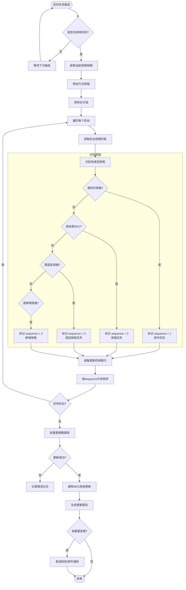

---

## 四、试错分配算法最优解判断逻辑

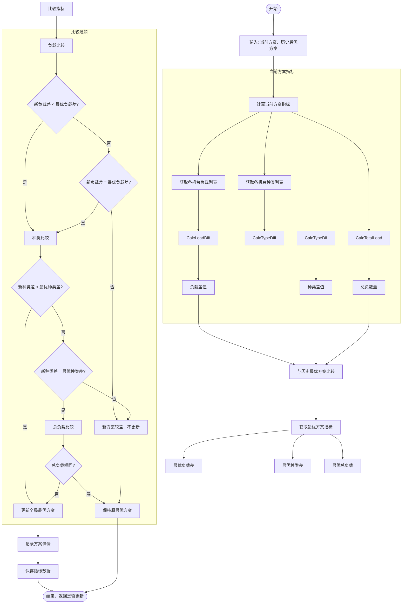

---

## 五、胎面整车波浪交替分配流程（补充）

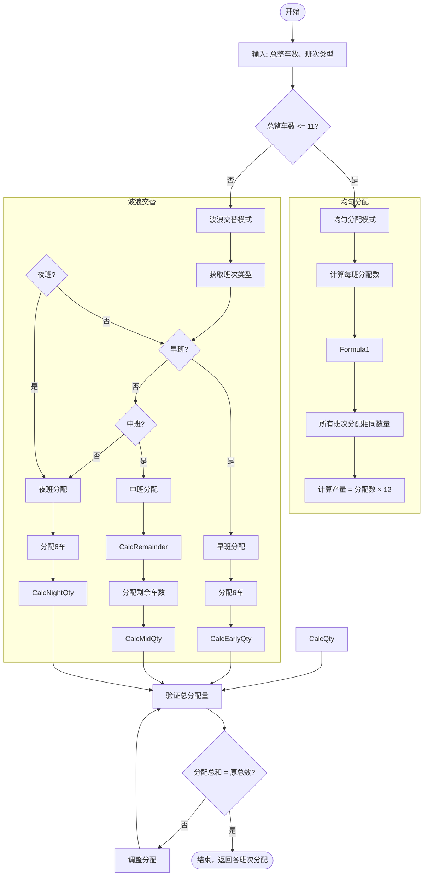

---

## 六、数据校验与初始化详细流程

```mermaid
flowchart TD
    Start([开始]) --> Trigger[触发: 一键生成成型计划]
    Trigger --> Phase1[S5.1 前置校验与初始化]
    
    Phase1 --> CollectData[收集基础数据]
    
    subgraph DataCollection [数据收集]
        CollectData --> Step1[Step 1: 获取胎胚实时库存]
        Step1 --> CallMES1[调用MES接口]
        CallMES1 --> GetInventory[获取胎胚库存数据]
        GetInventory --> ValidateInventory{库存数据有效?}
        ValidateInventory -->|否| ErrorInventory[记录错误: 库存数据异常]
        ValidateInventory -->|是| Step2
        
        Step2[Step 2: 获取成型机在产规格]
        Step2 --> CallMES2[调用MES接口]
        CallMES2 --> GetCurrentSpec[获取当前在产规格]
        GetCurrentSpec --> ValidateSpec{规格数据有效?}
        ValidateSpec -->|否| ErrorSpec[记录错误: 规格数据异常]
        ValidateSpec -->|是| Step3
        
        Step3[Step 3: 获取硫化工序日计划]
        Step3 --> CallMES3[调用MES接口]
        CallMES3 --> GetCuringPlan[获取硫化日计划]
        GetCuringPlan --> ValidateCuring{计划数据有效?}
        ValidateCuring -->|否| ErrorCuring[记录错误: 计划数据异常]
        ValidateCuring -->|是| Step4
        
        Step4[Step 4: 获取可用成型机台]
        Step4 --> QueryDB[查询数据库]
        QueryDB --> GetMachines[获取机台列表]
        GetMachines --> ValidateMachines{机台数据有效?}
        ValidateMachines -->|否| ErrorMachine[记录错误: 机台数据异常]
        ValidateMachines -->|是| Step5
        
        Step5[Step 5: 获取班产标准]
        Step5 --> QueryDB2[查询数据库]
        QueryDB2 --> GetStandards[获取班产标准]
        GetStandards --> ValidateStandards{标准数据有效?}
        ValidateStandards -->|否| ErrorStandard[记录错误: 标准数据异常]
        ValidateStandards -->|是| Step6
        
        Step6[Step 6: 获取配置参数]
        Step6 --> QueryConfig[查询配置中心]
        QueryConfig --> GetConfig[获取配置参数]
        GetConfig --> ValidateConfig{配置数据有效?}
        ValidateConfig -->|否| ErrorConfig[记录错误: 配置数据异常]
        ValidateConfig -->|是| Step7
        
        Step7[Step 7: 获取精度计划]
        Step7 --> QueryDB3[查询数据库]
        QueryDB3 --> GetAccuracy[获取精度计划]
        GetAccuracy --> ValidateAccuracy{精度数据有效?}
        ValidateAccuracy -->|否| ErrorAccuracy[记录错误: 精度数据异常]
        ValidateAccuracy -->|是| Step8
        
        Step8[Step 8: 获取开停产计划]
        Step8 --> QueryDB4[查询数据库]
        QueryDB4 --> GetStopStart[获取开停产计划]
        GetStopStart --> ValidateStopStart{计划数据有效?}
        ValidateStopStart -->|否| ErrorStopStart[记录错误: 开停产计划异常]
        ValidateStopStart -->|是| CheckErrors
    end
    
    CheckErrors{有错误记录?}
    CheckErrors -->|是| BuildErrorMessage[构建错误消息]
    BuildErrorMessage --> ThrowException[抛出数据异常]
    ThrowException --> EndError([结束: 初始化失败])
    CheckErrors -->|否| InitContext
    
    InitContext[初始化排程上下文]
    InitContext --> CreateContext[new MoldingScheduleContext]
    CreateContext --> SetStartDate[设置开始日期]
    SetStartDate --> SetDays[设置计划天数]
    SetDays --> SetMachines[设置机台列表]
    SetMachines --> SetInventories[设置库存数据]
    SetInventories --> SetCuringPlans[设置硫化计划]
    SetCuringPlans --> SetStandards[设置班产标准]
    SetStandards --> SetConfig[设置配置参数]
    SetConfig --> SetStopStart[设置开停产计划]
    SetStopStart --> ValidateContext
    
    ValidateContext[验证上下文完整性]
    ValidateContext --> CheckMachinesAvailable{有机台可用?}
    CheckMachinesAvailable -->|否| ErrorNoMachine[错误: 无可用机台]
    CheckMachinesAvailable -->|是| CheckPlansExist
    
    CheckPlansExist{有硫化计划?}
    CheckPlansExist -->|否| ErrorNoPlan[错误: 无硫化计划]
    CheckPlansExist -->|是| InitSuccess
    
    InitSuccess[初始化成功]
    InitSuccess --> CalcInventoryHours[计算库存时长]
    CalcInventoryHours --> SetContextReady[标记上下文就绪]
    SetContextReady --> ReturnContext
    
    ReturnContext[返回排程上下文]
    ReturnContext --> EndSuccess([结束: 初始化完成])
    
    ErrorInventory --> CheckErrors
    ErrorSpec --> CheckErrors
    ErrorCuring --> CheckErrors
    ErrorMachine --> CheckErrors
    ErrorStandard --> CheckErrors
    ErrorConfig --> CheckErrors
    ErrorAccuracy --> CheckErrors
    ErrorStopStart --> CheckErrors
    
    ErrorNoMachine --> EndError
    ErrorNoPlan --> EndError
```

---

## 七、班次量均衡调整详细流程

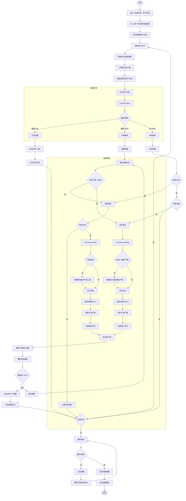

---

## 八、完整数据流向图（补充）

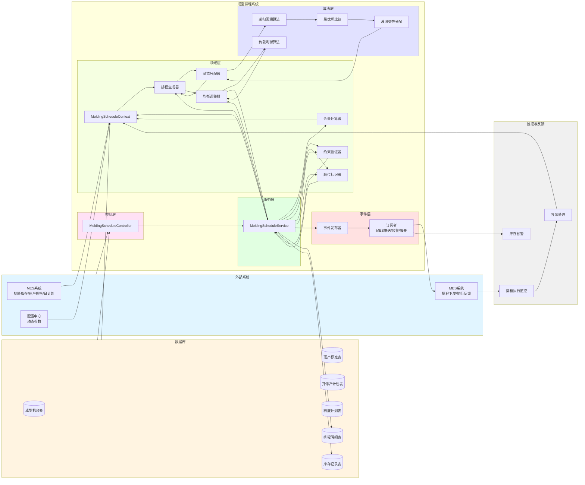

---

## 九、试错分配算法核心逻辑流程图

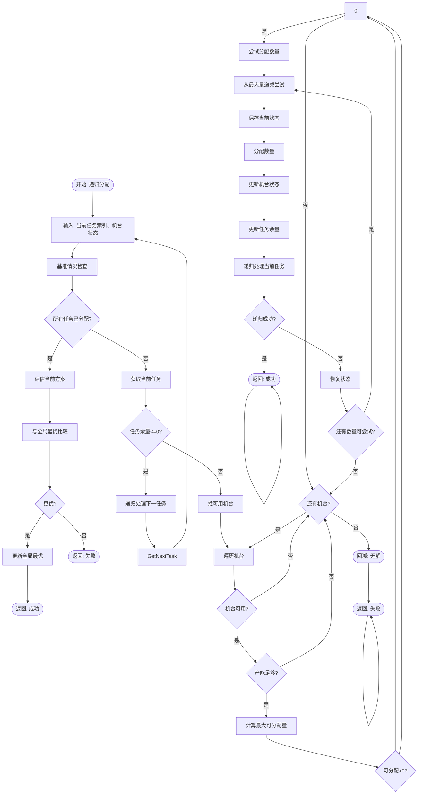

---

## 十、开产首班处理流程

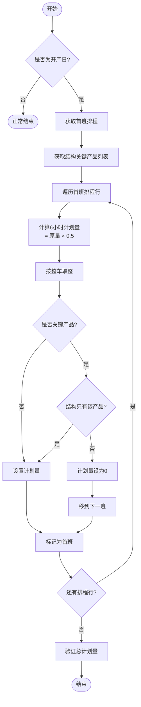

---

## 十一、停产最后一班处理流程

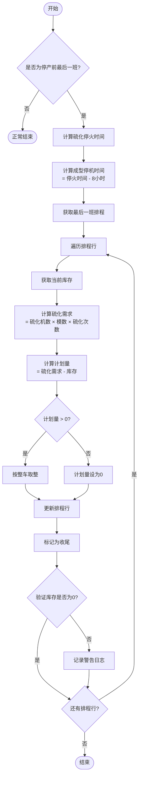

---

## 十二、产能不足处理流程

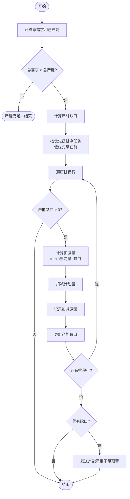

---

## 十三、库存爆满处理流程

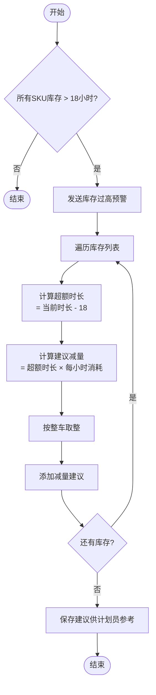

---

## 十四、试制校验流程

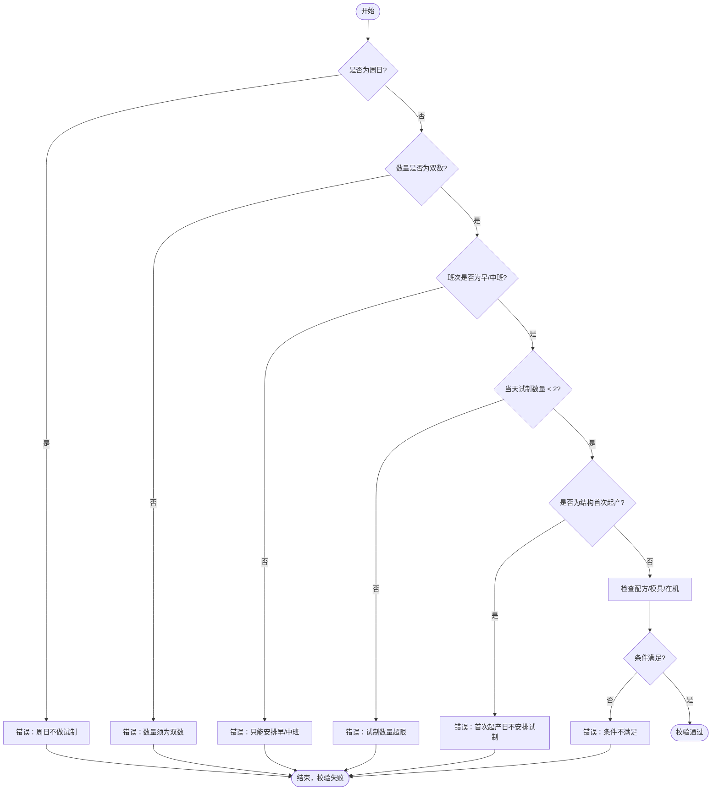

---

## 十五、胎面卷曲异常处理流程

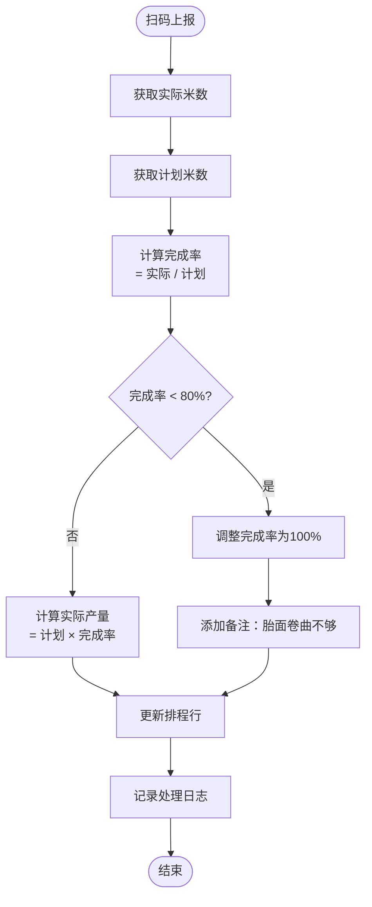

---

## 十六、大卷帘布用完处理流程

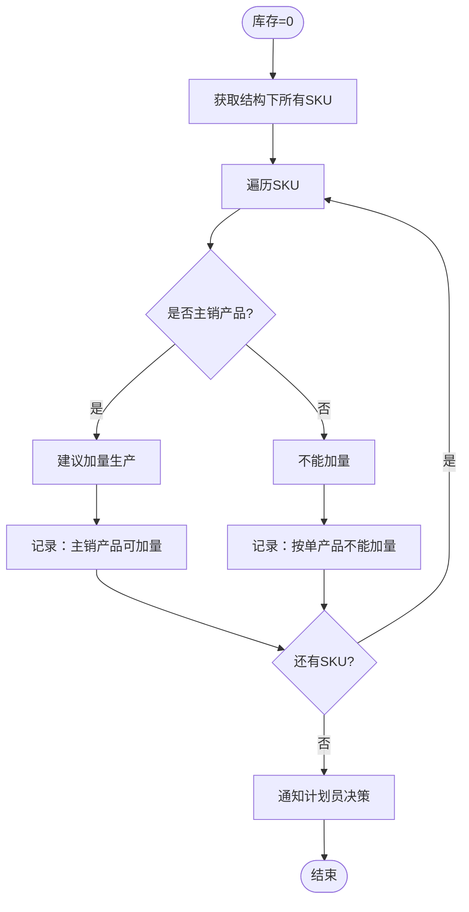

---

## 十七、精度计划冲突处理流程

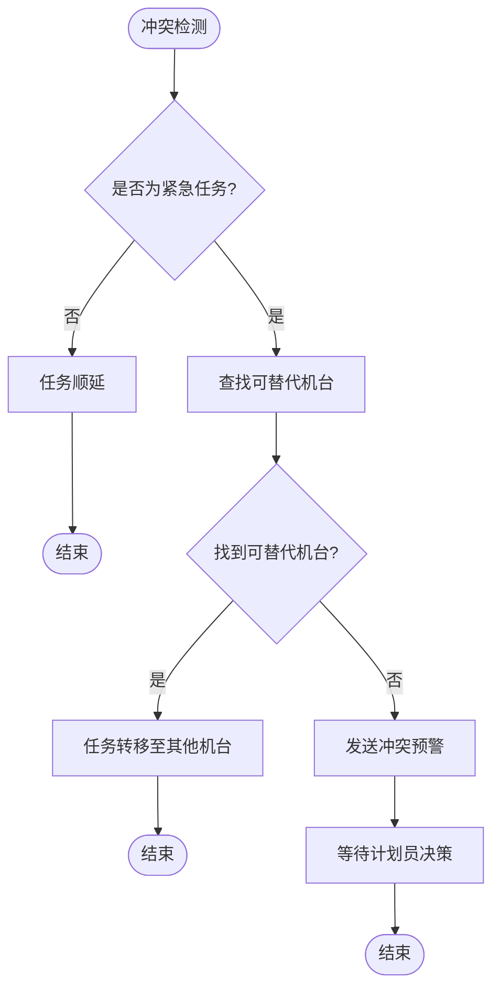

---

## 十八、事务恢复流程

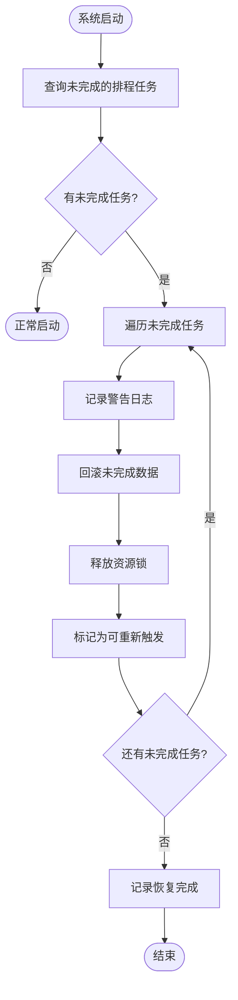

---

## 十九、动态调整并发控制流程

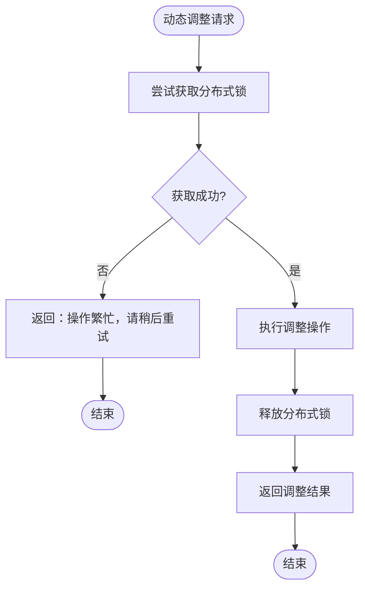

---

## 二十、其他流程图

### 10.1 胎胚库存时长计算流程

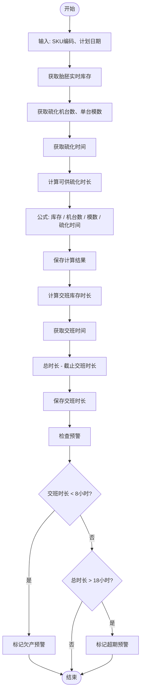

### 10.2 开停产处理流程

```mermaid
flowchart TD
    Start([开始]) --> Input[输入: 计划日期、班次]
    Input --> GetPlans[获取开停产计划]
    GetPlans --> CheckType{计划类型?}
    
    CheckType -->|开产| StartPlan
    CheckType -->|停产| StopPlan
    
    subgraph StartPlanFlow [开产处理]
        StartPlan[开产处理]
        StartPlan --> GetMachineCodes[获取开产机台列表]
        GetMachineCodes --> CheckFirstShift{是否首班开产?}
        CheckFirstShift -->|是| CalcFirstQty[计算首班产量 = 标准×0.5]
        CheckFirstShift -->|否| CalcNormalQty[使用标准产量]
        CalcFirstQty --> CreateScheduleLines
        CalcNormalQty --> CreateScheduleLines
        CreateScheduleLines[创建排程明细]
        CreateScheduleLines --> MarkStarting[标记投产=true]
        MarkStarting --> UpdateStatus[更新计划状态=执行中]
    end
    
    subgraph StopPlanFlow [停产处理]
        StopPlan[停产处理]
        StopPlan --> GetStopMachines[获取停产机台列表]
        GetStopMachines --> CheckStopMode{停产方式?}
        
        CheckStopMode -->|全部收尾| AllEnding
        CheckStopMode -->|分阶段| PhaseEnding
        
        AllEnding[全部收尾]
        AllEnding --> CheckInventory{有在制品库存?}
        CheckInventory -->|是| CalcEndingQty[计算收尾产量 = 库存量]
        CheckInventory -->|否| SetZero[计划量=0]
        CalcEndingQty --> CreateStopLines
        SetZero --> CreateStopLines
        
        PhaseEnding[分阶段收尾]
        PhaseEnding --> CalcPhaseQty[计算分阶段产量]
        CalcPhaseQty --> CreateStopLines
        
        CreateStopLines[创建停产排程明细]
        CreateStopLines --> MarkEnding[标记收尾=true]
        MarkEnding --> RecordReason[记录停产原因]
    end
    
    UpdateStatus --> End
    RecordReason --> End
    End([结束])
```

---

# 第六部分：时序图集

## 一、排程生成主流程时序图

```mermaid
sequenceDiagram
    autonumber
    participant User as 用户
    participant Controller as MoldingScheduleController
    participant Service as MoldingScheduleService
    participant DataCollector as DataCollector
    participant MES as MES系统
    participant DB as 数据库
    participant Generator as DefaultScheduleGenerator
    participant TrialAlloc as 试错分配器
    participant Optimizer1 as StructureBalanceOptimizer
    participant Optimizer2 as ShiftBalanceOptimizer
    participant Optimizer3 as InventoryDynamicAdjuster
    participant Validator as ConstraintValidator
    participant Publisher as EventPublisher

    User->>Controller: generateSchedule(startDate, days)
    Controller->>Service: generateSchedule(context)

    Service->>DataCollector: collectScheduleData(startDate, days)
    
    rect rgb(200, 220, 240)
        Note over DataCollector, DB: 数据收集阶段
        DataCollector->>MES: 获取胎胚实时库存
        MES-->>DataCollector: 库存数据
        DataCollector->>MES: 获取成型在产规格
        MES-->>DataCollector: 在产规格数据
        DataCollector->>MES: 获取硫化工序日计划
        MES-->>DataCollector: 硫化日计划
        DataCollector->>DB: 查询可用成型机台
        DB-->>DataCollector: 机台列表
        DataCollector->>DB: 查询班产标准
        DB-->>DataCollector: 班产标准
        DataCollector->>DB: 查询配置参数
        DB-->>DataCollector: 配置参数
    end
    
    DataCollector-->>Service: MoldingScheduleContext

    rect rgb(240, 200, 220)
        Note over Service: 余量计算阶段
        Service->>Service: calcMoldingRemainder()
        Service->>Service: markEndingSku()
    end

    Service->>Generator: generate(context)

    rect rgb(220, 240, 200)
        Note over Generator, TrialAlloc: 排程生成阶段
        loop 每天每个班次
            Generator->>Generator: processContinuation()
            Generator->>Generator: processNewSpecifications()
            Generator->>TrialAlloc: 试错分配
            TrialAlloc->>TrialAlloc: 递归回溯寻找最优解
            TrialAlloc->>TrialAlloc: 比较负载和种类差
            TrialAlloc-->>Generator: 最优分配方案
        end
    end

    Generator-->>Service: 初始排程列表

    rect rgb(240, 220, 180)
        Note over Service, Optimizer3: 优化阶段
        Service->>Optimizer1: 优化结构均衡
        Optimizer1->>Optimizer1: balanceDownward()
        Optimizer1->>Optimizer1: checkStructureBalance()
        Optimizer1-->>Service: 结构均衡后的排程

        Service->>Optimizer2: 优化班次均衡
        Optimizer2->>Optimizer2: balanceByShift()
        Optimizer2->>Optimizer2: compareWithStandard()
        Optimizer2-->>Service: 班次均衡后的排程

        Service->>Optimizer3: 动态库存调整
        Optimizer3->>Optimizer3: adjustByInventory()
        Optimizer3->>Optimizer3: increaseQty() / decreaseQty()
        Optimizer3-->>Service: 最终排程
    end

    rect rgb(200, 240, 240)
        Note over Service, Validator: 约束验证阶段
        Service->>Validator: validate(lines, context)
        Validator->>Validator: SkuTypeCountHandler
        Validator->>Validator: MoldingCuringRatioHandler
        Validator->>Validator: StructureSwitchHandler
        Validator-->>Service: ValidationResult
    end

    alt 验证通过
        Service->>DB: batchInsert(scheduleLines)
        DB-->>Service: 插入成功
        Service->>Publisher: publish(ScheduleGeneratedEvent)
        Publisher->>MES: 推送排程结果
        Publisher->>Publisher: 检查库存预警
        Service-->>Controller: ScheduleResult(成功)
    else 验证失败
        Service-->>Controller: ScheduleResult(失败, 违规记录)
    end

    Controller-->>User: 返回排程结果
```

---

## 二、续作处理时序图

```mermaid
sequenceDiagram
    autonumber
    participant Service as MoldingScheduleService
    participant Context as MoldingScheduleContext
    participant InMachineMap as 在产规格映射
    participant MachineService as 机台服务
    participant ScheduleLine as 排程明细

    Service->>Context: 获取在产规格映射
    Context-->>Service: Map<MachineCode, SkuCode>

    loop 遍历每个机台
        Service->>MachineService: 获取机台(machineCode)
        MachineService-->>Service: MoldingMachine

        Service->>InMachineMap: 查询在产规格
        InMachineMap-->>Service: skuCode

        alt 机台有在产规格
            Service->>Context: 查询SKU余量(skuCode)
            Context-->>Service: MoldingRemainder

            alt 余量 > 0
                Service->>Service: 计算续作计划量
                Note right of Service: 使用班产标准

                Service->>ScheduleLine: 构建排程明细
                ScheduleLine-->>Service: MoldingScheduleLine

                Service->>ScheduleLine: 设置属性
                Note right of Service: productionMode=续作<br/>isStarting=0

                Service->>Context: 更新余量
                Service->>Context: 添加到排程列表
            end
        end
    end

    Service-->>Service: 续作排产完成
```

---

## 三、新增规格排产时序图

```mermaid
sequenceDiagram
    autonumber
    participant Service as MoldingScheduleService
    participant Context as MoldingScheduleContext
    participant TaskList as 待排产任务列表
    participant TrialAlloc as 试错分配器
    participant Algorithm as 递归回溯算法
    participant MachineSelector as 机台选择器

    Service->>Context: 获取待排产任务列表
    Context-->>Service: List<MoldingRemainder>

    Service->>TaskList: 过滤未排产任务
    TaskList-->>Service: 已过滤列表

    loop 遍历待排产任务
        Service->>TaskList: 获取当前任务
        TaskList-->>Service: MoldingRemainder

        alt 余量 > 0
            Service->>TrialAlloc: 试错分配(task, machines)

            TrialAlloc->>Algorithm: 执行递归回溯
            loop 递归尝试所有方案
                Algorithm->>Algorithm: 尝试分配到某机台
                Algorithm->>Algorithm: 保存状态
                Algorithm->>Algorithm: 递归处理下一任务

                alt 递归成功
                    Algorithm->>Algorithm: 返回成功
                else 递归失败
                    Algorithm->>Algorithm: 恢复状态
                    Algorithm->>Algorithm: 尝试下一个机台
                end
            end

            Algorithm->>Algorithm: 比较所有方案
            Algorithm->>Algorithm: 选择最优解

            Algorithm-->>TrialAlloc: 最优分配方案
            TrialAlloc-->>Service: Map<MachineCode, Quantity>

            Service->>Service: 构建排程明细
            Service->>Context: 更新余量
        end
    end

    Service-->>Service: 新增规格排产完成
```

---

## 四、结构均衡优化时序图

```mermaid
sequenceDiagram
    autonumber
    participant Optimizer as StructureBalanceOptimizer
    participant ScheduleList as 排程列表
    participant StandardMap as 班产标准映射
    participant GroupMap as 结构分组映射
    participant Validator as 约束验证器

    Optimizer->>ScheduleList: 获取排程列表
    ScheduleList-->>Optimizer: List<MoldingSchedule>

    Optimizer->>Optimizer: 按结构分组
    Optimizer->>GroupMap: 创建分组映射

    loop 遍历每个结构
        Optimizer->>GroupMap: 获取该结构的排程
        GroupMap-->>Optimizer: List<MoldingSchedule>

        Optimizer->>StandardMap: 查询班产标准
        StandardMap-->>Optimizer: StructureShiftStandard

        Optimizer->>Validator: 检查胎胚种类数约束
        Validator-->>Optimizer: 约束检查结果

        alt 约束违反
            Optimizer->>Optimizer: 调整分配
            Note right of Optimizer: 调整至固定规格机台
        end

        Optimizer->>Validator: 检查成型硫化配比
        Validator-->>Optimizer: 配比检查结果

        alt 配比超限
            Optimizer->>Optimizer: 减少生产量
            Note right of Optimizer: 调整至配比范围内
        end

        Optimizer->>Validator: 检查结构均衡
        Validator-->>Optimizer: 均衡检查结果

        alt 不均衡
            Optimizer->>Optimizer: 调整产量分布
            Note right of Optimizer: 确保种类数差异<=1
        end
    end

    Optimizer-->>Optimizer: 结构均衡完成
```

---

## 五、库存动态调整时序图

```mermaid
sequenceDiagram
    autonumber
    participant Adjuster as InventoryDynamicAdjuster
    participant Strategy as 策略工厂
    participant InventoryMap as 库存映射
    participant ScheduleList as 排程列表
    participant StrategyInc as 增加策略
    participant StrategyDec as 减少策略

    Adjuster->>ScheduleList: 获取排程列表
    ScheduleList-->>Adjuster: List<MoldingSchedule>

    loop 遍历每个排程
        Adjuster->>ScheduleList: 获取SKU
        ScheduleList-->>Adjuster: skuCode

        Adjuster->>InventoryMap: 查询库存
        InventoryMap-->>Adjuster: MoldingInventory

        Adjuster->>Adjuster: 判断策略类型
        Note right of Adjuster: 基于交班库存时长

        alt 库存不足 (<8小时)
            Adjuster->>Strategy: 获取增加策略
            Strategy-->>Adjuster: IncreaseQuantityStrategy

            Adjuster->>StrategyInc: 执行调整
            StrategyInc->>StrategyInc: 计算增加量(+12)
            StrategyInc->>ScheduleList: 更新计划量
            StrategyInc-->>Adjuster: 调整结果
        else 库存充足 (>18小时)
            Adjuster->>Strategy: 获取减少策略
            Strategy-->>Adjuster: DecreaseQuantityStrategy

            Adjuster->>StrategyDec: 执行调整
            StrategyDec->>StrategyDec: 计算减少量(-12)
            StrategyDec->>ScheduleList: 更新计划量
            StrategyDec-->>Adjuster: 调整结果
        end
    end

    Adjuster-->>Adjuster: 库存调整完成
```

---

## 六、约束验证时序图

```mermaid
sequenceDiagram
    autonumber
    participant Validator as ConstraintValidator
    participant Chain as 责任链
    participant Handler1 as SkuTypeCountHandler
    participant Handler2 as MoldingCuringRatioHandler
    participant Handler3 as StructureSwitchHandler
    participant Context as 排程上下文
    participant Result as ValidationResult

    Validator->>Chain: 构建责任链
    Chain->>Handler1: 设置下一个处理器
    Handler1->>Handler2: 设置下一个处理器
    Handler2->>Handler3: 设置下一个处理器

    Validator->>Handler1: handle(context)

    rect rgb(200, 220, 240)
        Note over Handler1: 处理器1: 胎胚种类数检查
        Handler1->>Context: 获取排程列表
        Context-->>Handler1: schedules

        Handler1->>Handler1: 按机台分组
        Handler1->>Handler1: 计算每台机台的SKU种类数

        alt 超过4种
            Handler1->>Context: 添加违规记录
            Handler1->>Handler1: 返回false
        end

        Handler1->>Handler2: 转交下一个处理器
    end

    rect rgb(220, 240, 200)
        Note over Handler2: 处理器2: 成型硫化配比检查
        Handler2->>Context: 获取排程列表
        Context-->>Handler2: schedules

        Handler2->>Handler2: 计算实际配比

        alt 配比超限
            Handler2->>Context: 添加违规记录
            Handler2->>Handler2: 返回false
        end

        Handler2->>Handler3: 转交下一个处理器
    end

    rect rgb(240, 220, 180)
        Note over Handler3: 处理器3: 结构切换次数检查
        Handler3->>Context: 获取结构切换记录
        Context-->>Handler3: switches

        Handler3->>Handler3: 按日期统计切换次数

        alt 超过2次
            Handler3->>Context: 添加违规记录
            Handler3->>Handler3: 返回false
        end
    end

    Handler3-->>Validator: 检查结果

    Validator->>Result: 构建验证结果
    Validator-->>Validator: 返回ValidationResult
```

---

## 七、数据收集时序图

```mermaid
sequenceDiagram
    autonumber
    participant Collector as DataCollector
    participant MES as MES系统
    participant DB as 数据库
    participant Config as 配置中心
    participant Context as MoldingScheduleContext

    rect rgb(200, 220, 240)
        Note over Collector, MES: MES数据收集
        Collector->>MES: 调用胎胚库存接口
        MES-->>Collector: List<TireEmbryoInventory>

        Collector->>MES: 调用在产规格接口
        MES-->>Collector: Map<MachineCode, SkuCode>

        Collector->>MES: 调用硫化日计划接口
        MES-->>Collector: List<CuringDailyPlan>
    end

    rect rgb(220, 240, 200)
        Note over Collector, DB: 数据库查询
        Collector->>DB: 查询成型机台
        DB-->>Collector: List<MoldingMachine>

        Collector->>DB: 查询班产标准
        DB-->>Collector: Map<Structure, Standard>

        Collector->>DB: 查询精度计划
        DB-->>Collector: List<AccuracyPlan>

        Collector->>DB: 查询开停产计划
        DB-->>Collector: List<StartStopPlan>
    end

    rect rgb(240, 220, 180)
        Note over Collector, Config: 配置获取
        Collector->>Config: 获取动态配置
        Config-->>Collector: ConfigMap
    end

    Collector->>Context: 构建排程上下文
    Collector->>Context: 设置MES数据
    Collector->>Context: 设置数据库数据
    Collector->>Context: 设置配置参数

    Collector->>Context: 验证数据完整性
    Context-->>Collector: 验证结果

    alt 数据有效
        Collector-->>Collector: 返回有效上下文
    else 数据异常
        Collector-->>Collector: 抛出异常
    end
```

---

## 八、事件发布时序图

```mermaid
sequenceDiagram
    autonumber
    participant Service as 排程服务
    participant EventBus as 事件总线
    participant Event as 排程生成事件
    participant Sub1 as MES通知观察者
    participant Sub2 as 库存预警观察者
    participant Sub3 as 报表生成观察者
    participant MES as MES系统
    participant Notify as 通知服务

    Service->>Service: 生成排程完成
    Service->>EventBus: publish(ScheduleGeneratedEvent)

    rect rgb(200, 220, 240)
        Note over EventBus, Sub1: 事件广播
        EventBus->>Sub1: onScheduleGenerated(event)
        EventBus->>Sub2: onScheduleGenerated(event)
        EventBus->>Sub3: onScheduleGenerated(event)
    end

    rect rgb(220, 240, 200)
        Note over Sub1, MES: MES通知
        Sub1->>MES: 推送排程结果
        MES-->>Sub1: 推送成功
        Sub1->>Sub1: 记录日志
    end

    rect rgb(240, 220, 180)
        Note over Sub2: 库存预警检查
        Sub2->>Sub2: 检查所有SKU库存
        alt 有库存异常
            Sub2->>Notify: 发送预警通知
            Notify-->>Sub2: 通知已发送
        end
    end

    rect rgb(200, 240, 240)
        Note over Sub3: 报表生成
        Sub3->>Sub3: 生成排程报表
        Sub3->>Sub3: 保存到文件
        Sub3->>Sub3: 发送邮件
    end

    Service-->>Service: 事件发布完成
```

---

# 第七部分：UML类图集

## 一、核心类图

```mermaid
classDiagram
    %% 控制层
    class MoldingScheduleController {
        +generateSchedule(LocalDate startDate, int days) Result~ScheduleResult~
        +getScheduleResult(String scheduleId) ScheduleResultDTO
    }

    %% 服务层
    class MoldingScheduleService {
        -IMoldingScheduleRepository scheduleRepository
        -IDataCollector dataCollector
        -IScheduleGenerator scheduleGenerator
        -IOptimizer optimizer
        -IConstraintValidator validator
        -IEventPublisher eventPublisher
        +generateSchedule(MoldingScheduleContext context) ScheduleResult
        +calcMoldingRemainder(List~CuringDailyPlan~ plans) Map~String, BigDecimal~
    }

    %% 领域模型
    class MoldingScheduleContext {
        +LocalDate startDate
        +int days
        +List~MoldingMachine~ machines
        +List~TireEmbryoInventory~ inventories
        +List~CuringDailyPlan~ curingPlans
        +Map~String, Object~ configParams
        +List~MoldingScheduleLine~ scheduleLines
        +addScheduleLine(MoldingScheduleLine line)
        +getScheduleLines() List~MoldingScheduleLine~
    }

    class MoldingScheduleLine {
        +Long id
        +String scheduleId
        +LocalDate planDate
        +String shiftType
        +String machineCode
        +String machineType
        +String sku
        +String structure
        +BigDecimal planQty
        +BigDecimal actualQty
        +String productionMode
        +Integer sequence
        +Boolean isEnding
        +BigDecimal remainderQty
        +LocalDateTime createTime
    }

    class MoldingMachine {
        +String machineCode
        +String machineType
        +String fixedStructure1
        +String fixedStructure2
        +String fixedStructure3
        +Boolean isAvailable
        +BigDecimal capacityPerShift
        +String accuracyPlan
        +Boolean isStop
        +getCurrentLoad() BigDecimal
    }

    class TireEmbryoInventory {
        +String sku
        +BigDecimal quantity
        +BigDecimal availableHours
        +BigDecimal shiftEndHours
        +Boolean isOverstock
        +Boolean isUnderstock
    }

    class CuringDailyPlan {
        +String sku
        +String structure
        +BigDecimal planQty
        +BigDecimal completedQty
        +LocalDate planDate
        +Integer priority
        +Boolean isEnding
        +getRemainder() BigDecimal
    }

    class MoldingStandard {
        +String structure
        +String shiftType
        +BigDecimal standardQtyPerShift
        +BigDecimal minQty
        +BigDecimal maxQty
    }

    %% 数据收集器
    class DataCollector {
        -IMoldingScheduleRepository scheduleRepository
        -IMoldingMachineRepository machineRepository
        -ITireEmbryoInventoryRepository inventoryRepository
        -ICuringDailyPlanRepository curingPlanRepository
        -IMoldingStandardRepository standardRepository
        +collectScheduleData(LocalDate startDate, int days) MoldingScheduleContext
    }

    %% 排程生成器
    interface IScheduleGenerator {
        <<interface>>
        +generate(MoldingScheduleContext context) List~MoldingScheduleLine~
    }

    class DefaultScheduleGenerator {
        -MoldingRemainderCalculator remainderCalculator
        -MoldingPlanHelper planHelper
        +generate(MoldingScheduleContext context) List~MoldingScheduleLine~
        -processContinuation(MoldingScheduleContext context, LocalDate date, String shiftType)
        -processNewSpecifications(MoldingScheduleContext context, LocalDate date, String shiftType)
        -selectMachine(String structure, List~MoldingMachine~ machines) MoldingMachine
    }

    class MoldingRemainderCalculator {
        +calcRemainder(List~CuringDailyPlan~ plans, List~TireEmbryoInventory~ inventories) Map~String, BigDecimal~
        +markEndingSku(List~CuringDailyPlan~ plans, int days)
    }

    class MoldingPlanHelper {
        +calculateProductionQty(String sku, BigDecimal remainder, MoldingMachine machine) BigDecimal
        +handleStartStopPlan(MoldingScheduleContext context, LocalDate date, String shiftType)
        +handleAccuracyPlan(MoldingScheduleContext context, LocalDate date, String shiftType)
    }

    %% 试错分配器
    class TrialAllocationService {
        +allocate(List~MoldingRemainder~ tasks, List~MoldingMachine~ machines) Map~String, BigDecimal~
        -recursiveAllocate(int taskIndex, List~MoldingAllocationState~ states) boolean
        -compareSolutions(List~MoldingAllocationState~ solutions) MoldingAllocationState
        -evaluateSolution(MoldingAllocationState state) SolutionMetrics
    }

    class MoldingAllocationState {
        +Map~String, BigDecimal~ machineLoads
        +Map~String, Integer~ machineSkuCounts
        +Map~String, BigDecimal~ taskRemainders
        +List~StructureSwitch~ switches
        +deepCopy() MoldingAllocationState
    }

    class SolutionMetrics {
        +BigDecimal loadDiff
        +Integer typeDiff
        +BigDecimal totalLoad
        +Integer switchCount
    }

    %% 优化器
    interface IOptimizer {
        <<interface>>
        +optimize(List~MoldingScheduleLine~ lines, MoldingScheduleContext context) List~MoldingScheduleLine~
    }

    class StructureBalanceOptimizer {
        +optimize(List~MoldingScheduleLine~ lines, MoldingScheduleContext context) List~MoldingScheduleLine~
        -balanceDownward(List~MoldingScheduleLine~ lines)
        -checkStructureBalance(List~MoldingScheduleLine~ lines) boolean
    }

    class ShiftBalanceOptimizer {
        +optimize(List~MoldingScheduleLine~ lines, MoldingScheduleContext context) List~MoldingScheduleLine~
        -balanceByShift(List~MoldingScheduleLine~ lines)
        -compareWithStandard(MoldingScheduleLine line, MoldingStandard standard) BigDecimal
    }

    class InventoryDynamicAdjuster {
        +optimize(List~MoldingScheduleLine~ lines, MoldingScheduleContext context) List~MoldingScheduleLine~
        -adjustByInventory(List~MoldingScheduleLine~ lines, Map~String, TireEmbryoInventory~ inventories)
        -increaseQty(MoldingScheduleLine line)
        -decreaseQty(MoldingScheduleLine line)
    }

    %% 约束验证器
    interface IConstraintValidator {
        <<interface>>
        +validate(List~MoldingScheduleLine~ lines, MoldingScheduleContext context) ValidationResult
    }

    class ConstraintValidator {
        -List~IValidationHandler~ handlers
        +validate(List~MoldingScheduleLine~ lines, MoldingScheduleContext context) ValidationResult
        +addHandler(IValidationHandler handler)
    }

    interface IValidationHandler {
        <<interface>>
        +handle(List~MoldingScheduleLine~ lines, MoldingScheduleContext context) Violation
    }

    class SkuTypeCountHandler {
        +handle(List~MoldingScheduleLine~ lines, MoldingScheduleContext context) Violation
    }

    class MoldingCuringRatioHandler {
        +handle(List~MoldingScheduleLine~ lines, MoldingScheduleContext context) Violation
    }

    class StructureSwitchHandler {
        +handle(List~MoldingScheduleLine~ lines, MoldingScheduleContext context) Violation
    }

    class ValidationResult {
        +boolean isValid
        +List~Violation~ violations
    }

    class Violation {
        +String type
        +String message
        +Object details
    }

    %% 关系定义
    MoldingScheduleController ..> MoldingScheduleService : uses
    MoldingScheduleService *-- IMoldingScheduleRepository : uses
    MoldingScheduleService *-- IDataCollector : uses
    MoldingScheduleService *-- IScheduleGenerator : uses
    MoldingScheduleService *-- IOptimizer : uses
    MoldingScheduleService *-- IConstraintValidator : uses
    MoldingScheduleService *-- IEventPublisher : uses

    DataCollector ..> IMoldingMachineRepository : uses
    DataCollector ..> ITireEmbryoInventoryRepository : uses
    DataCollector ..> ICuringDailyPlanRepository : uses
    DataCollector ..> IMoldingStandardRepository : uses

    MoldingScheduleContext o-- MoldingMachine : contains
    MoldingScheduleContext o-- TireEmbryoInventory : contains
    MoldingScheduleContext o-- CuringDailyPlan : contains
    MoldingScheduleContext o-- MoldingScheduleLine : contains

    DefaultScheduleGenerator ..|> IScheduleGenerator : implements
    DefaultScheduleGenerator *-- MoldingRemainderCalculator : uses
    DefaultScheduleGenerator *-- MoldingPlanHelper : uses
    DefaultScheduleGenerator *-- TrialAllocationService : uses

    TrialAllocationService *-- MoldingAllocationState : uses
    TrialAllocationService *-- SolutionMetrics : uses

    StructureBalanceOptimizer ..|> IOptimizer : implements
    ShiftBalanceOptimizer ..|> IOptimizer : implements
    InventoryDynamicAdjuster ..|> IOptimizer : implements

    ConstraintValidator ..|> IConstraintValidator : implements
    ConstraintValidator o-- IValidationHandler : contains

    SkuTypeCountHandler ..|> IValidationHandler : implements
    MoldingCuringRatioHandler ..|> IValidationHandler : implements
    StructureSwitchHandler ..|> IValidationHandler : implements

    ValidationResult o-- Violation : contains

    MoldingScheduleService --> MoldingScheduleContext : creates
    MoldingScheduleService --> ScheduleResultDTO : returns
```

---

# 第八部分：架构设计优化方案

## 一、设计模式应用

### 1.1 策略模式（核心应用场景）

**应用场景1：胎胚库存时长动态调整策略**

通过策略模式实现不同的库存调整逻辑，系统可以根据库存时长自动选择合适的调整策略。

```java
// 策略接口
public interface InventoryAdjustmentStrategy {
    /**
     * 调整计划量
     * @param schedule 待调整的排程
     * @param inventory 库存信息
     * @return 调整后的计划量
     */
    int adjustQuantity(MoldingSchedule schedule, MoldingInventory inventory);
}

// 具体策略：增加产量策略（库存不足）
@Component("increaseStrategy")
public class IncreaseQuantityStrategy implements InventoryAdjustmentStrategy {
    
    @Value("${molding.inventory.warning.threshold:8}")
    private BigDecimal warningThreshold;
    
    @Value("${molding.vehicle.capacity:12}")
    private int vehicleCapacity;
    
    @Override
    public int adjustQuantity(MoldingSchedule schedule, MoldingInventory inventory) {
        // 交班库存时长 < 阈值，增加1个整车
        if (inventory.getShiftEndAvailableHours().compareTo(warningThreshold) < 0) {
            log.info("SKU {} 库存时长 {} 小时 < {}，增加 {} 条",
                     schedule.getSkuCode(), inventory.getShiftEndAvailableHours(),
                     warningThreshold, vehicleCapacity);
            return schedule.getPlanQuantity() + vehicleCapacity;
        }
        return schedule.getPlanQuantity();
    }
}

// 具体策略：减少产量策略（库存充足）
@Component("decreaseStrategy")
public class DecreaseQuantityStrategy implements InventoryAdjustmentStrategy {
    
    @Value("${molding.vehicle.capacity:12}")
    private int vehicleCapacity;
    
    @Override
    public int adjustQuantity(MoldingSchedule schedule, MoldingInventory inventory) {
        // 库存充足，减少1个整车（但不低于最低产量）
        int decreasedQuantity = schedule.getPlanQuantity() - vehicleCapacity;
        return Math.max(schedule.getMinPlanQuantity(), decreasedQuantity);
    }
}

// 策略工厂
@Service
public class InventoryAdjustmentStrategyFactory {
    
    private final Map<String, InventoryAdjustmentStrategy> strategyMap;
    
    @Autowired
    public InventoryAdjustmentStrategyFactory(
            List<InventoryAdjustmentStrategy> strategies) {
        this.strategyMap = strategies.stream()
            .collect(Collectors.toMap(
                s -> s.getClass().getAnnotation(Component.class).value(),
                Function.identity()
            ));
    }
    
    public InventoryAdjustmentStrategy getStrategy(String strategyName) {
        return strategyMap.get(strategyName);
    }
}
```

**应用场景2：班次产量分配策略（波浪交替）**

支持波浪交替和均匀分配两种模式，可根据配置动态切换。

```java
public interface ShiftQuantityStrategy {
    int calculateShiftVehicleCount(int totalVehicleCount, int shiftType);
}

// 波浪交替策略（6-12-6）
@Component("waveStrategy")
public class WaveShiftQuantityStrategy implements ShiftQuantityStrategy {
    
    @Override
    public int calculateShiftVehicleCount(int totalVehicleCount, int shiftType) {
        if (totalVehicleCount <= 11) {
            return (int) Math.ceil(totalVehicleCount / 3.0);
        }
        
        switch (shiftType) {
            case 1: return 11; // 早班
            case 2: return totalVehicleCount - 12; // 中班
            case 3: return 11; // 夜班
            default: return (int) Math.ceil(totalVehicleCount / 3.0);
        }
    }
}

// 均匀分配策略（备选）
@Component("evenStrategy")
public class EvenShiftQuantityStrategy implements ShiftQuantityStrategy {
    
    @Override
    public int calculateShiftVehicleCount(int totalVehicleCount, int shiftType) {
        return (int) Math.ceil(totalVehicleCount / 3.0);
    }
}
```

### 1.2 责任链模式

**应用场景：排程约束检查**

通过责任链模式实现多个约束检查器的串联，每个检查器独立负责一种约束的验证。

```java
// 约束检查处理器抽象类
public abstract class ScheduleConstraintHandler {
    
    protected ScheduleConstraintHandler nextHandler;
    
    public void setNext(ScheduleConstraintHandler next) {
        this.nextHandler = next;
    }
    
    /**
     * 检查约束
     * @param context 排程上下文
     * @return true-通过检查，false-不通过
     */
    public abstract boolean handle(SchedulingContext context);
    
    protected boolean handleNext(SchedulingContext context) {
        if (nextHandler != null) {
            return nextHandler.handle(context);
        }
        return true;
    }
}

// 具体处理器1：胎胚种类数约束检查
@Component
public class SkuTypeCountHandler extends ScheduleConstraintHandler {
    
    @Value("${molding.max.sku.per.machine:4}")
    private int maxSkuPerMachine;
    
    @Override
    public boolean handle(SchedulingContext context) {
        Map<String, List<MoldingSchedule>> machineSchedules = 
            context.getSchedules().stream()
                .collect(Collectors.groupingBy(MoldingSchedule::getMachineCode));
        
        for (Map.Entry<String, List<MoldingSchedule>> entry : machineSchedules.entrySet()) {
            long skuCount = entry.getValue().stream()
                .map(MoldingSchedule::getSkuCode)
                .distinct()
                .count();
            
            if (skuCount > maxSkuPerMachine) {
                context.addViolation(String.format(
                    "机台 %s 胎胚种类数 %d 超过限制 %d",
                    entry.getKey(), skuCount, maxSkuPerMachine));
                return false;
            }
        }
        
        return handleNext(context);
    }
}

// 具体处理器2：成型硫化配比约束检查
@Component
public class MoldingCuringRatioHandler extends ScheduleConstraintHandler {
    
    @Override
    public boolean handle(SchedulingContext context) {
        // 检查成型硫化配比
        for (MoldingSchedule schedule : context.getSchedules()) {
            StructureShiftStandard standard = 
                context.getStructureStandard(schedule.getProductStructure());
            
            if (standard != null && standard.getCuringMachineCount() != null) {
                // 检查是否超限
                int actualCuringMachines = calculateActualCuringMachines(schedule);
                if (actualCuringMachines > standard.getCuringMachineCount()) {
                    context.addViolation(String.format(
                        "SKU %s 成型硫化配比超限：实际 %d，限制 %d",
                        schedule.getSkuCode(), actualCuringMachines,
                        standard.getCuringMachineCount()));
                    return false;
                }
            }
        }
        
        return handleNext(context);
    }
}

// 具体处理器3：结构切换次数约束检查
@Component
public class StructureSwitchCountHandler extends ScheduleConstraintHandler {
    
    @Value("${molding.max.structure.switch.per.day:2}")
    private int maxSwitchCount;
    
    @Override
    public boolean handle(SchedulingContext context) {
        // 按日期统计结构切换次数
        Map<LocalDate, Long> switchCountMap = context.getStructureSwitches().stream()
            .collect(Collectors.groupingBy(
                StructureSwitch::getSwitchDate,
                Collectors.counting()
            ));
        
        for (Map.Entry<LocalDate, Long> entry : switchCountMap.entrySet()) {
            if (entry.getValue() > maxSwitchCount) {
                context.addViolation(String.format(
                    "日期 %s 结构切换次数 %d 超过限制 %d",
                    entry.getKey(), entry.getValue(), maxSwitchCount));
                return false;
            }
        }
        
        return handleNext(context);
    }
}

// 责任链构建器
@Component
public class ConstraintChainBuilder {
    
    @Autowired
    private SkuTypeCountHandler skuTypeCountHandler;
    
    @Autowired
    private MoldingCuringRatioHandler moldingCuringRatioHandler;
    
    @Autowired
    private StructureSwitchCountHandler structureSwitchCountHandler;
    
    public ScheduleConstraintHandler buildChain() {
        skuTypeCountHandler.setNext(moldingCuringRatioHandler);
        moldingCuringRatioHandler.setNext(structureSwitchCountHandler);
        return skuTypeCountHandler;
    }
}
```

### 1.3 工厂模式

**应用场景：排程生成器工厂**

支持不同类型的排程生成器（月度、周度、日度），根据计划类型自动选择合适的生成器。

```java
// 排程生成器接口
public interface ScheduleGenerator {
    List<MoldingSchedule> generate(SchedulingContext context);
}

// 月度排程生成器
@Component("monthlyGenerator")
public class MonthlyScheduleGenerator implements ScheduleGenerator {
    
    @Override
    public List<MoldingSchedule> generate(SchedulingContext context) {
        // 月度排程逻辑：考虑结构切换、降模、特殊材料约束
        List<MoldingSchedule> schedules = new ArrayList<>();
        // ...
        return schedules;
    }
}

// 日排程生成器
@Component("dailyGenerator")
public class DailyScheduleGenerator implements ScheduleGenerator {
    
    @Override
    public List<MoldingSchedule> generate(SchedulingContext context) {
        // 日排程逻辑：T/T+1/T+2日，胎胚库存时长动态调整
        List<MoldingSchedule> schedules = new ArrayList<>();
        // ...
        return schedules;
    }
}

// 工厂类
@Service
public class ScheduleGeneratorFactory {
    
    private final Map<String, ScheduleGenerator> generatorMap;
    
    @Autowired
    public ScheduleGeneratorFactory(
            List<ScheduleGenerator> generators) {
        this.generatorMap = generators.stream()
            .collect(Collectors.toMap(
                g -> g.getClass().getAnnotation(Component.class).value(),
                Function.identity()
            ));
    }
    
    public ScheduleGenerator getGenerator(PlanType planType) {
        String generatorName = planType.name().toLowerCase() + "Generator";
        return generatorMap.get(generatorName);
    }
}
```

### 1.4 观察者模式

**应用场景：排程状态变更通知**

通过观察者模式实现排程状态的异步通知，解耦业务逻辑。

```java
// 观察者接口
public interface ScheduleObserver {
    void onScheduleGenerated(MoldingSchedule schedule);
    void onScheduleChanged(MoldingSchedule oldSchedule, MoldingSchedule newSchedule);
    void onScheduleCompleted(MoldingSchedule schedule);
}

// 具体观察者1：MES通知观察者
@Component
@Slf4j
public class MesNotificationObserver implements ScheduleObserver {
    
    @Autowired
    private MesIntegrationService mesService;
    
    @Override
    public void onScheduleGenerated(MoldingSchedule schedule) {
        // 推送到MES
        mesService.pushScheduleToMes(schedule);
        log.info("排程已推送到MES：{}", schedule);
    }
    
    @Override
    public void onScheduleChanged(MoldingSchedule oldSchedule, MoldingSchedule newSchedule) {
        // 通知MES更新
        mesService.updateScheduleToMes(newSchedule);
        log.info("排程变更已通知MES：{} -> {}", oldSchedule.getPlanQuantity(), newSchedule.getPlanQuantity());
    }
}

// 具体观察者2：库存预警观察者
@Component
@Slf4j
public class InventoryWarningObserver implements ScheduleObserver {
    
    @Autowired
    private InventoryWarningService warningService;
    
    @Override
    public void onScheduleGenerated(MoldingSchedule schedule) {
        // 检查库存预警
        warningService.checkInventoryWarning(schedule.getSkuCode());
    }
}

// 被观察对象（Subject）
@Service
public class MoldingScheduleSubject {
    
    private final List<ScheduleObserver> observers = new ArrayList<>();
    
    @Autowired
    public MoldingScheduleSubject(List<ScheduleObserver> observerList) {
        this.observers.addAll(observerList);
    }
    
    public void notifyGenerated(MoldingSchedule schedule) {
        observers.forEach(o -> o.onScheduleGenerated(schedule));
    }
    
    public void notifyChanged(MoldingSchedule oldSchedule, MoldingSchedule newSchedule) {
        observers.forEach(o -> o.onScheduleChanged(oldSchedule, newSchedule));
    }
    
    public void notifyCompleted(MoldingSchedule schedule) {
        observers.forEach(o -> o.onScheduleCompleted(schedule));
    }
}
```

### 1.5 模板方法模式

**应用场景：排程生成流程模板**

定义排程生成的算法骨架，将某些步骤延迟到子类实现。

```java
public abstract class AbstractScheduleTemplate {
    
    /**
     * 模板方法：定义排程生成流程骨架
     */
    public final List<MoldingSchedule> generateSchedule(SchedulingContext context) {
        // 1. 数据准备
        prepareData(context);
        
        // 2. 约束检查
        if (!checkConstraints(context)) {
            throw new ScheduleException("约束检查失败：" + context.getViolations());
        }
        
        // 3. 生成初始排程
        List<MoldingSchedule> initialSchedules = generateInitialSchedule(context);
        
        // 4. 优化调整
        List<MoldingSchedule> optimizedSchedules = optimizeSchedule(
            initialSchedules, context);
        
        // 5. 结果验证
        validateResult(optimizedSchedules, context);
        
        // 6. 保存结果
        saveSchedule(optimizedSchedules);
        
        return optimizedSchedules;
    }
    
    // 钩子方法：子类可以覆盖
    protected void prepareData(SchedulingContext context) {
        log.info("准备排程数据...");
    }
    
    protected abstract boolean checkConstraints(SchedulingContext context);
    
    protected abstract List<MoldingSchedule> generateInitialSchedule(SchedulingContext context);
    
    protected List<MoldingSchedule> optimizeSchedule(
            List<MoldingSchedule> schedules, 
            SchedulingContext context) {
        return schedules;
    }
    
    protected void validateResult(List<MoldingSchedule> schedules, SchedulingContext context) {
        log.info("验证排程结果...");
    }
    
    protected void saveSchedule(List<MoldingSchedule> schedules) {
        log.info("保存排程结果...");
    }
}
```

### 1.6 建造者模式

**应用场景：复杂的排程上下文构建**

简化复杂对象的创建过程，提供链式调用。

```java
public class SchedulingContextBuilder {
    
    private LocalDate planStartDate;
    private int days;
    private List<Integer> shiftTypes;
    private List<MoldingMachine> machines;
    private Map<String, MoldingRemainder> moldingRemainderMap;
    private Map<String, StructureShiftStandard> structureStandardMap;
    private Map<String, String> configMap;
    
    public SchedulingContextBuilder planStartDate(LocalDate planStartDate) {
        this.planStartDate = planStartDate;
        return this;
    }
    
    public SchedulingContextBuilder days(int days) {
        this.days = days;
        return this;
    }
    
    public SchedulingContextBuilder shiftTypes(List<Integer> shiftTypes) {
        this.shiftTypes = shiftTypes;
        return this;
    }
    
    public SchedulingContextBuilder machines(List<MoldingMachine> machines) {
        this.machines = machines;
        return this;
    }
    
    public SchedulingContext build() {
        SchedulingContext context = new SchedulingContext();
        context.setPlanStartDate(planStartDate);
        context.setDays(days);
        context.setShiftTypes(shiftTypes);
        context.setMachines(machines);
        context.setMoldingRemainderMap(moldingRemainderMap);
        context.setStructureStandardMap(structureStandardMap);
        context.setConfigMap(configMap);
        
        return context;
    }
}
```

---

## 二、性能优化策略

### 2.1 数据库层面优化

#### 2.1.1 索引优化策略

```sql
-- 成型排程表核心索引
CREATE INDEX idx_plan_date_shift ON aps_molding_schedule(plan_date, shift_type);
CREATE INDEX idx_machine_shift ON aps_molding_schedule(machine_code, shift_type);
CREATE INDEX idx_sku_date_status ON aps_molding_schedule(sku_code, plan_date, schedule_status);
CREATE INDEX idx_composite_machine_structure ON aps_molding_schedule(machine_code, product_structure, plan_date);

-- 覆盖索引：减少回表
CREATE INDEX idx_covering_schedule ON aps_molding_schedule(
    plan_date, shift_type, machine_code, sku_code, plan_quantity, schedule_status
);

-- 分区表：按月分区，提升查询性能
CREATE TABLE aps_molding_schedule (
    -- 字段定义...
    plan_date DATE NOT NULL,
    -- 其他字段...
) PARTITION BY RANGE (TO_DAYS(plan_date)) (
    PARTITION p202501 VALUES LESS THAN (TO_DAYS('2025-02-01')),
    PARTITION p202502 VALUES LESS THAN (TO_DAYS('2025-03-01')),
    PARTITION p202503 VALUES LESS THAN (TO_DAYS('2025-04-01')),
    -- ... 按月分区
    PARTITION p_future VALUES LESS THAN MAXVALUE
);
```

#### 2.1.2 批量操作优化

使用批量插入替代循环插入，性能提升10倍以上。

```java
@Service
public class MoldingScheduleBatchService {
    
    @Autowired
    private JdbcTemplate jdbcTemplate;
    
    /**
     * 批量保存排程结果（性能提升10倍以上）
     */
    public void batchSaveSchedules(List<MoldingSchedule> schedules) {
        String sql = "INSERT INTO aps_molding_schedule (" +
            "schedule_version, plan_date, shift_type, machine_code, sku_code, " +
            "product_structure, plan_quantity, production_mode, schedule_status, " +
            "vehicle_count, is_ending, is_starting, create_time) VALUES (" +
            "?, ?, ?, ?, ?, ?, ?, ?, ?, ?, ?, ?, ?)";
        
        jdbcTemplate.batchUpdate(sql, new BatchPreparedStatementSetter() {
            @Override
            public void setValues(PreparedStatement ps, int i) throws SQLException {
                MoldingSchedule schedule = schedules.get(i);
                ps.setString(1, schedule.getScheduleVersion());
                ps.setDate(2, java.sql.Date.valueOf(schedule.getPlanDate()));
                ps.setInt(3, schedule.getShiftType());
                ps.setString(4, schedule.getMachineCode());
                ps.setString(5, schedule.getSkuCode());
                ps.setString(6, schedule.getProductStructure());
                ps.setInt(7, schedule.getPlanQuantity());
                ps.setString(8, schedule.getProductionMode());
                ps.setInt(9, schedule.getScheduleStatus());
                ps.setInt(10, schedule.getVehicleCount());
                ps.setInt(11, schedule.getIsEnding());
                ps.setInt(12, schedule.getIsStarting());
                ps.setTimestamp(13, java.sql.Timestamp.valueOf(schedule.getCreateTime()));
            }
            
            @Override
            public int getBatchSize() {
                return schedules.size();
            }
        });
        
        log.info("批量保存 {} 条排程记录完成", schedules.size());
    }
}
```

### 2.2 算法层面优化

#### 2.2.1 并行计算（多线程排程）

```java
@Service
public class ParallelSchedulingService {
    
    @Autowired
    private TaskExecutor taskExecutor;
    
    /**
     * 并行生成排程（每个日期独立线程）
     */
    public List<MoldingSchedule> generateScheduleParallel(
            LocalDate startDate,
            int days) {
        
        // 使用线程池并行处理每天的排程
        List<CompletableFuture<List<MoldingSchedule>>> futures = new ArrayList<>();
        
        for (int dayOffset = 0; dayOffset < days; dayOffset++) {
            LocalDate currentDate = startDate.plusDays(dayOffset);
            
            CompletableFuture<List<MoldingSchedule>> future = 
                CompletableFuture.supplyAsync(() -> {
                    return generateDaySchedule(currentDate);
                }, taskExecutor);
            
            futures.add(future);
        }
        
        // 等待所有任务完成
        CompletableFuture<Void> allFutures = CompletableFuture.allOf(
            futures.toArray(new CompletableFuture[0])
        );
        
        // 合并结果
        return allFutures.thenApply(v -> 
            futures.stream()
                .flatMap(future -> future.join().stream())
                .collect(Collectors.toList())
        ).join();
    }
}
```

#### 2.2.2 缓存策略

```java
@Configuration
@EnableCaching
public class MoldingCacheConfig {
    
    /**
     * 配置本地缓存（Caffeine）
     */
    @Bean
    public CacheManager cacheManager() {
        CaffeineCacheManager cacheManager = new CaffeineCacheManager();
        cacheManager.setCaffeine(Caffeine.newBuilder()
            .initialCapacity(100)
            .maximumSize(1000)
            .expireAfterWrite(30, TimeUnit.MINUTES)
            .recordStats());
        
        return cacheManager;
    }
}

// 缓存使用
@Service
public class MoldingStructureStandardService {
    
    @Autowired
    private StructureStandardMapper standardMapper;
    
    /**
     * 缓存班产标准（减少数据库查询）
     */
    @Cacheable(value = "structureStandard", key = "#structure", unless = "#result == null")
    public StructureShiftStandard getStandardByStructure(String structure) {
        return standardMapper.selectByStructure(structure);
    }
}
```

### 2.3 应用层面优化

#### 2.3.1 异步处理

```java
@Service
public class AsyncScheduleService {
    
    @Autowired
    private AsyncTaskExecutor asyncTaskExecutor;
    
    /**
     * 异步生成排程（不阻塞主线程）
     */
    @Async("asyncTaskExecutor")
    public CompletableFuture<String> generateScheduleAsync(
            LocalDate startDate, 
            int days) {
        
        try {
            log.info("异步排程任务开始：{}", startDate);
            
            // 生成排程
            List<MoldingSchedule> schedules = generateSchedule(startDate, days);
            
            // 异步保存
            saveScheduleAsync(schedules);
            
            // 异步推送到MES
            pushToMesAsync(schedules);
            
            return CompletableFuture.completedFuture("排程生成成功，共 " + schedules.size() + " 条");
            
        } catch (Exception e) {
            log.error("异步排程任务失败", e);
            return CompletableFuture.failedFuture(e);
        }
    }
}
```

---

## 三、应对频繁需求变动的架构设计

### 3.1 规则引擎集成

将业务规则外置到规则引擎，实现规则的可配置化和动态调整。

```java
// 配置Drools
@Configuration
public class DroolsConfig {
    
    @Bean
    public KieContainer kieContainer() {
        KieServices kieServices = KieServices.Factory.get();
        KieFileSystem kieFileSystem = kieServices.newKieFileSystem();
        
        kieFileSystem.write(ResourceFactory.newClassPathResource(
            "rules/molding-schedule-rules.drl"));
        
        KieBuilder kieBuilder = kieServices.newKieBuilder(kieFileSystem);
        kieBuilder.buildAll();
        
        KieModule kieModule = kieBuilder.getKieModule();
        return kieServices.newKieContainer(kieModule.getReleaseId());
    }
}
```

### 3.2 配置化设计

将可变的业务参数配置化，通过配置中心动态调整。

```yaml
# 配置文件：application-molding.yml
molding:
  schedule:
    max-sku-per-machine: 4
    max-structure-switch-per-day: 2
    inventory-warning-threshold: 8
    inventory-overstock-threshold: 18
    vehicle-capacity: 12
    shift-mode: WAVE  # WAVE(波浪交替) / EVEN(均匀)
```

```java
@Component
@RefreshScope
@ConfigurationProperties(prefix = "molding.schedule")
@Data
public class MoldingScheduleConfig {
    
    private int maxSkuPerMachine = 4;
    private int maxStructureSwitchPerDay = 2;
    private int inventoryWarningThreshold = 8;
    private int inventoryOverstockThreshold = 18;
    private int vehicleCapacity = 12;
    private ShiftMode shiftMode = ShiftMode.WAVE;
    
    public enum ShiftMode {
        WAVE,  // 波浪交替（6-12-6）
        EVEN   // 均匀分配
    }
}
```

### 3.3 插件化架构

将可变的功能模块插件化，实现模块的热插拔。

```java
/**
 * 排程插件接口
 */
public interface SchedulePlugin {
    String getName();
    String getVersion();
    List<MoldingSchedule> execute(SchedulingContext context);
    int getPriority();
}

/**
 * 插件管理器
 */
@Service
public class SchedulePluginManager {
    
    private final List<SchedulePlugin> plugins;
    
    @Autowired
    public SchedulePluginManager(List<SchedulePlugin> pluginList) {
        this.plugins = pluginList.stream()
            .sorted(Comparator.comparingInt(SchedulePlugin::getPriority))
            .collect(Collectors.toList());
    }
    
    /**
     * 执行所有插件
     */
    public List<MoldingSchedule> executePlugins(SchedulingContext context) {
        List<MoldingSchedule> schedules = context.getSchedules();
        
        for (SchedulePlugin plugin : plugins) {
            log.info("执行插件：{} v{}", plugin.getName(), plugin.getVersion());
            schedules = plugin.execute(context);
        }
        
        return schedules;
    }
    
    /**
     * 动态注册插件
     */
    public void registerPlugin(SchedulePlugin plugin) {
        plugins.add(plugin);
        plugins.sort(Comparator.comparingInt(SchedulePlugin::getPriority));
    }
}
```

---

## 四、架构总览图

```
┌─────────────────────────────────────────────────────────────┐
│                        表现层                              │
├─────────────────────────────────────────────────────────────┤
│  WebController | RestController | ScheduleQueryController  │
└────────────────────────┬────────────────────────────────────┘
                         │
┌────────────────────────▼────────────────────────────────────┐
│                       应用层                               │
├─────────────────────────────────────────────────────────────┤
│  ┌─────────────┐  ┌─────────────┐  ┌──────────────────┐  │
│  │ 排程生成器  │  │ 排程验证器  │  │  插件管理器      │  │
│  │ (工厂模式)  │  │ (责任链)    │  │  (策略模式)      │  │
│  └─────────────┘  └─────────────┘  └──────────────────┘  │
│  ┌─────────────┐  ┌─────────────┐  ┌──────────────────┐  │
│  │ 约束处理器  │  │ 优化器      │  │ 事件总线         │  │
│  │ (责任链)    │  │ (策略模式)  │  │ (观察者模式)     │  │
│  └─────────────┘  └─────────────┘  └──────────────────┘  │
└────────────────────────┬────────────────────────────────────┘
                         │
┌────────────────────────▼────────────────────────────────────┐
│                       领域层                               │
├─────────────────────────────────────────────────────────────┤
│  MoldingSchedule | MoldingInventory | StructureStandard    │
│  SchedulingContext | ScheduleConstraint | DomainEvent       │
│  TrialAllocationService | MoldingAllocationState           │
└────────────────────────┬────────────────────────────────────┘
                         │
┌────────────────────────▼────────────────────────────────────┐
│                     基础设施层                             │
├─────────────────────────────────────────────────────────────┤
│  ┌──────────────┐  ┌──────────────┐  ┌──────────────┐   │
│  │   规则引擎   │  │   缓存中心   │  │  配置中心    │   │
│  │   (Drools)   │  │  (Caffeine)  │  │  (Nacos)     │   │
│  └──────────────┘  └──────────────┘  └──────────────┘   │
│  ┌──────────────┐  ┌──────────────┐  ┌──────────────┐   │
│  │   数据库     │  │   MES集成    │  │  消息队列    │   │
│  │  (MySQL)     │  │  (Feign)     │  │  (RabbitMQ)  │   │
│  └──────────────┘  └──────────────┘  └──────────────┘   │
└─────────────────────────────────────────────────────────────┘
```

---

# 第九部分：接口设计

## 一、MES接口

### 1.1 接口列表

| 序号 | 接口名称 | 接口方向 | 说明 |
|------|----------|----------|------|
| 1 | 胎胚库存同步接口 | MES → APS | 同步胎胚实时库存 |
| 2 | 成型在机同步接口 | MES → APS | 同步成型机在产规格 |
| 3 | 硫化日计划同步接口 | MES → APS | 同步硫化工序日计划 |
| 4 | 成型排程结果下发接口 | APS → MES | 下发成型排程结果 |
| 5 | 成型排程完成量回报接口 | MES → APS | 回报成型排程完成量 |
| 6 | 成型排程日完成量回报接口 | MES → APS | 回报每日完成量 |

### 1.2 接口详细说明

#### 1.2.1 胎胚库存同步接口

**接口方向**：MES → APS  
**接口方式**：RESTful API  
**调用频率**：每5分钟

**请求参数**：
```json
{
  "syncTime": "2026-03-21T10:00:00",
  "inventoryList": [
    {
      "skuCode": "SKU001",
      "skuName": "12R22.5-18PR",
      "productStructure": "12R22.5",
      "currentQuantity": 500,
      "curingMachineCount": 10,
      "singleMachineCapacity": 2,
      "curingTime": 45.5
    }
  ]
}
```

**响应参数**：
```json
{
  "code": 200,
  "message": "同步成功",
  "data": {
    "syncCount": 100,
    "failedCount": 0
  }
}
```

#### 1.2.2 成型在机同步接口

**接口方向**：MES → APS  
**接口方式**：RESTful API  
**调用频率**：每15分钟

**请求参数**：
```json
{
  "syncTime": "2026-03-21T10:00:00",
  "inProductionMap": {
    "H1101": "SKU001",
    "H1102": "SKU002"
  }
}
```

**响应参数**：
```json
{
  "code": 200,
  "message": "同步成功",
  "data": {
    "syncCount": 25
  }
}
```

#### 1.2.3 硫化日计划同步接口

**接口方向**：MES → APS  
**接口方式**：RESTful API  
**调用频率**：每日凌晨

**请求参数**：
```json
{
  "planDate": "2026-03-21",
  "planList": [
    {
      "skuCode": "SKU001",
      "skuName": "12R22.5-18PR",
      "productStructure": "12R22.5",
      "planQty": 1000,
      "completedQty": 200,
      "priority": 1,
      "isEnding": false
    }
  ]
}
```

**响应参数**：
```json
{
  "code": 200,
  "message": "同步成功",
  "data": {
    "syncCount": 50
  }
}
```

#### 1.2.4 成型排程结果下发接口

**接口方向**：APS → MES  
**接口方式**：RESTful API  
**调用时机**：排程生成完成后

**请求参数**：
```json
{
  "scheduleVersion": "V20260321001",
  "planDate": "2026-03-21",
  "scheduleList": [
    {
      "machineCode": "H1101",
      "shiftType": 1,
      "skuCode": "SKU001",
      "skuName": "12R22.5-18PR",
      "productStructure": "12R22.5",
      "planQty": 242,
      "productionSequence": 1,
      "productionMode": "续作",
      "isEnding": 0,
      "isStarting": 0
    }
  ]
}
```

**响应参数**：
```json
{
  "code": 200,
  "message": "下发成功",
  "data": {
    "receivedCount": 100
  }
}
```

#### 1.2.5 成型排程完成量回报接口

**接口方向**：MES → APS  
**接口方式**：RESTful API  
**调用频率**：实时

**请求参数**：
```json
{
  "scheduleId": "SCH001",
  "machineCode": "H1101",
  "skuCode": "SKU001",
  "completedQty": 220,
  "completeTime": "2026-03-21T18:00:00"
}
```

**响应参数**：
```json
{
  "code": 200,
  "message": "回报成功"
}
```

---

## 二、接口详细说明

### 2.1 数据格式规范

**日期格式**：yyyy-MM-dd  
**时间格式**：yyyy-MM-dd'T'HH:mm:ss  
**数量单位**：条  
**编码格式**：UTF-8

### 2.2 错误码定义

| 错误码 | 说明 | 处理建议 |
|--------|------|----------|
| 200 | 成功 | - |
| 400 | 请求参数错误 | 检查请求参数 |
| 401 | 未授权 | 检查权限 |
| 404 | 资源不存在 | 检查资源ID |
| 500 | 服务器内部错误 | 联系管理员 |
| 501 | 数据同步失败 | 重试或联系管理员 |

### 2.3 安全机制

1. **接口认证**：使用OAuth2.0认证
2. **数据加密**：敏感数据使用AES加密
3. **访问控制**：基于角色的访问控制（RBAC）
4. **日志记录**：所有接口调用记录日志

---

# 第十部分：附录

## A. 配置参数说明

| 配置键 | 配置值 | 类型 | 说明 |
|--------|--------|------|------|
| MAX_SKU_PER_MACHINE_PER_DAY | 4 | NUMBER | 单台成型机每天最大胎胚种类数 |
| MAX_STRUCTURE_SWITCH_PER_DAY | 2 | NUMBER | 每日结构切换最大次数 |
| SHIFT_WARNING_THRESHOLD | 8 | NUMBER | 交班库存预警阈值（小时） |
| OVERSTOCK_WARNING_THRESHOLD | 18 | NUMBER | 库存超期预警阈值（小时） |
| FIRST_SHIFT_PRODUCTION_RATIO | 0.5 | NUMBER | 开产首班产量比例 |
| ACCURACY_DURATION | 240 | NUMBER | 成型精度时长（分钟） |
| MAX_ACCURACY_PER_DAY | 2 | NUMBER | 每日最多精度机台数 |
| INCH_SWITCH_SHIFT | 1 | NUMBER | 英寸交替允许班次：1-早班 |
| FIRST_INSPECTION_DURATION | 30 | NUMBER | 首检时长（分钟） |
| CURE_STOP_BUFFER_HOURS | 1 | NUMBER | 硫化停机前缓冲时长（小时） |
| VEHICLE_CAPACITY | 12 | NUMBER | 胎面整车容量（条） |
| WAVE_ALLOCATION_THRESHOLD | 6 | NUMBER | 波浪交替分配阈值（整车数） |
| WAVE_ALLOCATION_BASE | 6 | NUMBER | 波浪交替分配基础数量（整车数） |
| MAX_TEST_PRODUCTION_PER_DAY | 2 | NUMBER | 每日最多试制胎胚数 |
| TEST_PRODUCTION_SHIFT | 1,2 | STRING | 试制允许班次（1-早班,2-中班） |
| ACCURACY_INTERVAL_DAYS | 60 | NUMBER | 精度校验间隔天数（每两个月） |
| ACCURACY_DURATION | 240 | NUMBER | 精度校验时长（分钟,4小时） |
| STOP_REDUCTION_D3 | 0.90 | NUMBER | 停产前第3天减量比例 |
| STOP_REDUCTION_D2 | 0.80 | NUMBER | 停产前第2天减量比例 |
| STOP_REDUCTION_D1 | 0.70 | NUMBER | 停产前第1天减量比例 |
| FIRST_SHIFT_HOURS | 6 | NUMBER | 开产首班工作时长（小时） |
| FIRST_SHIFT_RATIO | 0.50 | NUMBER | 开产首班产量比例 |
| TIRE_SURFACE_REST_TIME | 4 | NUMBER | 胎面停放时间（小时） |
| DYNAMIC_ADJUST_INTERVAL | 60 | NUMBER | 动态调整检查间隔（分钟,每班结束前1小时） |
| MAIN_PRODUCT_THRESHOLD | 500 | NUMBER | 主销产品月均销量阈值（条） |
| ENDING_DISCARD_THRESHOLD | 2 | NUMBER | 非主销产品收尾舍弃阈值（条） |
| MATERIAL_COMPLETE_RATE | 0.80 | NUMBER | 材料异常完成率阈值 |

## B. 顺位标识规则说明

| sequence | 含义 | 说明 |
|----------|------|------|
| 1 | 续作优先 | 机台当前在产规格，优先延续生产 |
| 2 | 收尾优先 | 标注为收尾的SKU，优先安排 |
| 3 | 固定规格优先 | 机台固定规格，优先分配对应任务 |
| 4 | 新增规格 | 其他新增规格，按优先级排序 |

## C. 班次均衡调整策略

| 偏差范围 | 处理策略 | 说明 |
|----------|----------|------|
| < 5% | 不调整 | 认为正常波动 |
| 5% - 20% | 可选调整 | 根据库存和产能情况决定 |
| > 20% | 强制调整 | 必须调整至合理范围 |

## D. 试错分配算法特点

**核心思想**：通过递归回溯的方式，尝试所有可能的分配方案，找出满足所有约束条件且使负载和种类数最均衡的最优方案。

**优点**：
- 保证找到全局最优解（如果存在）
- 可以处理复杂的约束条件
- 均衡性好

**缺点**：
- 计算复杂度高（指数级）
- 对于大规模问题需要剪枝优化

**剪枝策略**：
1. 提前终止：当某个任务无法分配时，立即回溯
2. 有序尝试：按优先级顺序尝试分配，更快找到可行解
3. 记忆化：缓存中间结果，避免重复计算
4. 下界估计：当当前方案已不可能优于最优方案时，提前终止


## E. 术语表

| 术语 | 英文 | 说明 |
|------|------|------|
| APS | Advanced Planning and Scheduling | 高级计划与排程系统 |
| SKU | Stock Keeping Unit | 库存保有单位 |
| MES | Manufacturing Execution System | 制造执行系统 |
| WMS | Warehouse Management System | 仓库管理系统 |
| TBR | Truck and Bus Radial | 全钢子午线轮胎 |
| PCR | Passenger Car Radial | 半钢子午线轮胎 |
| 胎胚 | Tire Embryo | 成型后的未硫化轮胎 |
| 硫化 | Curing | 轮胎生产的最后工序 |
| 成型 | Molding | 将各部件组合成胎胚的工序 |
| 结构 | Structure | 轮胎规格，如12R22.5 |
| 续作 | Continuation | 延续上一班次的生产 |
| 收尾 | Ending | 某SKU最后一批生产 |
| 投产 | Starting | 新SKU开始生产 |

## F. 文档变更记录

| 版本 | 日期 | 变更内容 | 变更人 |
|------|------|----------|--------|
| V4.1.0 | 2026-03-22 | 新增第十二部分"测试设计"；补充接口容错机制、性能分析、异常处理分支 | 系统生成 |
| V4.0.0 | 2026-03-21 | 整合蓝图文档业务需求、优化现状与优化项、完善接口设计 | 系统生成 |
| V3.0.0-B | 2026-03-21 | 整合B版本试错分配算法、波浪交替策略、顺位标识更新、班次均衡调整 | 系统生成 |
| V2.0.0 | 2026-03-21 | 整合架构设计优化方案和补充流程图 | 系统生成 |
| V1.0.0 | 2026-03-21 | 初始版本 | 系统生成 |

## G. 试制与量试规则

| 规则项 | 规则内容 |
|--------|----------|
| 提前申请 | 提前7天提交试制需求 |
| 条件检查 | 配方（制造示方、文字示方、硫化示方）、结构在机、模具 |
| 每日数量 | 一天最多做2个新胎胚 |
| 周日安排 | 周日不做试制 |
| 班次限制 | 只能安排在早班或中班（7:30-15:00） |
| 数量要求 | 必须是双数 |
| 紧急插单 | 紧急试制可在锁定期内插单，普通试制排到锁定期后1天 |
| 同一机台 | 试制和量试要在同一台成型机做 |
| 优先级 | 新胎胚优先级高于普通新增胎胚，但不能挤掉已排好的实单 |

## H. 精度计划规则

| 规则项 | 规则内容 |
|--------|----------|
| 校验周期 | 每个机台每两个月做一次 |
| 校验时长 | 每次4小时 |
| 每日数量 | 一天最多做2台 |
| 提前安排 | 正常提前3天安排（X号到期，安排在X-2号） |
| 班次安排 | 胎胚库存够吃超过一个班，安排在早班（7:30-11:30）；特殊情况可安排中班（13:00-17:00） |
| 硫化处理 | 精度期间成型机停机，胎胚库存够4小时以上硫化机继续生产，不够则减产一半 |

## I. 停产与开产规则

### 停产规则

| 时间节点 | 减量比例 |
|----------|----------|
| 倒数第3天 | 90% |
| 倒数第2天 | 80% |
| 倒数第1天 | 70% |

- 减量优先级：先减本来就没活的机台 → 当天刚好收尾的机台 → 客人少的结构 → 大订单
- 成型机停机时间：比硫化机停火提前1个班次
- 最后一班计划量：保证做完后胎胚库存刚好为0，正好够硫化机吃到停火

### 开产规则

| 规则项 | 规则内容 |
|--------|----------|
| 开机时间 | 成型机比硫化机提前1个班次开机 |
| 首班时长 | 只排6小时（不是正常8小时） |
| 首班产量 | 计划量减半 |
| 关键产品 | 开产第一个班不排关键产品，从第二个班才开始做（除非结构只有该产品） |

## J. 材料异常处理规则

### 胎面卷曲米数不够

- 操作工扫码上报实际米数
- 完成率低于80%（可配置）时，把完成率调成100%
- 在原因里备注"胎面卷曲不够"

### 大卷帘布用完

- 主销产品（月均销量≥500条）：可以加量生产（哪怕不在计划里），尽可能利用剩下的材料
- 按单生产的产品：不能加量

## K. 收尾管理规则

| 场景 | 处理方式 |
|------|----------|
| 10天内能做完 | 正常安排 |
| 10天内做不完 | 计算延误量，平摊到未来3天补回来 |
| 3天内补不完 | 通知月计划调整（调用接口） |
| 3天内要收尾 | 打上"紧急收尾"标签，优先安排 |
| 主销产品收尾 | 月均销量≥500条，收尾余量不够一整车时，按整车下 |
| 非主销产品收尾 | 收尾余量≤2条时舍弃，>2条时按实际量下 |

---

# 第十一部分：成型排程系统整体说明

## 一、系统是什么？

成型排程系统就是帮助计划员安排每天生产任务的工具。它负责把硫化车间要生产的胎胚需求，转化成每台成型机每个班次具体做什么、做多少、按什么顺序做。

系统要考虑很多因素：

- 成型机有多少台、哪些能用、哪些在保养
- 胎胚库里还有多少库存
- 今天硫化要消耗多少
- 每台成型机最多能做几种不同的胎胚（不能超过4种）
- 胎面是按"整车"来的，一车就是12条
- 胎面做好后要停放4小时才能用
- 节假日要提前减产、节后要恢复
- 研发要试制新胎胚
- 成型机要定期做精度校验
- 操作工请假要调整计划
- 有些结构（菜系）快要收尾了，要优先安排

系统要把这些复杂的情况都处理好，最后输出一张清晰的排产表，发给车间执行。

---

## 二、系统要处理的特殊场景

### 2.1 开产与停产

#### 停产（比如放长假）

- 停产前三天，每天的计划量要按比例减少：倒数第3天90%、倒数第2天80%、倒数第1天70%
- 减量的优先级：先减本来就没活的机台，再减当天刚好收尾的机台，然后减那些客人少的结构，最后才减大订单
- 成型机停机时间：比硫化机停火提前1个班次
- 最后一班的计划量要算好，保证做完后胎胚库存刚好为0，正好够硫化机吃到停火
- 如果某个结构在停产期间有换模能力，可以临时新增胎胚，这种不受"增模要在机3天"的限制

#### 开产（节假日结束）

- 成型机比硫化机提前1个班次开机
- 开产后第一个班只排6小时（不是正常8小时），计划量减半
- 如果这个结构里有"关键产品"（质量要求特别高的），开产第一个班不排这些产品，从第二个班才开始做。但如果这个结构只有这一个关键产品，那第一个班也只能排它

---

### 2.2 试制与量试（研发新胎胚）

研发部要试做新胎胚，提前7天把需求提交给系统。系统会检查三个条件：

- 配方有没有（制造示方、文字示方、硫化示方）
- 这个结构目前有没有成型机在生产（结构在机）
- 模具有没有

满足条件后，系统按以下规则排产：

- 一天最多做2个新胎胚，周日不做
- 如果某天是这个结构第一次起产，不安排新胎胚
- 紧急的可以在锁定期内插单，普通的排到锁定期后1天
- 同一个胎胚的试制和量试要在同一台成型机做（系统会记住试制用的机台，量试时优先选它）
- 新胎胚的优先级高于普通的新增胎胚，但不能挤掉已经排好的实单
- 只能安排在早班或中班（7:30-15:00），数量必须是双数

---

### 2.3 成型精度计划（设备校准）

品质部每周会下发精度计划，告诉系统哪些机台什么时候要做精度校验。每个机台每两个月做一次，每次4小时。

- 正常提前3天安排（比如X号到期，就安排在X-2号）
- 一天最多做2台
- 如果胎胚库存够吃超过一个班，就安排在早班（7:30-11:30）；特殊情况可以安排中班（13:00-17:00）

精度期间，成型机停机。系统会判断：如果胎胚库存够硫化机吃4小时以上，硫化机继续生产；如果不够，硫化机要减产一半，慢慢消化库存，等成型精度做完再恢复。

---

### 2.4 操作工请假

计划员可以在系统里登记哪个机台、哪个班次、哪个厨师请假。登记后，计划员人工把那个机台的计划往后顺延或转给其他机台。系统不自动处理，只记录和提醒。

---

### 2.5 收尾管理（月度计划层面的收尾）

系统会每天检查每个结构（菜系）的收尾情况。

1. 先算还要做多少才能收尾：硫化余量 - 胎胚库存
2. 看10天内能不能做完：
   - 如果做不完，就计算延误了多少，把这个延误量平摊到未来3天里，让这3天多做一点补回来
   - 如果未来3天把所有机台开足马力也补不完，系统就通知月计划调整（调用接口）
3. 如果3天内就要收尾，就打上"紧急收尾"标签，优先安排
4. 10天以外的，正常安排

这个检查每天都会做，因为库存和计划都在变。

---

## 三、日常排程怎么做（每天早上的流程）

### 第一步：看全局

计划员一上班，系统先帮他算好今天要做什么。

#### 算需求量

系统用公式计算每个胎胚今天要做多少条：

日胎胚计划量 = (硫化今天要吃掉的量 - 从库存里分给这个胎胚的量) × (1 + 损耗率)

其中，库存是按比例分给不同胎胚的（如果多个胎胚共用同一种胎胚的话）。

#### 检查收尾

系统把胎胚按结构分组，对每个结构算一下"还要做多少才能收尾"。按前面说的逻辑，给每个结构打上标签（紧急收尾、计划收尾、正常）。

#### 查看机台

系统列出所有成型机，哪些能用、哪些在保养、哪个昨天做了什么（历史任务）。如果有精度计划，今天要做精度的机台就扣掉4小时产能。如果有人请假，那个机台那个班次就标记为不可用。

#### 如果有节假日

- 停产：系统按比例减量，按优先级扣减
- 开产：系统提前1个班次开机，首班只排6小时，计划量减半

#### 如果有试制

系统把符合条件的试制胎胚加入待排菜单

#### 如果有关键产品

如果今天是开产日，系统会把关键产品的第一个班计划量设为0（除非这个结构只有它）

---

### 第二步：分配任务到机台

系统用"试错法"把胎胚分给各台成型机。

1. 先把胎胚按需求量从大到小排队，但紧急收尾的插到最前面
2. 对每个胎胚，系统尝试分给不同机台：
   - 如果昨天这个机台做过这个胎胚（老熟人），而且"强制保留"开关打开，这个机台可以优先接，而且不算新种类
   - 如果是新胎胚，只能找还没达到种类上限（最多4种）的机台
   - 在能接的机台里，优先选当前干活最少的、种类最少的
3. 尝试不同的分法：比如胎胚A需要80条，给机台1最多能接50条，就先试50条，不行再减到40条……直到所有胎胚分完，或者退回重试
4. 系统会记住所有可行的分法，最后选出"干活最平均"且"种类数最平均"的那个方案

---

### 第三步：把一天的任务拆成三个班

每个机台一天的总任务量定了，现在要分到早、中、夜三个班。

#### 基础规则

- 夜班:早班:中班 = 1:2:1（波浪形）
- 但生产要按"整车"来，一车是12条。所以先按比例算理论班产量（比如9-18-9），然后向上取整到12的倍数（12-24-12），再微调让总和等于日计划
- 如果某个班微调后变成0，允许，但尽量让三个班都有活

#### 特殊处理

- **开产首班**：只排6小时，计划量减半
- **停产最后一班**：精确计算，保证做完后库存为0，且正好够硫化吃到停火
- **关键产品**：开产日第一个班不排
- **收尾处理**：
  - 主销产品（月均销量≥500条）：收尾余量不够一整车时，按整车下
  - 非主销产品：收尾余量≤2条时舍弃，>2条时按实际量下
- **精度计划**：有精度的机台，要避开那4小时

---

### 第四步：排生产顺序

每个机台每个班要做哪些胎胚、各做多少整车都定了。现在要排谁先做、谁后做。

**核心原则**：谁最急（库存快没了）谁先做。紧急收尾的再优先。

#### 怎么算急不急？

预计库存可供硫化时长 = (胎胚实时库存 + 计划) / (硫化机数 × 单台模数)

这个时长越短，越急。

系统把每个"胎胚+整车"当成一个任务，先按"是否紧急收尾"分组，再按库存时长从小到大排顺序。

**预警**：如果某个胎胚的库存时长 > 18小时，说明库存太高了，系统会预警。

---

### 第五步：执行过程中动态调整

计划排好了，车间开始生产。但实际生产可能有快有慢，库存会有波动。系统每班结束前1小时会检查一次。

1. 算预计交班库存 = 当前库存 + 本班已做 + 本班剩余计划 – 本班剩余消耗
2. 算交班可供时长 = 预计交班库存 / (硫化机数×单台模数) – 剩余班次时间
3. 如果交班可供时长 < 6小时，说明到交班时库存只够吃6小时了，有断料风险。系统给下个班这个胎胚加1整车，同时从库存最长的胎胚下个班计划里减1整车，平衡总库存
4. 如果交班可供时长 > 18小时，系统预警

调整后还要重新算顺位，并且检查胎面能不能跟上：

- 胎面停放时间4小时，系统会算每个任务开始时胎面有没有到位
- 如果胎面还没到，顺位后移
- 如果胎面刚好卡着点（差10分钟以内），预警但不后移

这个调整会滚动影响未来8个班次，每班结束前都来一遍，保证计划一直"新鲜"。

---

### 第六步：处理材料异常

#### 胎面卷曲米数不够

如果胎面送到时，首卷或末卷长度不够，实际做不了那么多。操作工会扫码，系统拿到实际米数后，如果完成率低于80%（可配置），就把完成率调成100%，并在原因里备注"胎面卷曲不够"。这样就不会因为材料问题冤枉机台。

#### 大卷帘布用完

当大卷帘布（特殊材料）库存为0时，系统会触发计划修正。对于主销产品，可以加量生产（哪怕不在计划里），尽可能利用剩下的材料；对于按单生产的产品，不能加量。

---

### 第七步：发布计划

所有调整确认后，系统把未来8个班的详细计划发布到MES，车间各机台按单生产。系统会持续接收完成量回报，用于下一轮的动态调整。

---

## 四、输出什么

最终排程表包含：

- 哪个成型机台、供哪个硫化机台
- 做什么胎胚（物料编码、描述）
- 月计划多少、已经做了多少、还剩多少
- 当前胎胚库存
- 未来8个班（T日早/中、T+1日夜/早/中、T+2日夜/早/中）每个班的计划量、顺位、完成量、原因分析

**颜色标识**：

- 快收尾的（余量小于阈值）：橙色
- 新开规格：黄色
- 试制量试：蓝色

---

这样，整个成型排程系统就能在复杂的约束下，平稳高效地运转，既不让硫化机断料，也不让胎胚库存爆满，同时让每台成型机的工作量和种类数都尽量均衡。无论是日常、节假日、研发新胎胚、设备校准、材料异常、人员请假，还是月度收尾管理，都能从容应对。

---


# 第十二部分：测试设计

## 一、测试策略

### 1.1 测试层级定义

| 测试层级 | 测试重点 | 测试方法 | 负责角色 | 覆盖率/通过率要求 |
|----------|----------|----------|----------|-------------------|
| 单元测试 | 核心算法（试错分配、均衡计算）、工具类、约束检查 | JUnit + Mockito，白盒测试 | 开发 | 行覆盖率≥80%，核心算法≥90% |
| 集成测试 | 数据库操作、MES接口、缓存、消息队列 | SpringBootTest + TestContainers | 开发+测试 | 接口集成通过率100% |
| 系统测试 | 完整排程流程、特殊场景、约束验证 | 黑盒测试，基于测试用例 | 测试 | 核心业务用例通过率100% |
| 性能测试 | 排程生成耗时、并发场景、大数据量 | JMeter / Gatling | 测试+运维 | 详见性能指标 |
| 验收测试 | 用户场景、操作流程、报表 | UAT，业务用户参与 | 业务+测试 | 业务验收通过 |

### 1.2 测试阶段划分

```
单元测试 → 集成测试 → 系统测试 → 性能测试 → 验收测试
(开发)     (开发+测试) (测试)    (测试+运维) (业务+测试)
```

### 1.3 准入准出标准

| 阶段 | 准入条件 | 准出条件 |
|------|----------|----------|
| 单元测试 | 代码提交通知 | 覆盖率达标，所有单测通过 |
| 集成测试 | 单元测试完成，接口定义确定 | 集成场景通过率100%，无阻塞缺陷 |
| 系统测试 | 集成测试完成，测试环境就绪 | 所有测试用例通过，缺陷收敛（严重缺陷为0） |
| 性能测试 | 系统测试完成 | 性能指标达标，无资源泄漏 |
| 验收测试 | 性能测试完成，用户确认 | 业务验收通过，签署验收报告 |

---

## 二、测试用例

### 2.1 核心业务场景用例

| 用例ID | 场景名称 | 前置条件 | 测试步骤 | 预期结果 |
|--------|----------|----------|----------|----------|
| TC-01 | 正常日排程生成 | 有硫化计划、机台可用、库存正常 | 1. 选择计划日期<br>2. 点击"一键生成" | 生成未来8个班的排程，无约束违反 |
| TC-02 | 续作优先 | 机台有在产规格 | 1. 查看某机台在产规格<br>2. 生成排程 | 该续作任务排在第一顺位 |
| TC-03 | 紧急收尾优先 | 某SKU 3天内收尾 | 1. 设置该SKU余量<400条<br>2. 生成排程 | 该SKU排程顺位提前，且标注红色 |
| TC-04 | 班次波浪分配 | 日计划36条（3整车） | 1. 分配日计划36条<br>2. 查看班次分配 | 夜班12，早班12，中班12 |
| TC-05 | 开产首班 | 开产日 | 1. 配置开产计划<br>2. 生成排程 | 首班只排6小时，计划量减半 |
| TC-06 | 停产最后一班 | 停产前1个班 | 1. 配置停产计划<br>2. 生成排程 | 计划量精确计算，库存归零 |
| TC-07 | 库存动态调整 | 某SKU交班库存时长5小时 | 1. 模拟生产延迟<br>2. 触发动态调整 | 下个班次加1整车，同时从最长库存SKU减1车 |
| TC-08 | 胎面卷曲异常 | 胎面实际米数不足 | 1. 操作工扫码上报<br>2. 系统获取米数 | 完成率调整至100%，备注"胎面卷曲不够" |

### 2.2 边界条件用例

| 用例ID | 场景名称 | 前置条件 | 测试步骤 | 预期结果 |
|--------|----------|----------|----------|----------|
| TC-B01 | 无可用机台 | 所有机台精度/请假 | 生成排程 | 系统提示"无可用机台"，排程中止 |
| TC-B02 | 产能不足 | 总需求 > 总产能 | 生成排程 | 系统预警"产能不足"，按优先级扣减计划 |
| TC-B03 | 库存爆满 | 所有SKU库存时长>18h | 生成排程 | 系统预警"库存过高"，提示计划员减量 |
| TC-B04 | 单机台种类超限 | 某机台已排4种 | 新增第5种 | 分配失败，触发机台调整或顺延 |
| TC-B05 | 结构切换超限 | 某机台当天已切换2次 | 第3次切换 | 约束检查失败，禁止切换 |
| TC-B06 | 试制数量超限 | 当天已排2个试制 | 新增第3个 | 系统拒绝，提示"试制数量超限" |
| TC-B07 | 试制数量非双数 | 试制数量为单数 | 导入试制计划 | 校验失败，提示"数量须为双数" |
| TC-B08 | 关键产品唯一 | 结构只有1个关键产品 | 开产日 | 首班正常排该关键产品（不跳过） |

### 2.3 异常场景用例

| 用例ID | 场景名称 | 前置条件 | 测试步骤 | 预期结果 |
|--------|----------|----------|----------|----------|
| TC-E01 | MES接口超时 | 调用库存接口超时 | 生成排程 | 重试3次后失败，记录日志，提示人工检查 |
| TC-E02 | 数据库连接失败 | 数据库不可用 | 生成排程 | 系统降级，返回错误，不丢失已生成数据 |
| TC-E03 | 排程中途系统崩溃 | 排程生成过程中服务重启 | 恢复后 | 未完成排程可重新触发，无脏数据 |
| TC-E04 | 约束违反强制调整失败 | 调整后仍违反约束 | 验证 | 系统记录违规，提示人工介入 |
| TC-E05 | 胎面卷曲数据异常 | 上报的米数无法折算为整数条 | 扫码 | 系统向下取整，记录异常日志 |
| TC-E06 | 大卷帘布用完 | 库存=0 | 触发修正 | 主销产品加量，按单产品不变 |
| TC-E07 | 精度计划冲突 | 机台精度与紧急任务冲突 | 排程 | 系统优先保证精度，任务顺延 |
| TC-E08 | 开产首班超6小时 | 首班计划超过6小时 | 排程 | 系统自动截断，多余量移至下一班 |

### 2.4 性能测试用例

| 用例ID | 场景名称 | 并发用户 | 数据量 | 目标指标 |
|--------|----------|----------|--------|----------|
| TC-P01 | 单次排程生成 | 1 | 日计划50条 | 耗时<30秒 |
| TC-P02 | 并发排程生成 | 10 | 日计划50条 | 无错误，平均耗时<45秒 |
| TC-P03 | 大数据量排程 | 1 | 日计划200条 | 耗时<90秒 |
| TC-P04 | 动态调整并发 | 5 | 8个班次数据 | 响应时间<3秒 |
| TC-P05 | 接口并发查询 | 20 | 排程记录1000条 | TPS>50，平均响应<500ms |

---

## 三、测试数据准备

### 3.1 数据准备方案

| 数据类型 | 数据内容 | 准备方式 | 数据量 | 用途 |
|----------|----------|----------|--------|------|
| 基础数据 | 成型机台（25台）、班产标准、配置参数 | SQL脚本初始化 | 稳定 | 所有测试 |
| 硫化计划 | 多SKU、不同余量、收尾标记 | 造数据工具（Python脚本） | 50~200条/天 | 核心排程 |
| 胎胚库存 | 正常、不足、爆满、多SKU共用 | 造数据工具 | 与SKU匹配 | 库存调整 |
| 在产规格 | 部分机台有续作任务 | 造数据工具 | 5~10台 | 续作逻辑 |
| 精度计划 | 部分机台有精度安排 | 手工配置 | 1~2台/天 | 精度场景 |
| 开停产计划 | 节假日计划 | 手工配置 | 少量 | 开停产场景 |
| 试制计划 | 试制、量试需求 | 导入模板 | 少量 | 试制场景 |
| 材料库存 | 胎面、帘布库存 | 造数据工具 | 按需 | 材料异常 |

### 3.2 测试数据模板（示例）

**硫化计划模板**：

```json
{
  "planDate": "2026-03-22",
  "plans": [
    {
      "skuCode": "SKU001",
      "productStructure": "12R22.5",
      "planQty": 500,
      "completedQty": 200,
      "isEnding": false
    },
    {
      "skuCode": "SKU002",
      "productStructure": "11R22.5",
      "planQty": 300,
      "completedQty": 100,
      "isEnding": true
    }
  ]
}
```

**胎胚库存模板**：

```json
{
  "inventoryDate": "2026-03-22 06:00:00",
  "inventoryList": [
    {
      "skuCode": "SKU001",
      "quantity": 150,
      "curingMachineCount": 10,
      "singleMachineCapacity": 2,
      "curingTime": 45
    }
  ]
}
```

---

## 四、测试环境

### 4.1 环境配置

| 环境 | 用途 | 配置要求 | 数据要求 | 依赖系统 |
|------|------|----------|----------|----------|
| 开发环境 | 开发自测 | 单机，内存≥8G，CPU≥4核 | 基础数据+少量测试数据 | 无 |
| 测试环境 | 功能测试、集成测试 | 集群2节点，内存≥16G/节点 | 模拟生产数据量，每天排程100+ | MES测试环境、WMS测试环境 |
| 性能环境 | 性能测试 | 与生产一致，4节点 | 大数据量（1个月排程数据） | MES测试环境（模拟） |
| UAT环境 | 用户验收 | 与生产一致，2节点 | 真实业务数据脱敏 | MES测试环境、WMS测试环境 |
| 联调环境 | 与MES联调 | 可与MES测试环境互通 | 双方约定测试数据 | MES测试环境 |

### 4.2 测试数据隔离

- 使用独立数据库实例，测试数据不污染生产
- 测试数据与生产数据通过环境变量区分
- 关键测试用例执行前执行数据初始化脚本
- 测试完成后清理数据，保持环境干净

---

## 五、测试工具

| 测试类型 | 推荐工具 | 用途 | 备注 |
|----------|----------|------|------|
| 单元测试 | JUnit 5 + Mockito | 核心算法、工具类 | 必须覆盖试错分配器 |
| 集成测试 | SpringBootTest + TestContainers | 数据库、缓存、消息队列 | 使用嵌入式MySQL/Redis |
| API测试 | Postman / REST Assured | 接口功能验证 | 提供Postman集合 |
| UI自动化 | Selenium / Cypress | 前端操作回归 | 可选，适用于稳定版本 |
| 性能测试 | JMeter / Gatling | 并发排程、压力测试 | 提供JMX脚本 |
| 代码覆盖率 | JaCoCo | 统计单元测试覆盖率 | 集成到CI流水线 |
| 缺陷管理 | Jira / 禅道 | 缺陷跟踪 | 使用标准流程 |
| 持续集成 | Jenkins / GitLab CI | 自动化测试流水线 | 每次提交触发 |

---

## 六、质量门禁

### 6.1 代码质量门禁

| 门禁项 | 要求 | 检查方式 | 责任人 | 阻断条件 |
|--------|------|----------|--------|----------|
| 单元测试覆盖率 | ≥80%，核心算法≥90% | JaCoCo | 开发 | 未达标不允许合并 |
| 单元测试通过率 | 100% | CI流水线 | 开发 | 有失败不允许合并 |
| 集成测试通过率 | 100% | CI流水线 | 开发+测试 | 有失败不允许发布测试环境 |
| 代码规范检查 | 无严重违规 | SonarQube | 开发 | 有严重违规需修复 |
| 重复代码率 | <5% | SonarQube | 开发 | 超过需重构 |

### 6.2 测试质量门禁

| 门禁项 | 要求 | 检查方式 | 责任人 | 阻断条件 |
|--------|------|----------|--------|----------|
| 核心业务用例通过率 | 100% | 手工测试报告 | 测试 | 有失败不允许发布UAT |
| 边界用例通过率 | 100% | 手工测试报告 | 测试 | 有失败需回归 |
| 异常用例通过率 | ≥95% | 手工测试报告 | 测试 | 严重异常需修复 |
| 性能指标 | 见2.4节 | JMeter报告 | 测试+运维 | 不达标不允许上线 |
| 缺陷密度 | 每千行代码 ≤ 2个严重缺陷 | 缺陷统计 | 测试 | 超过需评审 |
| 回归测试通过率 | 100% | 自动化+手工 | 测试 | 有失败不允许发布生产 |

---

## 七、测试计划

### 7.1 测试阶段时间安排

| 阶段 | 开始时间 | 结束时间 | 工时（人天） | 产出物 |
|------|----------|----------|--------------|--------|
| 单元测试 | 开发开始 | 开发结束 | 3 | 测试报告 |
| 集成测试 | 开发结束 | 开发结束+2 | 2 | 集成测试报告 |
| 系统测试 | 集成测试结束 | 集成测试结束+5 | 5 | 系统测试报告、缺陷列表 |
| 性能测试 | 系统测试结束 | 系统测试结束+3 | 3 | 性能测试报告 |
| 验收测试 | 性能测试结束 | 性能测试结束+2 | 2 | 验收报告 |
| **合计** | | | **15** | |

### 7.2 资源需求

| 角色 | 人数 | 职责 |
|------|------|------|
| 测试经理 | 1 | 测试策略、计划、进度跟踪、风险管控 |
| 测试工程师 | 2 | 测试用例编写、执行、缺陷管理 |
| 开发工程师 | 2 | 单元测试、集成测试支持、缺陷修复 |
| 运维工程师 | 1 | 测试环境搭建、性能测试支持 |
| 业务代表 | 1 | 验收测试参与 |

### 7.3 风险与应对

| 风险项 | 概率 | 影响 | 应对措施 |
|--------|------|------|----------|
| MES测试环境不稳定 | 中 | 高 | 提前沟通MES团队，准备本地模拟数据 |
| 试错分配算法性能不达标 | 中 | 高 | 提前进行算法优化，增加剪枝策略，预留优化时间 |
| 测试数据准备耗时 | 中 | 中 | 开发数据生成工具，模板化测试数据 |
| 缺陷修复周期长 | 低 | 中 | 建立缺陷评审机制，优先级明确 |
| 验收测试用户时间冲突 | 中 | 中 | 提前预约用户时间，提供操作手册 |

---

# 第十三部分：项目计划

## 一、项目里程碑

| 里程碑 | 计划日期 | 交付物 | 验收标准 |
|--------|----------|--------|----------|
| **M1-需求评审完成** | 2026-04-01 | 需求规格说明书 | 业务方签字确认 |
| **M2-设计评审完成** | 2026-04-15 | 技术设计文档 | 架构评审通过 |
| **M3-开发完成** | 2026-06-15 | 源代码、单元测试报告 | 代码评审通过，覆盖率≥80% |
| **M4-测试完成** | 2026-07-15 | 测试报告 | 核心业务用例通过率100% |
| **M5-UAT完成** | 2026-07-30 | 验收报告 | 业务验收签字 |
| **M6-上线发布** | 2026-08-01 | 生产环境部署 | 系统稳定运行1周 |

---

## 二、WBS任务分解

### 2.1 需求分析阶段（2周）

| 任务 | 工时（人天） | 负责人 | 依赖 |
|------|--------------|--------|------|
| 需求调研 | 3 | 需求分析师 | - |
| 需求文档编写 | 5 | 需求分析师 | 需求调研 |
| 需求评审 | 2 | 项目经理 | 需求文档 |

### 2.2 设计阶段（2周）

| 任务 | 工时（人天） | 负责人 | 依赖 |
|------|--------------|--------|------|
| 架构设计 | 5 | 架构师 | 需求评审 |
| 数据库设计 | 3 | 架构师 | 架构设计 |
| 接口设计 | 3 | 架构师 | 架构设计 |
| 设计评审 | 2 | 项目经理 | 设计文档 |

### 2.3 开发阶段（8周）

| 任务 | 工时（人天） | 负责人 | 依赖 |
|------|--------------|--------|------|
| 基础框架搭建 | 5 | 开发组长 | 设计评审 |
| 数据库开发 | 5 | 后端开发 | 设计评审 |
| 排程生成核心算法 | 15 | 后端开发 | 基础框架 |
| 排程调整功能 | 10 | 后端开发 | 排程生成 |
| 排程查询功能 | 5 | 后端开发 | 基础框架 |
| MES接口集成 | 10 | 后端开发 | 基础框架 |
| 前端页面开发 | 15 | 前端开发 | 接口设计 |
| 单元测试 | 10 | 后端开发 | 功能开发 |

### 2.4 测试阶段（4周）

| 任务 | 工时（人天） | 负责人 | 依赖 |
|------|--------------|--------|------|
| 测试用例编写 | 5 | 测试工程师 | 需求评审 |
| 集成测试 | 5 | 测试工程师 | 开发完成 |
| 系统测试 | 10 | 测试工程师 | 集成测试 |
| 性能测试 | 5 | 测试工程师 | 系统测试 |
| 缺陷修复 | 10 | 开发工程师 | 测试反馈 |

### 2.5 上线阶段（2周）

| 任务 | 工时（人天） | 负责人 | 依赖 |
|------|--------------|--------|------|
| UAT测试 | 5 | 业务代表 | 系统测试 |
| 上线部署 | 3 | 运维工程师 | UAT通过 |
| 上线支持 | 5 | 全团队 | 上线部署 |

---

## 三、资源需求

### 3.1 人力资源

| 角色 | 人数 | 职责 | 投入时间 |
|------|------|------|----------|
| 项目经理 | 1 | 项目计划、进度跟踪、风险管理 | 全程 |
| 架构师 | 1 | 技术架构、设计评审、技术攻关 | 前4周 |
| 需求分析师 | 1 | 需求调研、需求文档、需求评审 | 前2周 |
| 后端开发工程师 | 3 | 后端功能开发、单元测试 | 第3-12周 |
| 前端开发工程师 | 2 | 前端页面开发、接口联调 | 第5-12周 |
| 测试工程师 | 2 | 测试用例、测试执行、缺陷跟踪 | 第3-16周 |
| 运维工程师 | 1 | 环境搭建、部署上线、监控配置 | 第10-18周 |
| 业务代表 | 1 | 需求确认、UAT测试、验收签字 | 关键节点 |

### 3.2 硬件资源

| 资源 | 数量 | 配置 | 用途 |
|------|------|------|------|
| 开发服务器 | 1 | 4核8G | 开发环境 |
| 测试服务器 | 2 | 8核16G | 测试环境 |
| 生产服务器 | 4 | 8核16G | 生产环境 |
| 数据库服务器 | 2 | 8核16G | MySQL主从 |
| 缓存服务器 | 2 | 4核8G | Redis集群 |

---

## 四、沟通计划

| 会议 | 频率 | 参与人 | 内容 |
|------|------|--------|------|
| 每日站会 | 每天 9:00 | 开发团队 | 昨日进展、今日计划、阻塞问题 |
| 周会 | 每周五 14:00 | 全团队 | 本周总结、下周计划、风险通报 |
| 里程碑评审 | 里程碑节点 | 全团队+业务 | 里程碑交付物评审 |
| 需求澄清会 | 按需 | 需求分析师+开发 | 需求细节澄清 |
| 技术评审会 | 按需 | 架构师+开发 | 技术方案评审 |

---

## 五、变更管理流程

```
变更申请 → 影响分析 → 变更评审 → 变更实施 → 变更验证 → 变更关闭
    │           │           │           │           │           │
    ▼           ▼           ▼           ▼           ▼           ▼
  提交申请    评估工作量   CCB评审    执行变更    测试验证    更新文档
  （Jira）   和影响范围   批准/拒绝   （Git）    （测试）    （Confluence）
```

### 5.1 变更申请模板

| 字段 | 说明 |
|------|------|
| 变更标题 | 简明描述变更内容 |
| 变更类型 | 需求变更/设计变更/缺陷修复 |
| 变更原因 | 为什么需要变更 |
| 变更内容 | 具体变更描述 |
| 影响范围 | 影响哪些模块/功能 |
| 工作量评估 | 需要多少人天 |
| 风险分析 | 可能带来的风险 |
| 申请人 | 谁提出的变更 |
| 申请日期 | 变更申请日期 |

---

## 六、交付物清单

| 阶段 | 交付物 | 格式 | 负责人 |
|------|--------|------|--------|
| 需求 | 需求规格说明书 | Word/Markdown | 需求分析师 |
| 设计 | 技术设计文档 | Markdown | 架构师 |
| 设计 | 数据库设计文档 | Markdown | 架构师 |
| 设计 | 接口设计文档 | Markdown/Swagger | 架构师 |
| 开发 | 源代码 | Git | 开发工程师 |
| 开发 | 单元测试报告 | HTML | 开发工程师 |
| 测试 | 测试用例 | Excel | 测试工程师 |
| 测试 | 测试报告 | Word | 测试工程师 |
| 上线 | 部署文档 | Markdown | 运维工程师 |
| 上线 | 操作手册 | Word | 需求分析师 |
| 上线 | 验收报告 | Word | 项目经理 |

---

**文档结束**
